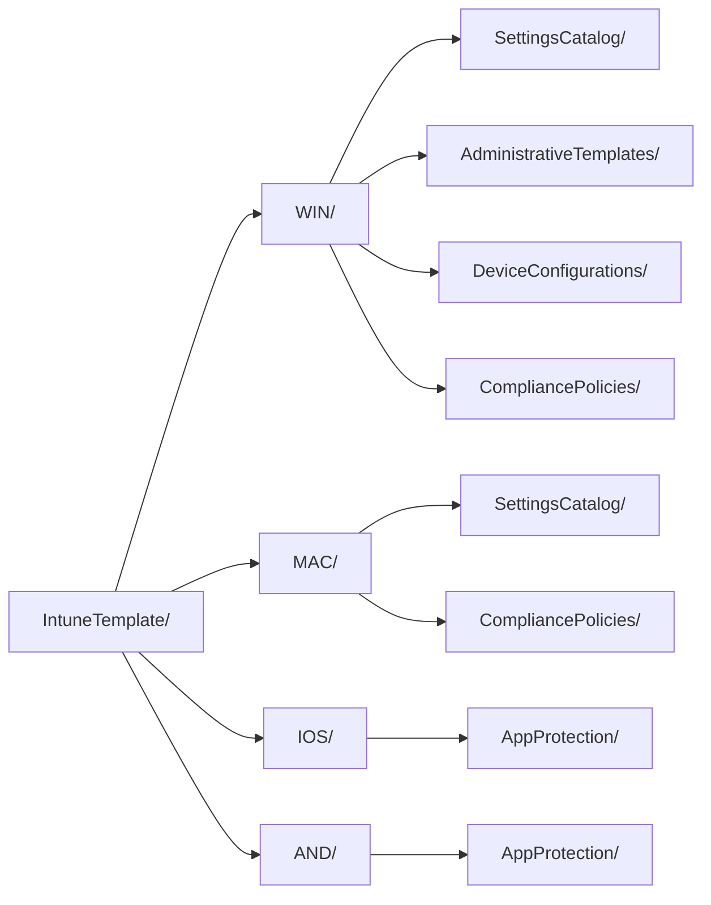

<!-- Generated by scripts/generate-docs.js — do not edit by hand. -->

[Nederlands](README.md) · **English** · [Français](README.fr.md)

# IntuneTemplate — 197 policies

The source of this repo: the agreed Intune policies in CIPP template format. Everything
in `export/` and `BaselineTemplate/` is derived from it and generated.

| Platform | Settings Catalog | ADMX | Device config | Compliance | App Protection | Total |
|---|---:|---:|---:|---:|---:|---:|
| [Windows](WIN/README.en.md) | 114 | 1 | 6 | 11 | – | **132** |
| [macOS](MAC/README.en.md) | 30 | – | 3 | 4 | – | **37** |
| [iOS/iPadOS](IOS/README.en.md) | 8 | – | 2 | 3 | 1 | **14** |
| [Android](AND/README.en.md) | 3 | – | 2 | 8 | 1 | **14** |
| **Total** | **155** | **1** | **13** | **26** | **2** | **197** |

## Layout

The folder follows from the file name (platform) and the CIPP `Type` (policy type), so it carries
no information that is not also in the file. `check-scope.js` checks that every
file is in its place.

## The `_` files

| File | What it records | Read by |
|---|---|---|
| [`_assignments.json`](_assignments.json) | the assignment target per policy | `export-intunebackup.js`, `check-scope.js` |
| [`_manifest.json`](_manifest.json) | which OIB policy lands where, why it deviates and in which phase it is deployed | `import-oib.js`, `set-packages.js` |
| [`_renames.json`](_renames.json) | what policies were called in the tenant and what they map to now | `Rename-BaselinePolicy.ps1`, `check-scope.js` |
| [`_ca.json`](_ca.json) | per policy the Conditional Access policies that rely on it — a copy from `docs/policies.json` in the CA-Policies repo | `generate-docs.js` (also writes it, with that repo next to this one) |
| [`_controls.json`](_controls.json) | the standards vocabulary: ISO 27001 Annex A, NIS2 art. 21(2), CIS Controls v8.1, NIST CSF 2.0 | `check-scope.js`, `generate-compliance.js` |
| [`_i18n/`](_i18n/) | the English and French translation of the texts from the data, for the generated documentation | `generate-docs.js`, `generate-compliance.js` |

Assignments are deliberately not in the template itself: CIPP assigns separately, but
IntuneBackupAndRestore does need them to restore completely.

They have no `RowKey` and no `Displayname`, so on a repo sync CIPP turns them into one
nameless row. It does nothing — see the [main README](../README.en.md#restoring-into-a-tenant).

## CIPP packages

The `Package` field in every template. CIPP's baselines have the standard **Intune Template
Package**: it deploys every template with the same value in one go and re-evaluates that
membership on every run — so a new policy moves along automatically, without anything
having to be clicked in CIPP.

The deploy options of that one standard are copied literally onto every member, so one
package is one assignment target. Hence the split below instead of `Baseline` on
everything: that would put the user policies on devices and deploy the policies that are not
ready yet untested. The value follows from `fase` in `_manifest.json` and the target in
`_assignments.json`; `set-packages.js` writes it, `check-scope.js` guards it.

| `Package` | Assign in CIPP to | Stage | Policies |
|---|---|---:|---:|
| `CXNM - Standard - Baseline-Devices` | Assign to all devices | 1 | 69 |
| `CXNM - Standard - Baseline-Users` | Assign to all users | 1 | 32 |
| `CXNM - Standard - Baseline-Pilot` | Custom group: SEC-Baseline-Pilot | 2 | 39 |
| `CXNM - Standard - Baseline-Wacht` | Do not assign | 3 | 26 |
| `CXNM - Standard - Baseline-ADE-token` | Do not assign (link to an ADE token in Intune) | 1 | 2 |
| `CXNM - Standard - Baseline-SEC-Android-Dedicated` | Custom group: SEC-Android-Dedicated | 1 | 1 |
| `CXNM - Standard - Baseline-SEC-Baseline-Pilot` | Custom group: SEC-Baseline-Pilot | 1 | 1 |
| `CXNM - Standard - Baseline-SEC-iOS-BYOD` | Custom group: SEC-iOS-BYOD | 1 | 1 |
| `CXNM - Standard - Baseline-SEC-iOS-Corporate` | Custom group: SEC-iOS-Corporate | 1 | 3 |
| `CXNM - Standard - Baseline-SEC-Remote-Support-macOS` | Custom group: SEC-Remote-Support-macOS | 1 | 2 |
| `CXNM - Standard - Baseline-SEC-Shared-Devices` | Custom group: SEC-Shared-Devices | 1 | 2 |
| `CXNM - Standard - Baseline-SEC-Update-Ring1` | Custom group: SEC-Update-Ring1 | 1 | 2 |
| `CXNM - Standard - Baseline-SEC-Update-Ring2` | Custom group: SEC-Update-Ring2 | 1 | 2 |
| *(empty)* | not deployed | – | 15 |

The stage column is the stage in [`BaselineTemplate/Baseline.json`](../BaselineTemplate/Baseline.json),
the CIPP baseline that deploys these packages.

Phase 5 deliberately gets an empty value: CIPP only shows packages with a filled-in
`Package`, so those policies are in no package at all. They can still be picked individually —
they exist as an alternative to a policy that is deployed.

## Per platform

- [Windows](WIN/README.en.md) — 132 policies
- [macOS](MAC/README.en.md) — 37 policies
- [iOS/iPadOS](IOS/README.en.md) — 14 policies
- [Android](AND/README.en.md) — 14 policies

See the [main README](../README.en.md) for the naming convention, the checks and how to bring in a
new OpenIntuneBaseline version.
