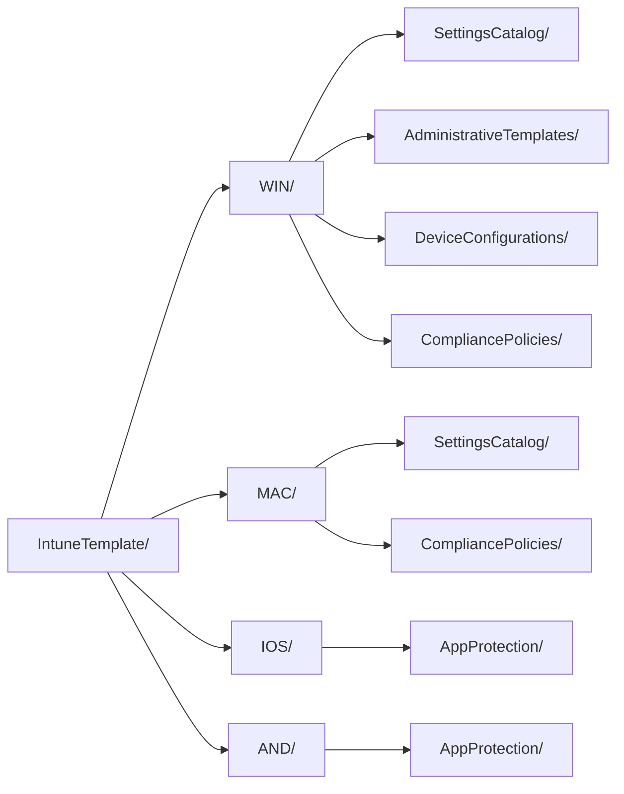

<!-- Généré par scripts/generate-docs.js — ne pas modifier à la main. -->

[Nederlands](README.md) · [English](README.en.md) · **Français**

# IntuneTemplate — 197 policies

La source de ce dépôt : les policies Intune convenues, au format template CIPP. Tout ce qui
se trouve dans `export/` et `BaselineTemplate/` en est dérivé et généré.

| Platform | Settings Catalog | ADMX | Device config | Compliance | App Protection | Total |
|---|---:|---:|---:|---:|---:|---:|
| [Windows](WIN/README.fr.md) | 114 | 1 | 6 | 11 | – | **132** |
| [macOS](MAC/README.fr.md) | 30 | – | 3 | 4 | – | **37** |
| [iOS/iPadOS](IOS/README.fr.md) | 8 | – | 2 | 3 | 1 | **14** |
| [Android](AND/README.fr.md) | 3 | – | 2 | 8 | 1 | **14** |
| **Total** | **155** | **1** | **13** | **26** | **2** | **197** |

## Organisation

Le dossier découle du nom de fichier (plateforme) et du `Type` CIPP (type de policy) ; il ne porte donc
aucune information qui ne figure pas déjà dans le fichier. `check-scope.js` vérifie que chaque
fichier est à sa place.

## Les fichiers `_`

| Fichier | Ce qu'il consigne | Lu par |
|---|---|---|
| [`_assignments.json`](_assignments.json) | la cible d'affectation par policy | `export-intunebackup.js`, `check-scope.js` |
| [`_manifest.json`](_manifest.json) | quelle policy OIB atterrit où, pourquoi il y a un écart et dans quelle phase elle est déployée | `import-oib.js`, `set-packages.js` |
| [`_renames.json`](_renames.json) | le nom des policies dans le tenant et leur correspondance actuelle | `Rename-BaselinePolicy.ps1`, `check-scope.js` |
| [`_controls.json`](_controls.json) | le vocabulaire des normes : ISO 27001 Annexe A, NIS2 art. 21(2), CIS Controls v8.1, NIST CSF 2.0 | `check-scope.js`, `generate-compliance.js` |
| [`_i18n/`](_i18n/) | la traduction anglaise et française des textes issus des données, pour la documentation générée | `generate-docs.js`, `generate-compliance.js` |

Les affectations ne sont volontairement pas dans le template lui-même : CIPP affecte séparément, mais
IntuneBackupAndRestore en a besoin pour une restauration complète.

Ils n'ont ni `RowKey` ni `Displayname` ; lors d'une synchronisation du dépôt, CIPP en fait donc une
ligne sans nom. Elle ne fait rien — voir le [README principal](../README.fr.md#restaurer-dans-un-tenant).

## Packages CIPP

Le champ `Package` de chaque template. Les baselines de CIPP disposent du standard **Intune Template
Package** : il déploie en une fois chaque template portant la même valeur et réévalue cette
appartenance à chaque exécution — une nouvelle policy suit donc automatiquement, sans rien
avoir à cliquer dans CIPP.

Les options de déploiement de ce standard sont copiées telles quelles sur chaque membre : un
package correspond donc à une cible d'affectation. D'où la répartition ci-dessous plutôt que `Baseline`
partout : cela appliquerait les policies utilisateur aux appareils et déploierait sans test les policies
qui ne sont pas encore prêtes. La valeur découle de `fase` dans `_manifest.json` et de la cible dans
`_assignments.json` ; `set-packages.js` l'écrit, `check-scope.js` la contrôle.

| `Package` | Affecter dans CIPP à | Stage | Policies |
|---|---|---:|---:|
| `CXNM - Standard - Baseline-Devices` | Assign to all devices | 1 | 69 |
| `CXNM - Standard - Baseline-Users` | Assign to all users | 1 | 32 |
| `CXNM - Standard - Baseline-Pilot` | Custom group: SEC-Baseline-Pilot | 2 | 39 |
| `CXNM - Standard - Baseline-Wacht` | Do not assign | 3 | 26 |
| `CXNM - Standard - Baseline-ADE-token` | Do not assign (à lier à un jeton ADE dans Intune) | 1 | 2 |
| `CXNM - Standard - Baseline-SEC-Android-Dedicated` | Custom group: SEC-Android-Dedicated | 1 | 1 |
| `CXNM - Standard - Baseline-SEC-Baseline-Pilot` | Custom group: SEC-Baseline-Pilot | 1 | 1 |
| `CXNM - Standard - Baseline-SEC-iOS-BYOD` | Custom group: SEC-iOS-BYOD | 1 | 1 |
| `CXNM - Standard - Baseline-SEC-iOS-Corporate` | Custom group: SEC-iOS-Corporate | 1 | 3 |
| `CXNM - Standard - Baseline-SEC-Remote-Support-macOS` | Custom group: SEC-Remote-Support-macOS | 1 | 2 |
| `CXNM - Standard - Baseline-SEC-Shared-Devices` | Custom group: SEC-Shared-Devices | 1 | 2 |
| `CXNM - Standard - Baseline-SEC-Update-Ring1` | Custom group: SEC-Update-Ring1 | 1 | 2 |
| `CXNM - Standard - Baseline-SEC-Update-Ring2` | Custom group: SEC-Update-Ring2 | 1 | 2 |
| *(vide)* | non déployé | – | 15 |

La colonne stage est le stage dans [`BaselineTemplate/Baseline.json`](../BaselineTemplate/Baseline.json),
la baseline CIPP qui déploie ces packages.

La phase 5 reçoit volontairement une valeur vide : CIPP n'affiche que les packages dont le `Package`
est renseigné, ces policies ne figurent donc dans aucun package. On peut toujours les choisir une à une —
elles existent comme alternative à une policy qui, elle, est déployée.

## Par plateforme

- [Windows](WIN/README.fr.md) — 132 policies
- [macOS](MAC/README.fr.md) — 37 policies
- [iOS/iPadOS](IOS/README.fr.md) — 14 policies
- [Android](AND/README.fr.md) — 14 policies

Voir le [README principal](../README.fr.md) pour la convention de nommage, les contrôles et la façon d'intégrer une
nouvelle version d'OpenIntuneBaseline.
