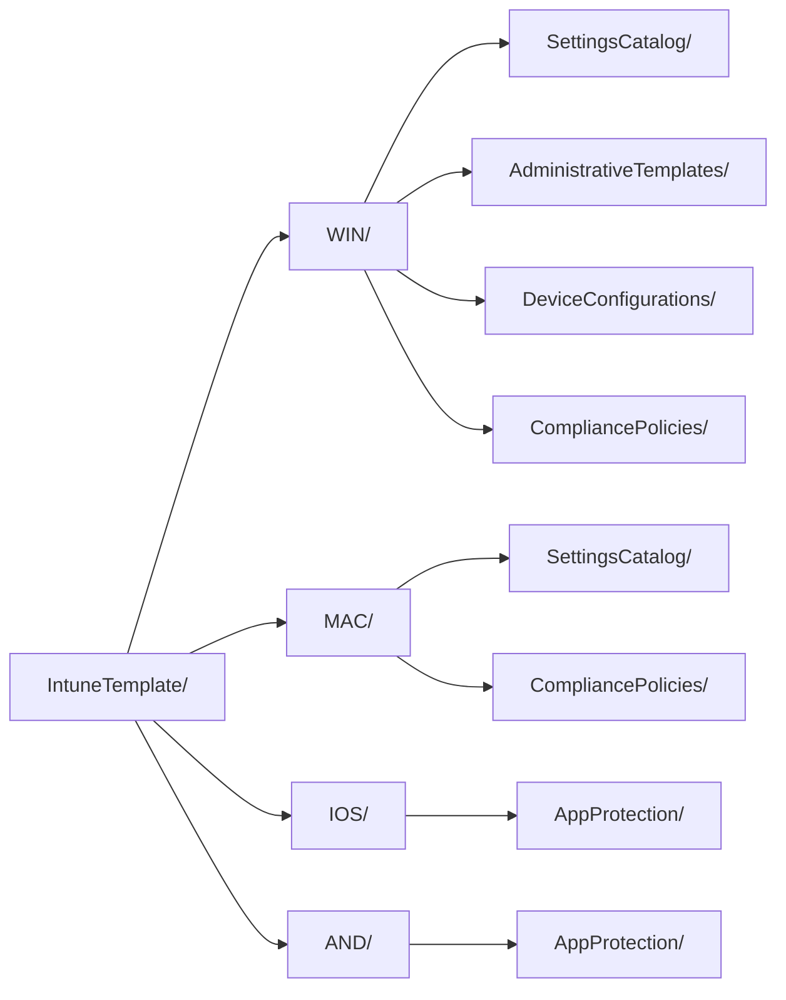

<!-- Gegenereerd door scripts/generate-docs.js — niet met de hand bijwerken. -->

# IntuneTemplate — 141 policies

De bron van deze repo: de afgesproken Intune-policies in CIPP-templateformaat. Alles wat
in `baseline/` en `export/` staat is hieruit afgeleid en wordt gegenereerd.

| Platform | Settings Catalog | ADMX | Device config | Compliance | App Protection | Totaal |
|---|---:|---:|---:|---:|---:|---:|
| [Windows](WIN/README.md) | 99 | 1 | 4 | 5 | – | **109** |
| [macOS](MAC/README.md) | 21 | – | 1 | 4 | – | **26** |
| [iOS/iPadOS](IOS/README.md) | – | – | – | 2 | 1 | **3** |
| [Android](AND/README.md) | – | – | – | 2 | 1 | **3** |
| **Totaal** | **120** | **1** | **5** | **13** | **2** | **141** |

## Indeling

De map volgt uit de bestandsnaam (platform) en het CIPP-`Type` (policytype) en draagt dus
geen informatie die niet ook in het bestand staat. `check-scope.js` controleert dat elk
bestand op zijn plek staat.

## De drie `_`-bestanden

| Bestand | Wat het vastlegt | Gelezen door |
|---|---|---|
| [`_assignments.json`](_assignments.json) | het toewijzingsdoel per policy | `export-intunebackup.js`, `check-scope.js` |
| [`_manifest.json`](_manifest.json) | welke OIB-policy waar landt, waarom er afgeweken wordt en in welke fase hij uitrolt | `import-oib.js`, `set-packages.js` |
| [`_renames.json`](_renames.json) | hoe policies in de tenant heetten en wat er nu bij hoort | `Rename-BaselinePolicy.ps1`, `check-scope.js` |

Assignments staan bewust niet in het template zelf: CIPP wijst apart toe, maar
IntuneBackupAndRestore heeft ze wél nodig om compleet terug te kunnen zetten.

Ze hebben geen `RowKey` en geen `Displayname`, dus CIPP maakt er bij een repo-sync één
naamloze rij van. Die doet niets — zie de [hoofd-README](../README.md#terugzetten-in-een-tenant).

## CIPP-pakketten

Het veld `Package` in elk template. CIPP's baselines kennen de standard **Intune Template
Package**: die rolt in één keer élk template met dezelfde waarde uit en bepaalt dat
lidmaatschap bij iedere run opnieuw — een nieuwe policy schuift dus vanzelf mee, zonder dat
er in CIPP iets aangeklikt hoeft te worden.

De deploy-opties van die ene standard worden letterlijk op elk lid gekopieerd, dus één
pakket is één toewijzingsdoel. Vandaar de verdeling hieronder in plaats van `Baseline` op
alles: die zou de gebruikerspolicies op apparaten zetten en de policies die nog niet klaar
zijn ongetest uitrollen. De waarde volgt uit `fase` in `_manifest.json` en het doel in
`_assignments.json`; `set-packages.js` schrijft hem, `check-scope.js` bewaakt hem.

| `Package` | In CIPP toewijzen aan | Policies |
|---|---|---:|
| `Baseline-Devices` | Assign to all devices | 80 |
| `Baseline-Users` | Assign to all users | 28 |
| `Baseline-Pilot` | Custom group: SEC-Baseline-Pilot | 14 |
| `Baseline-Wacht` | Do not assign | 5 |
| `Baseline-ADE-token` | Do not assign (koppelen aan een ADE-token in Intune) | 2 |
| `Baseline-SEC-Baseline-Pilot` | Custom group: SEC-Baseline-Pilot | 1 |
| `Baseline-SEC-Shared-Devices` | Custom group: SEC-Shared-Devices | 2 |
| `Baseline-SEC-Update-Ring1` | Custom group: SEC-Update-Ring1 | 2 |
| `Baseline-SEC-Update-Ring2` | Custom group: SEC-Update-Ring2 | 2 |
| *(leeg)* | wordt niet uitgerold | 5 |

Fase 5 krijgt bewust een lege waarde: CIPP toont alleen pakketten met een gevulde
`Package`, dus die policies staan in geen enkel pakket. Los kiezen kan nog steeds — ze
bestaan als alternatief voor een policy die wél uitrolt.

## Per platform

- [Windows](WIN/README.md) — 109 policies
- [macOS](MAC/README.md) — 26 policies
- [iOS/iPadOS](IOS/README.md) — 3 policies
- [Android](AND/README.md) — 3 policies

Zie de [hoofd-README](../README.md) voor de naamconventie, de controles en hoe je een
nieuwe OpenIntuneBaseline-versie binnenhaalt.
