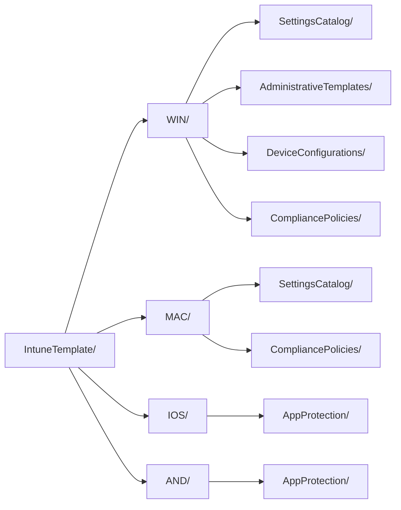

<!-- Gegenereerd door scripts/generate-docs.js — niet met de hand bijwerken. -->

# IntuneTemplate — 95 policies

De bron van deze repo: de afgesproken Intune-policies in CIPP-templateformaat. Alles wat
in `baseline/` en `export/` staat is hieruit afgeleid en wordt gegenereerd.

| Platform | Settings Catalog | ADMX | Device config | Compliance | App Protection | Totaal |
|---|---:|---:|---:|---:|---:|---:|
| [Windows](WIN/README.md) | 64 | 1 | 4 | 4 | – | **73** |
| [macOS](MAC/README.md) | 17 | – | – | 3 | – | **20** |
| [iOS/iPadOS](IOS/README.md) | – | – | – | – | 1 | **1** |
| [Android](AND/README.md) | – | – | – | – | 1 | **1** |
| **Totaal** | **81** | **1** | **4** | **7** | **2** | **95** |

## Indeling

De map volgt uit de bestandsnaam (platform) en het CIPP-`Type` (policytype) en draagt dus
geen informatie die niet ook in het bestand staat. `check-scope.js` controleert dat elk
bestand op zijn plek staat.

## De drie `_`-bestanden

| Bestand | Wat het vastlegt | Gelezen door |
|---|---|---|
| [`_assignments.json`](_assignments.json) | het toewijzingsdoel per policy | `export-intunebackup.js`, `check-scope.js` |
| [`_oib-manifest.json`](_oib-manifest.json) | welke OIB-policy waar landt, en waarom er afgeweken wordt | `import-oib.js` |
| [`_renames.json`](_renames.json) | hoe policies in de tenant heetten en wat er nu bij hoort | `Rename-BaselinePolicy.ps1`, `check-scope.js` |

Assignments staan bewust niet in het template zelf: CIPP wijst apart toe, maar
IntuneBackupAndRestore heeft ze wél nodig om compleet terug te kunnen zetten.

Ze hebben geen `RowKey` en geen `Displayname`, dus CIPP maakt er bij een repo-sync één
naamloze rij van. Die doet niets — zie de [hoofd-README](../README.md#terugzetten-in-een-tenant).

## Per platform

- [Windows](WIN/README.md) — 73 policies
- [macOS](MAC/README.md) — 20 policies
- [iOS/iPadOS](IOS/README.md) — 1 policies
- [Android](AND/README.md) — 1 policies

Zie de [hoofd-README](../README.md) voor de naamconventie, de controles en hoe je een
nieuwe OpenIntuneBaseline-versie binnenhaalt.
