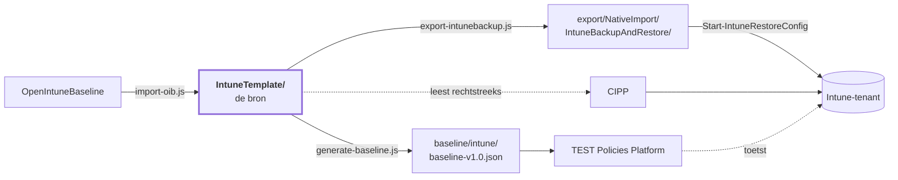

<!-- Gegenereerd door scripts/generate-docs.js — niet met de hand bijwerken. -->

# Intune-baseline — overzicht

95 policies over 4 platformen, met
[OpenIntuneBaseline](https://github.com/SkipToTheEndpoint/OpenIntuneBaseline) als bron.
Dit is de samenvatting; de details staan in de [hoofd-README](README.md) en per map.

| | Aantal |
|---|---:|
| Policies | 95 |
| Baseline-checks | 88 |
| Zonder toewijzing (bewust) | 4 |
| Uitgerold in de tenant | 0 |

## Wat er in zit

| Platform | Settings Catalog | ADMX | Device config | Compliance | App Protection | Totaal |
|---|---:|---:|---:|---:|---:|---:|
| [Windows](IntuneTemplate/WIN/README.md) | 64 | 1 | 4 | 4 | – | **73** |
| [macOS](IntuneTemplate/MAC/README.md) | 17 | – | – | 3 | – | **20** |
| [iOS/iPadOS](IntuneTemplate/IOS/README.md) | – | – | – | – | 1 | **1** |
| [Android](IntuneTemplate/AND/README.md) | – | – | – | – | 1 | **1** |

Per platform staat er een tabel met **elke policy, wat hij doet en waar hij landt**:
- [Windows](IntuneTemplate/WIN/README.md) — 73 policies
- [macOS](IntuneTemplate/MAC/README.md) — 20 policies
- [iOS/iPadOS](IntuneTemplate/IOS/README.md) — 1 policy
- [Android](IntuneTemplate/AND/README.md) — 1 policy

## Eén bron, drie afgeleiden

Wijzigen doe je in `IntuneTemplate/`. De rest wordt gegenereerd en door CI opnieuw gebouwd.

## Wat er in augustus 2026 veranderde

Van 24 eigen policies naar de huidige set.

| | Aantal | |
|---|---:|---|
| Herschreven op OIB-inhoud | 15 | checkId behouden; Edge Security ging van 2 naar 54 instellingen, Defender Antivirus van 11 naar 28, Audit van 23 naar 40 |
| Nieuw | 75 | o.a. Windows Hello for Business, Credential Guard, Local Administrators, Office Security, 7 compliance-policies, 20 macOS-policies, 2 BYOD-MAM |
| Opgegaan in een andere policy | 6 | Administrative Templates (300 instellingen) uit elkaar getrokken; Network Security, System Services, Windows Search en OneDrive KFM opgeslokt |
| Ongewijzigd meegegaan | 5 | waar OIB geen tegenhanger voor heeft: EDR-onboarding, Outlook-autoconfiguratie, Edge-zoekmachine, update-ring 3, user experience |

Vijf checkId's zijn daarmee opgeheven (008, 017, 023, 025, 028) en worden niet opnieuw
uitgedeeld. Instellingen die alleen wij hadden — versleuteling van vaste en verwisselbare
schijven bijvoorbeeld — zijn bij een herschrijving behouden in plaats van stilzwijgend
weggevallen.

## Wat er nog moet gebeuren

De repo is klaar en de controles staan groen. De tenant is niet aangeraakt: de policies
staan daar nog onder hun oude naam. De volgorde is een afhankelijkheid, geen suggestie —
stap 4 vóór stap 3 levert twee policies op die elkaar tegenspreken.

| # | Stap | |
|---:|---|---|
| 1 | Inventariseren | `Get-BaselinePolicyState.ps1` — moet nog gebouwd worden |
| 2 | Hernoemen | `Rename-BaselinePolicy.ps1 -WhatIf` eerst; PATCH, dus id en assignments blijven |
| 3 | Vervangen | Windows Firewall en Office Updates wisselen van policytype — handwerk |
| 4 | Opheffen | Network Security, Windows Search, System Services, OneDrive KFM verwijderen |
| 5 | Uitrollen | de nieuwe policies via CIPP of `Start-IntuneRestoreConfig` |
| 6 | Toewijzen | `Set-BaselineAssignment.ps1 -Scope D -AllDevices` en `-Scope U -AllUsers` |
| 7 | Opnieuw inventariseren | de lijst met wees-policies moet leeg zijn |

> **De baseline-check is hier geen vangnet.** De checks vergelijken op inhoud, niet op naam.
> Een achtergebleven policy onder de óude naam houdt zijn check dus groen, ook als de nieuwe
> nooit is aangemaakt of nergens is toegewezen.

## Eerst in een pilot

| Policy | Waarom |
|---|---|
| `WIN - D - Disable NTLM` | breekt oude on-prem toepassingen en apparaten die geen Kerberos spreken |
| `WIN - D - Device Guard and Credential Guard` | vraagt een herstart en kan oude stuurprogramma's blokkeren |
| `WIN - D - Administrator Protection` | Windows 11 24H2+; verandert het UAC-gedrag van beheerders |
| `WIN - D - In-Box App Removal` | verwijdert ingebouwde apps; controleer of niemand ze gebruikt |
| `WIN - D - Windows Hello for Business` | vereist een TPM en een PIN van minimaal zes tekens |
| `WIN - D - Script File Associations` | .js, .vbs en .hta openen voortaan in Kladblok |
| `MAC - D - FileVault` | versleutelt de schijf; regel eerst de escrow van de herstelsleutel |

Daarnaast staan 4 policies bewust zonder toewijzing: de update-ringen 1 en 2 voor Windows
en Defender zetten dezelfde instellingen als ring 3 met andere waarden. Alle ringen op All
Devices zou een conflict opleveren; die horen op een pilot- en een UAT-groep.
