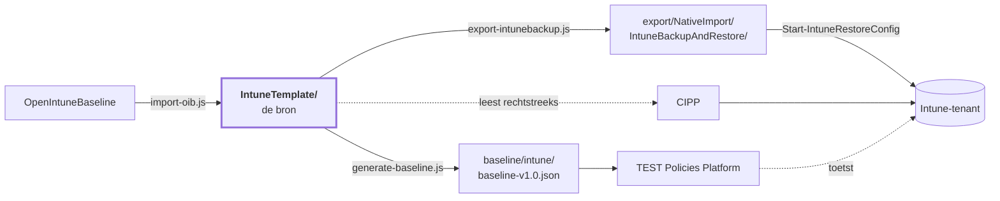

<!-- Gegenereerd door scripts/generate-docs.js — niet met de hand bijwerken. -->

# Intune-baseline — overzicht

105 policies over 4 platformen, met
[OpenIntuneBaseline](https://github.com/SkipToTheEndpoint/OpenIntuneBaseline) als bron.
Dit is de samenvatting; de details staan in de [hoofd-README](README.md) en per map.

| | Aantal |
|---|---:|
| Policies | 105 |
| Baseline-checks | 98 |
| Zonder toewijzing (bewust) | 10 |
| Uitgerold in de tenant | 0 |

## Wat er in zit

| Platform | Settings Catalog | ADMX | Device config | Compliance | App Protection | Totaal |
|---|---:|---:|---:|---:|---:|---:|
| [Windows](IntuneTemplate/WIN/README.md) | 71 | 1 | 4 | 4 | – | **80** |
| [macOS](IntuneTemplate/MAC/README.md) | 20 | – | – | 3 | – | **23** |
| [iOS/iPadOS](IntuneTemplate/IOS/README.md) | – | – | – | – | 1 | **1** |
| [Android](IntuneTemplate/AND/README.md) | – | – | – | – | 1 | **1** |

Per platform staat er een tabel met **elke policy, wat hij doet en waar hij landt**:
- [Windows](IntuneTemplate/WIN/README.md) — 80 policies
- [macOS](IntuneTemplate/MAC/README.md) — 23 policies
- [iOS/iPadOS](IntuneTemplate/IOS/README.md) — 1 policy
- [Android](IntuneTemplate/AND/README.md) — 1 policy

## Eén bron, drie afgeleiden

Wijzigen doe je in `IntuneTemplate/`. De rest wordt gegenereerd en door CI opnieuw gebouwd.

## Wat er in augustus 2026 veranderde

Van 24 eigen policies naar de huidige set.

| | Aantal | |
|---|---:|---|
| Herschreven op OIB-inhoud | 15 | checkId behouden; Edge Security ging van 2 naar 54 instellingen, Defender Antivirus van 11 naar 28, Audit van 23 naar 40 |
| Nieuw | 75 | o.a. Windows Hello for Business, Credential Guard, Local Administrators, Office Security, 7 compliance-policies, 20 macOS-policies, 2 BYOD-MAM |
| Opgegaan in een andere policy | 6 | Administrative Templates (300 instellingen) uit elkaar getrokken; Network Security, System Services, Windows Search en OneDrive KFM opgeslokt |
| Ongewijzigd meegegaan | 5 | waar OIB geen tegenhanger voor heeft: EDR-onboarding, Outlook-autoconfiguratie, Edge-zoekmachine, update-ring 3, user experience |

Vijf checkId's zijn daarmee opgeheven (008, 017, 023, 025, 028) en worden niet opnieuw
uitgedeeld. Instellingen die alleen wij hadden — versleuteling van vaste en verwisselbare
schijven bijvoorbeeld — zijn bij een herschrijving behouden in plaats van stilzwijgend
weggevallen.

## Wat de vergelijking met IntuneAdmin opleverde

Eind augustus 2026 is de set naast [IntuneAdmin/IntuneBaselines](https://github.com/IntuneAdmin/IntuneBaselines)
gelegd — 874 profielen, vergeleken op settingDefinitionId en waarde. 654 instellingen komen in
beide sets voor, waarvan 55 met een andere waarde. Dat leverde vier nieuwe policies en drie
aanpassingen op:

| | |
|---|---|
| `WIN - D - Windows AI` | Recall en Click To Do uit. OIB v3.8 kent nog geen Windows AI-policy en wij dus ook niet. |
| `WIN - D - Removable Storage` | schrijven naar USB-opslag en WPD-apparaten geblokkeerd; verwisselbare media was nergens beperkt. |
| `WIN - U - Windows Hello for Business` | WHfB per gebruiker naast de bestaande per-apparaatpolicy. |
| `WIN - D - Windows Hello for Business Multi User` | WHfB voor gedeelde apparaten, zonder inrichting direct na het aanmelden. |
| `WIN - D - Windows Firewall` | *local policy merge* stond alleen op het openbare profiel; nu ook op domein en privé. |
| `WIN - D - Login and Lock Screen` | het wachtwoord-onthulknopje gaat uit — de enige harde CIS-L1-afwijking zonder functionele reden. |
| `WIN - D - Defender Antivirus` | lage en gemiddelde dreigingen naar quarantaine in plaats van block en remove: een fout-positief is dan terug te draaien. |

Daarnaast verloren de drie CIPP-standaardtemplates voor Defender hun toewijzing. Ze zetten
dezelfde instellingen als hun OIB-tegenhanger op een andere waarde — 19 conflicten in totaal,
waarvan 16 ASR-regels. Bij een conflict past Intune de instelling door géén van beide policies
toe, dus die 16 regels stonden feitelijk uit.

Wat bewust anders blijft dan CIS en IntuneAdmin: telemetrie op *Optioneel* (Endpoint Analytics
en Windows Update-rapportage leunen erop) en locatie aan (Apparaat zoeken, tijdzone). Beide
staan met reden in het `doel`-veld van hun policy.

## Wat de macOS-herziening opleverde

Eind augustus 2026 is de macOS-set als geheel nagelopen. Dat leverde twee nieuwe policies
en drie correcties op:

| | |
|---|---|
| `MAC - D - Enrollment Profile Administrator / Standard User Affinity` | twee ADE-inschrijfprofielen die in precies één instelling verschillen: wordt het aangemelde account beheerder of standaardgebruiker. Alternatieven van elkaar, dus geen van beide toegewezen. |
| `MAC - D - Software Updates` | van de klassieke `com.apple.softwareupdate`-payload naar declaratief updatebeleid (DDM, macOS 14+): uitstel van 7 dagen voor kleine, 14 voor grote en 21 voor systeemupdates, Rapid Security Responses aan inclusief terugdraaien. checkId 047 blijft. |
| `MAC - D - Defender for Endpoint` | de organisatienaam van het inhoudsfilter stond op *JAMF Software* — een restant uit de Jamf-profielen waar de MDE-documentatie op leunt. Die naam ziet de gebruiker in Systeeminstellingen → Netwerk → Filters. |
| `MAC - U - Compliance Device Health` en `Device Security` | droegen elkaars omschrijving. Device Health toetst System Integrity Protection; Device Security toetst de versleuteling, de firewall en Gatekeeper. |

Één gat is bewust niet gedicht: `MAC - U - Compliance Password` eist een wachtwoord van
minimaal acht tekens met vergrendeling na vijftien minuten, maar er is geen configuratiepolicy
die dat op de Mac instelt. Een Mac zonder schermvergrendeling wordt dus wel als niet-compliant
gemeld en krijgt de instelling niet opgelegd — dat vraagt een eigen passcode-policy.

## Wat er nog moet gebeuren

De repo is klaar en de controles staan groen. De tenant is niet aangeraakt: de policies
staan daar nog onder hun oude naam. De volgorde is een afhankelijkheid, geen suggestie —
stap 4 vóór stap 3 levert twee policies op die elkaar tegenspreken.

| # | Stap | |
|---:|---|---|
| 1 | Inventariseren | `Get-BaselinePolicyState.ps1` — moet nog gebouwd worden |
| 2 | Hernoemen | `Rename-BaselinePolicy.ps1 -WhatIf` eerst; PATCH, dus id en assignments blijven |
| 3 | Vervangen | Windows Firewall en Office Updates wisselen van policytype — handwerk |
| 4 | Opheffen | Network Security, Windows Search, System Services, OneDrive KFM verwijderen |
| 5 | Uitrollen | de nieuwe policies via CIPP of `Start-IntuneRestoreConfig` |
| 6 | Toewijzen | `Set-BaselineAssignment.ps1 -Scope D -AllDevices` en `-Scope U -AllUsers` |
| 7 | Opnieuw inventariseren | de lijst met wees-policies moet leeg zijn |

> **De baseline-check is hier geen vangnet.** De checks vergelijken op inhoud, niet op naam.
> Een achtergebleven policy onder de óude naam houdt zijn check dus groen, ook als de nieuwe
> nooit is aangemaakt of nergens is toegewezen.

## Eerst in een pilot

| Policy | Waarom |
|---|---|
| `WIN - D - Disable NTLM` | breekt oude on-prem toepassingen en apparaten die geen Kerberos spreken |
| `WIN - D - Device Guard and Credential Guard` | vraagt een herstart en kan oude stuurprogramma's blokkeren |
| `WIN - D - Administrator Protection` | Windows 11 24H2+; verandert het UAC-gedrag van beheerders |
| `WIN - D - In-Box App Removal` | verwijdert ingebouwde apps; controleer of niemand ze gebruikt |
| `WIN - D - Windows Hello for Business` | vereist een TPM en een PIN van minimaal zes tekens |
| `WIN - D - Script File Associations` | .js, .vbs en .hta openen voortaan in Kladblok |
| `WIN - D - Removable Storage` | schrijven naar USB-opslag en naar telefoons en camera's wordt geblokkeerd |
| `MAC - D - FileVault` | versleutelt de schijf; regel eerst de escrow van de herstelsleutel |
| `MAC - D - Software Updates` | declaratief updatebeleid vraagt macOS 14 of hoger; oudere Macs krijgen het profiel niet |
| `MAC - D - Enrollment Profile Administrator / Standard User Affinity` | vergrendelde inschrijving is na de inschrijving alleen met een wipe terug te draaien |

Daarnaast staan 10 policies bewust zonder toewijzing. Stuk voor stuk een *alternatief*
voor een policy die wél is toegewezen, niet een aanvulling erop: de update-ringen 1 en 2 voor
Windows en Defender zetten dezelfde instellingen als ring 3 met andere waarden, de drie
CIPP-standaardtemplates voor Defender doen hetzelfde als hun OIB-tegenhanger, de WHfB-variant
voor gedeelde apparaten hoort op een groep met gedeelde apparaten, en de twee macOS-inschrijf-
profielen verschillen in precies één instelling. Allemaal op All Devices zou
een conflict opleveren, waarna Intune de betwiste instelling door géén van beide policies
toepast; die horen op een eigen groep.
