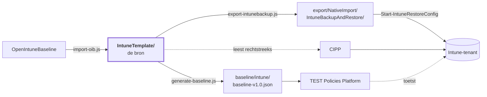

<!-- Gegenereerd door scripts/generate-docs.js — niet met de hand bijwerken. -->

# Intune-baseline — overzicht

195 policies over 4 platformen, met
[OpenIntuneBaseline](https://github.com/SkipToTheEndpoint/OpenIntuneBaseline) als bron.
Dit is de samenvatting; de details staan in de [hoofd-README](README.md) en per map.

| | Aantal |
|---|---:|
| Policies | 195 |
| Baseline-checks | 160 |
| Zonder toewijzing (bewust) | 94 |
| Uitgerold in de tenant | 0 |

## Wat er in zit

| Platform | Settings Catalog | ADMX | Device config | Compliance | App Protection | Totaal |
|---|---:|---:|---:|---:|---:|---:|
| [Windows](IntuneTemplate/WIN/README.md) | 112 | 1 | 6 | 11 | – | **130** |
| [macOS](IntuneTemplate/MAC/README.md) | 30 | – | 3 | 4 | – | **37** |
| [iOS/iPadOS](IntuneTemplate/IOS/README.md) | 8 | – | 2 | 3 | 1 | **14** |
| [Android](IntuneTemplate/AND/README.md) | 3 | – | 2 | 8 | 1 | **14** |

Per platform staat er een tabel met **elke policy, wat hij doet en waar hij landt**:
- [Windows](IntuneTemplate/WIN/README.md) — 130 policies
- [macOS](IntuneTemplate/MAC/README.md) — 37 policies
- [iOS/iPadOS](IntuneTemplate/IOS/README.md) — 14 policies
- [Android](IntuneTemplate/AND/README.md) — 14 policies

## Normenkader

195 van de 195 policies verwijzen naar ISO/IEC 27001:2022 Annex A, NIS2 art. 21(2),
CIS Controls v8.1 en NIST CSF 2.0; de policies in fase 1 raken samen 31 van de 93 Annex A-controls.
Per control en per NIS2-punt wat de baseline afdwingt, hoe het getoetst wordt en wat de organisatie
zelf moet regelen: [COMPLIANCE.md](COMPLIANCE.md).

## Eén bron, drie afgeleiden

Wijzigen doe je in `IntuneTemplate/`. De rest wordt gegenereerd en door CI opnieuw gebouwd.

## Wat er in augustus 2026 veranderde

Van 24 eigen policies naar de huidige set.

| | Aantal | |
|---|---:|---|
| Herschreven op OIB-inhoud | 15 | checkId behouden; Edge Security ging van 2 naar 54 instellingen, Defender Antivirus van 11 naar 28, Audit van 23 naar 40 |
| Nieuw | 75 | o.a. Windows Hello for Business, Credential Guard, Local Administrators, Office Security, 7 compliance-policies, 20 macOS-policies, 2 BYOD-MAM |
| Opgegaan in een andere policy | 6 | Administrative Templates (300 instellingen) uit elkaar getrokken; Network Security, System Services, Windows Search en OneDrive KFM opgeslokt |
| Ongewijzigd meegegaan | 5 | waar OIB geen tegenhanger voor heeft: EDR-onboarding, Outlook-autoconfiguratie, Edge-zoekmachine, update-ring 3, user experience |

Vijf checkId's zijn daarmee opgeheven (008, 017, 023, 025, 028) en worden niet opnieuw
uitgedeeld. Instellingen die alleen wij hadden — versleuteling van vaste en verwisselbare
schijven bijvoorbeeld — zijn bij een herschrijving behouden in plaats van stilzwijgend
weggevallen.

## Wat de vergelijking met IntuneAdmin opleverde

Eind augustus 2026 is de set naast [IntuneAdmin/IntuneBaselines](https://github.com/IntuneAdmin/IntuneBaselines)
gelegd — 874 profielen, vergeleken op settingDefinitionId en waarde. 654 instellingen komen in
beide sets voor, waarvan 55 met een andere waarde. Dat leverde vier nieuwe policies en drie
aanpassingen op:

| | |
|---|---|
| `WIN - D - Windows AI` | Recall en Click To Do uit. OIB v4.0 kent nog geen Windows AI-policy en wij dus ook niet. |
| `WIN - D - Removable Storage` | schrijven naar USB-opslag en WPD-apparaten geblokkeerd; verwisselbare media was nergens beperkt. |
| `WIN - U - Windows Hello for Business` | WHfB per gebruiker naast de bestaande per-apparaatpolicy. |
| `WIN - D - Windows Hello for Business Multi User` | WHfB voor gedeelde apparaten, zonder inrichting direct na het aanmelden. |
| `WIN - D - Windows Firewall` | *local policy merge* stond alleen op het openbare profiel; nu ook op domein en privé. |
| `WIN - D - Login and Lock Screen` | het wachtwoord-onthulknopje gaat uit — de enige harde CIS-L1-afwijking zonder functionele reden. |
| `WIN - D - Defender Antivirus` | lage en gemiddelde dreigingen naar quarantaine in plaats van block en remove: een fout-positief is dan terug te draaien. |

Daarnaast verloren de drie CIPP-standaardtemplates voor Defender hun toewijzing. Ze zetten
dezelfde instellingen als hun OIB-tegenhanger op een andere waarde — 19 conflicten in totaal,
waarvan 16 ASR-regels. Bij een conflict past Intune de instelling door géén van beide policies
toe, dus die 16 regels stonden feitelijk uit.

Wat bewust anders blijft dan CIS en IntuneAdmin: telemetrie op *Optioneel* (Endpoint Analytics
en Windows Update-rapportage leunen erop) en locatie aan (Apparaat zoeken, tijdzone). Beide
staan met reden in het `doel`-veld van hun policy.

## Wat de macOS-herziening opleverde

Eind augustus 2026 is de macOS-set als geheel nagelopen. Dat leverde twee nieuwe policies
en drie correcties op:

| | |
|---|---|
| `MAC - D - Enrollment Profile Administrator / Standard User Affinity` | twee ADE-inschrijfprofielen die in precies één instelling verschillen: wordt het aangemelde account beheerder of standaardgebruiker. Alternatieven van elkaar, dus geen van beide toegewezen. |
| `MAC - D - Software Updates` | van de klassieke `com.apple.softwareupdate`-payload naar declaratief updatebeleid (DDM, macOS 14+): uitstel van 7 dagen voor kleine, 14 voor grote en 21 voor systeemupdates, Rapid Security Responses aan inclusief terugdraaien. checkId 047 blijft. |
| `MAC - D - Defender for Endpoint` | de organisatienaam van het inhoudsfilter stond op *JAMF Software* — een restant uit de Jamf-profielen waar de MDE-documentatie op leunt. Die naam ziet de gebruiker in Systeeminstellingen → Netwerk → Filters. |
| `MAC - U - Compliance Device Health` en `Device Security` | droegen elkaars omschrijving. Device Health toetst System Integrity Protection; Device Security toetst de versleuteling, de firewall en Gatekeeper. |

Één gat is bewust niet gedicht: `MAC - U - Compliance Password` eist een wachtwoord van
minimaal acht tekens met vergrendeling na vijftien minuten, maar er is geen configuratiepolicy
die dat op de Mac instelt. Een Mac zonder schermvergrendeling wordt dus wel als niet-compliant
gemeld en krijgt de instelling niet opgelegd — dat vraagt een eigen passcode-policy.

## Wat er nog moet gebeuren

De repo is klaar en de controles staan groen. De tenant is niet aangeraakt: de policies
staan daar nog onder hun oude naam. De volgorde is een afhankelijkheid, geen suggestie —
stap 4 vóór stap 3 levert twee policies op die elkaar tegenspreken.

| # | Stap | |
|---:|---|---|
| 1 | Inventariseren | `Get-BaselinePolicyState.ps1` — moet nog gebouwd worden |
| 2 | Hernoemen | `Rename-BaselinePolicy.ps1 -WhatIf` eerst; PATCH, dus id en assignments blijven |
| 3 | Vervangen | Windows Firewall en Office Updates wisselen van policytype — handwerk |
| 4 | Opheffen | Network Security, Windows Search, System Services, OneDrive KFM verwijderen |
| 5 | Uitrollen | de nieuwe policies via CIPP of `Start-IntuneRestoreConfig` |
| 6 | Toewijzen | `Set-BaselineAssignment.ps1 -Scope D -AllDevices` en `-Scope U -AllUsers` nemen alleen fase 1; de pilot volgt met `-GroupName 'SEC-Baseline-Pilot'` |
| 7 | Opnieuw inventariseren | de lijst met wees-policies moet leeg zijn |

> **De baseline-check is hier geen vangnet.** De checks vergelijken op inhoud, niet op naam.
> Een achtergebleven policy onder de óude naam houdt zijn check dus groen, ook als de nieuwe
> nooit is aangemaakt of nergens is toegewezen.

## Eerst in een pilot

Fase 2 in `_manifest.json`. Deze policies rollen via het pakket `Baseline-Pilot` uit naar
`SEC-Baseline-Pilot`, en pas naar iedereen als ze naar fase 1 gaan — een PR, want dat
verandert naar wie ze uitrollen. Het waarom per policy is de `faseWaarom` uit het manifest.

| Policy | Waarom |
|---|---|
| `WIN - D - Access Control` | Gebruikers moeten hun volledige naam typen in plaats van te klikken, en zien een banner. Pas de bannertekst eerst aan op de eigen organisatienaam. |
| `WIN - D - Account Lockout` | De machine-drempel zet een apparaat na tien mislukte pogingen in BitLocker-herstel. Dat is recoverable (de sleutel staat in Entra ID) maar levert een helpdeskvraag op; kijk in de pilot hoe vaak het gebeurt. |
| `WIN - D - Administrator Protection` | Verandert hoe een beheerder werkt: geen permanent verhoogde rechten meer, maar per handeling een bevestiging. Scripts en tools die stil op beheerdersrechten leunen merken dat. Windows 11 24H2 en hoger; op oudere builds doet hij niets. |
| `WIN - D - Cryptography` | Een intern systeem dat alleen TLS 1.0/1.1 spreekt wordt onbereikbaar. Dat is de bedoeling, maar het moet bekend zijn. |
| `WIN - D - Device Guard and Credential Guard` | Vraagt een herstart, en geheugenintegriteit (HVCI) laadt geen stuurprogramma's die er niet op gebouwd zijn — denk aan oude VPN-, printer- en dockdrivers. Kijk in de pilot of alles nog start. |
| `WIN - D - Disable NTLM` | Weigert alle NTLM, inkomend en uitgaand. Wat niet via Kerberos kan breekt: toepassingen die op IP-adres verbinden, apparaten buiten het domein, en shares waarvoor het apparaat geen Kerberos-ticket krijgt — een Entra-joined apparaat dat een share op Entra Domain Services opent valt terug op NTLM. Lees vóór de pilot op een paar Windows 11 24H2-apparaten Microsoft-Windows-NTLM/Operational (4020/4021 uitgaand, 4022/4023 inkomend): die logging staat daar standaard aan en laat zien wat er zou breken. |
| `WIN - D - Enrollment Hardening` | Raakt de eerste installatie van een apparaat, niet een draaiend apparaat. Test op één Autopilot-toestel: zonder netwerk komt de gebruiker niet verder, en dat is de bedoeling — maar het moet wel kloppen met hoe apparaten bij jullie worden uitgerold. |
| `WIN - D - In-Box App Removal` | Verwijdert ingebouwde apps, ook van apparaten die al in gebruik zijn. Kijk in de pilot of iemand er een mist. |
| `WIN - D - Kernel DMA Protection` | Een dock of eGPU zonder DMA-remapping werkt niet meer. Test met de docks die in de vloot zitten. |
| `WIN - D - Logon Hardening` | Gebruikers moeten voortaan CTRL+ALT+DEL indrukken vóór het aanmeldscherm. Communiceer dat vóór de brede uitrol. |
| `WIN - D - Microsoft Edge DNS over HTTPS Automatic` | Automatisch is de standaard van Edge, maar vastgelegd kan de gebruiker het niet meer uitzetten of een eigen resolver kiezen. Test op de pilotgroep of interne namen en een eventuele webproxy/DNS-filter blijven werken. |
| `WIN - D - Network Authentication Hardening` | PKU2U dichtzetten breekt Remote Desktop naar een ander Entra-joined apparaat met Entra-referenties via de oude aanmeldmethode, en P-node breekt NetBIOS-naamresolutie via broadcast in een netwerk zonder DNS of WINS. Eerst op de pilotgroep. |
| `WIN - D - Printing Hardening` | Windows Protected Print laat printers vallen die geen Mopria-driver hebben. Inventariseer de printervloot eerst. |
| `WIN - D - Remote Access Hardening` | Controleer of geen beheerscript of monitoringtool op winrs leunt. Enter-PSSession en Invoke-Command blijven werken, winrs niet. |
| `WIN - D - Removable Storage` | Schrijven naar USB-sticks, externe schijven en telefoons wordt geblokkeerd, en dat merkt een gebruiker meteen. Let op: tot deze policy breed uitrolt is verwisselbare opslag nergens beperkt — BitLocker laat removabledrivesrequireencryption bewust uit, omdat deze blokkade dat afdekt. |
| `WIN - D - Script File Associations` | Dubbelklikken op een .js-, .vbs- of .hta-bestand opent voortaan Kladblok. Een inlog- of installatiescript dat zo gestart wordt doet dan niets meer; kijk in de pilot of er zulke scripts in omloop zijn. |
| `WIN - D - Security Log Monitoring` | Module-logging voor alle modules (*) levert veel gebeurtenis 4103 op in Microsoft-Windows-PowerShell/Operational. Eerst op de pilotgroep kijken wat dat met de logomvang en een eventuele SIEM-ingest doet; zie extras/windows/event-log-sizes voor de logboekgrootte. |
| `WIN - D - Windows AI Features Restricted` | Gebruikers zien de AI-knoppen in Paint verdwijnen. Dat is de bedoeling, maar het is zichtbaar en verdient een aankondiging. Kies per klant tussen deze en de Permitted-variant — nooit allebei toewijzen. |
| `WIN - D - Windows Component Hardening` | Merkbaar op twee punten: 'Doorgaan op dit apparaat' (Continue experiences) verdwijnt, en een kioskapparaat dat met AutoAdminLogon werkt meldt niet meer vanzelf aan. Eerst op de pilotgroep; kiosken buiten deze policy houden. |
| `WIN - D - Windows Hello for Business` | Elke gebruiker wordt bij de eerstvolgende aanmelding door de PIN-inrichting geleid, en een apparaat zonder TPM krijgt WHfB niet. Gaat samen met WIN - U - Windows Hello for Business de pilot in: de een in de pilot en de ander op iedereen maakt de pilot zinloos. |
| `WIN - D - Windows Hello PIN Complexity Alphanumeric` | Gaat samen met WIN - D - Windows Hello for Business en WIN - U - Windows Hello for Business de pilot in — die staan in dezelfde fase en wachten op ditzelfde besluit. Complexiteit toewijzen aan gebruikers zonder ingerichte WHfB doet niets; andersom valt een gebruiker mét WHfB zonder deze policy terug op zes cijfers. Kijk in de pilot naar het aantal PIN-resets: dat is de kostenpost van deze variant. |
| `WIN - U - AI Usage Control Restricted` | Neemt de Edge-URL-blokkeerlijst over van Microsoft Edge User Experience — die instelling is daar al weggehaald. Controleer in de pilot dat er geen legitieme site geblokkeerd wordt. Kies per klant tussen deze en de Permitted-variant; nooit allebei toewijzen. |
| `WIN - U - Compliance OS Version` | Een apparaat onder de ondergrens wordt niet-compliant en verliest daarmee toegang via Conditional Access. Kijk eerst in de rapportage hoeveel apparaten dat raakt — het antwoord hoort nul te zijn, maar dat moet je gezien hebben en niet aannemen. Respijt staat op 72 uur. |
| `WIN - U - File Sharing Restrictions` | Een gebruiker die gewend is een map uit zijn profiel via Verkenner te delen, ziet die optie verdwijnen. Delen via OneDrive en Teams blijft werken. |
| `WIN - U - Microsoft Edge Management` | Draait de voorrang om: beleid uit de Edge Management Service wint daarna van het Edge-beleid uit deze baseline. Wie de rol Edge Administrator heeft kan dan dus instellingen uit Microsoft Edge Security en User Experience overschrijven. Leg eerst vast wie die rol heeft voordat dit breed uitrolt. |
| `WIN - U - Microsoft Outlook Cached Mode Managed` | Raakt elk bestaand profiel: Outlook bouwt het OST opnieuw op en een gedeelde mailbox in het profiel gaat van gecachet naar online. Dat is zichtbaar — de eerste synchronisatie kost tijd en bandbreedte, en wie gewend is offline in een gedeelde mailbox te werken merkt het meteen. Eerst op de pilotgroep, en kijk daar hoeveel profielen een gedeelde mailbox hebben. |
| `WIN - U - Microsoft Teams` | Blokkeert aanmelden met een account uit een andere tenant. Dat is de bedoeling, maar wie een tweede werkaccount in Teams gebruikt merkt het meteen — kijk in de pilot of dat voorkomt. |
| `WIN - U - Windows Hello for Business` | Hoort bij WIN - D - Windows Hello for Business en gaat samen met die de pilot in — op alle gebruikers zou hij WHfB alsnog op elk apparaat inrichten, en dan test de pilot niets. |
| `MAC - D - Apple Intelligence Restricted` | Gebruikers zien Writing Tools, samenvattingen, Genmoji, Image Playground en de ChatGPT-integratie verdwijnen. Dat is de bedoeling, maar het is zichtbaar en verdient een aankondiging. Kies per klant tussen deze en de Permitted-variant — nooit allebei toewijzen. |
| `MAC - D - FileVault` | Versleutelt de schijf en vraagt de gebruiker daarbij om mee te werken. Controleer in de pilot dat de herstelsleutel ook echt in Intune verschijnt voordat je breed uitrolt. |
| `MAC - D - Login Window` | Gebruikers moeten bij het inlogvenster hun accountnaam typen in plaats van hun naam aan te klikken. Aankondigen. Na een herstart ziet de gebruiker nog steeds de accountlijst van het FileVault-ontgrendelscherm; deze instelling geldt voor het inlogvenster daarna (afmelden, gebruikers wisselen). |
| `MAC - D - Passcode and Screen Lock` | Gebruikers met een korter of eenvoudiger wachtwoord moeten het bij de eerstvolgende aanmelding wijzigen. |
| `MAC - D - Recovery Lock` | Wie recoveryOS nodig heeft — macOS opnieuw installeren, Schijfhulpprogramma vanuit herstel, een andere opstartschijf — moet voortaan het wachtwoord bij de servicedesk opvragen. Controleer in de pilot dat het wachtwoord in Intune zichtbaar is voordat je breed uitrolt. |
| `MAC - D - Restrictions Hardening` | Een niet-ondertekende app via rechtsklik → Open starten kan niet meer, en een gebruiker kan geen profiel of certificaat meer met de hand installeren (bijvoorbeeld van een VPN-leverancier, een testomgeving of een wifi-portaal). Inventariseer in de pilot wie dat nu doet; die installaties horen voortaan via Intune. |
| `MAC - D - Screensaver` | Wie gewend is het scherm binnen een minuut na de schermbeveiliging zonder wachtwoord terug te krijgen, moet nu direct wachtwoord of Touch ID gebruiken. Merkbaar, niet breekbaar; eerst pilot en aankondigen. |
| `MAC - D - Software Updates` | Updates worden automatisch geïnstalleerd en uiterlijk 30 dagen na uitgave afgedwongen met een herstart om 12:30 — ook voor een nieuwe hoofdversie van macOS. Kijk in de pilot hoe het herstartmoment valt en of bedrijfsapps de nieuwe hoofdversie aankunnen. Beta-inschrijving is niet meer mogelijk. |
| `MAC - U - Compliance OS Version` | Een Mac onder macOS 14 wordt niet-compliant en verliest toegang via Conditional Access. OVERZICHT.md noemt al dat oudere Macs het updateprofiel niet krijgen; deze policy maakt dat zichtbaar in plaats van stil. Kijk eerst hoeveel Macs het raakt. Respijt staat op 72 uur. |
| `AND - U - Corporate AI Restricted` | Gebruikers verliezen Circle to Search en de schermcontext van Gemini op het werkprofiel of het hele toestel. Of dat past is een klantbesluit over generatieve AI, net als bij Windows AI Restricted; eerst op een pilotgroep, en niet toewijzen bij een klant die deze assistenten toestaat. |
| `AND - U - Corporate Data Protection` | Gebruikers merken het meteen: geen schermafdrukken, geen bestanden via Bluetooth, en een fully managed toestel kan niet meer zelf gereset worden — IT moet wissen. Eerst op een pilotgroep; zonder fully managed- of corporate-owned work profile-inschrijving doet hij niets. |

Zonder toewijzing staan er 94: de 39 hierboven, 26 die op een voorwaarde
wachten, 16 voor een eigen groep en 13 die niet uitrollen. Die laatste twee zijn een
*alternatief* voor een policy die wél is toegewezen, niet een aanvulling erop: de update-ringen
1 en 2 voor Windows en Defender zetten dezelfde instellingen als ring 3 met andere waarden, de
drie CIPP-standaardtemplates voor Defender doen hetzelfde als hun OIB-tegenhanger, de
WHfB-variant voor gedeelde apparaten hoort op een groep met gedeelde apparaten, en de twee
macOS-inschrijfprofielen verschillen in precies één instelling. Allemaal op All Devices zou
een conflict opleveren, waarna Intune de betwiste instelling door géén van beide policies
toepast; die horen op een eigen groep.
