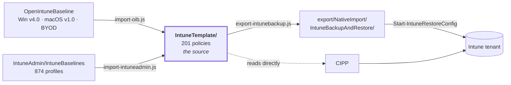

[Nederlands](README.md) · **English** · [Français](README.fr.md)

# IntuneBackup

`IntuneTemplate/` is the source: the agreed Intune policies in CIPP template format (a Table
Storage row with a nested `JSON`/`RAWJson` string). Since August 2026 the content comes
largely from [OpenIntuneBaseline](https://github.com/SkipToTheEndpoint/OpenIntuneBaseline)
(Windows v4.0, macOS v1.0, BYOD), supplemented with what this baseline covers on top of that. Windows v4.0 was
adopted before the official release — see [`ANALYSE.md`](docs/ANALYSE.en.md#round-oib-windows-v40-14-september-2026).

201 policies across four platforms:

| | Settings Catalog | ADMX | Device config | Compliance | App Protection | total |
|---|---|---|---|---|---|---|
| [Windows](IntuneTemplate/WIN/README.en.md) | 118 | 1 | 6 | 11 | – | **136** |
| [macOS](IntuneTemplate/MAC/README.en.md) | 30 | – | 3 | 4 | – | **37** |
| [iOS](IntuneTemplate/IOS/README.en.md) | 8 | – | 2 | 3 | 1 | **14** |
| [Android](IntuneTemplate/AND/README.en.md) | 3 | – | 2 | 8 | 1 | **14** |



**[OVERZICHT.md](docs/OVERZICHT.en.md)** is the summary to share: what is in it, what changed
and what still needs to happen in the tenant.

**[STRUCTUUR.md](docs/STRUCTUUR.en.md)** is the map: which folder contains what, which script reads and
writes what, and which systems the repo is tied to.

**[COMPLIANCE.md](docs/COMPLIANCE.en.md)** is the accountability document for a CISO or auditor: per ISO/IEC 27001:2022
Annex A control, per NIS2 measure (art. 21(2)), per CIS Controls v8.1 safeguard and per NIST CSF
2.0 subcategory, which policies implement it technically, in which phase — and what
remains organisational. Generated by `scripts/generate-compliance.js` from the `controls` in
`_manifest.json` and the vocabulary in `IntuneTemplate/_controls.json`; `check-scope.js` rejects a
policy with a missing or unknown label. What is in git covers Intune only; the
Conditional Access policies from the CA-Policies repo (cloned next to this one as `../CA-Policies`)
are added with `--ca ../CA-Policies/controls/ca-controls.json` — needed for an honest picture of
NIS2 (j), because MFA depends almost entirely on that repo. See [`scripts/README.md`](scripts/README.en.md#the-ca-side-of-compliancemd).

Every policy that a Conditional Access policy touches — compliance, app protection, Windows Hello,
the SSO plug-ins — has a **Conditional Access** section in its README: which CA policies rely on it
and what breaks there if you change it. The link is maintained in `docs/policies.json` of the
CA-Policies repo; a copy is kept here in `IntuneTemplate/_ca.json`.

**Everything for a platform sits together.** Next to the CIPP templates (`SettingsCatalog/`,
`AdministrativeTemplates/`, `DeviceConfigurations/`, `CompliancePolicies/`, `AppProtection/`),
`IntuneTemplate/<PLATFORM>/` also holds the components that are not a CIPP policy type, in folders
that follow the menus of the Intune portal: `Enrollment/` (Autopilot, ADE profiles, restrictions),
`EndpointSecurity/` (App Control, Defender onboarding), `PlatformScripts/`, `Remediations/`,
`ComplianceScripts/`, `Apps/`, `AppConfiguration/` and `AssignmentFilters/`. If a component has
several separate topics, each gets a subfolder. Each platform's README
([Windows](IntuneTemplate/WIN/README.en.md), [macOS](IntuneTemplate/MAC/README.en.md),
[iOS/iPadOS](IntuneTemplate/IOS/README.en.md), [Android](IntuneTemplate/AND/README.en.md)) lists them
under *Other components*; every folder has its own README with deployment instructions. The pipeline
only reads the `Baseline_*.json` templates. `export-intunebackup.js` copies the ADE profiles and the
macOS shell scripts into the export as sidecars; CIPP, `check-scope.js` and
`Set-BaselineAssignment.ps1` do nothing with the other components.

Each folder has a README with the details: [`IntuneTemplate/`](IntuneTemplate/README.en.md) (with
a table per platform), [`scripts/`](scripts/README.en.md) and [`export/`](export/README.en.md).

The shell and platform scripts for Azure Files do the same thing in two forms: a **drive mapping is not a policy**. None
of the 18,329 settingDefinitionIds in the settings catalog maps a network drive, and Group
Policy Preferences → Drive Maps is not ADMX and therefore cannot be ingested. Anyone who wants to get a share to a
group of users does so with a script in user context that is assigned to a
user group.

The McAfee app belongs here for one reason: McAfee puts **Microsoft Defender in passive mode**. The
ASR rules, Controlled Folder Access, Network Protection and Remote Encryption Protection from this
baseline all rely on an active Defender engine. If they land on a device with McAfee,
Intune reports them as succeeded while nothing is enforced.

## Two tenant settings that are not a policy

The baseline cannot set them and `check-scope.js` does not see them, but without these two part
of the rest does nothing. Set them before you start assigning.

| Setting | Where | Why |
|---|---|---|
| **Mark devices with no compliance policy assigned as → Not compliant** | Intune → Devices → Compliance → Compliance policy settings | Defaults to *Compliant*. A device that falls outside *every* assignment because of a filter, an exclusion group or a missing primary user then counts as compliant and passes Conditional Access without issue. The compliance policies in this baseline say nothing about that — they are only evaluated once one is assigned. See [Rozemuller](https://rozemuller.com/why-does-this-intune-device-have-no-compliance-policy-assigned/). |
| **Defender for Endpoint connector** | Intune → Endpoint Security → Microsoft Defender for Endpoint | Needed for onboarding via `WIN - D - Defender EDR Policy` and for a check on the risk score from Defender. That check is deliberately not in the baseline — OpenIntuneBaseline v4.0 does not have it either; `WIN - U - Compliance Defender Real Time Protection` and `Defender Security Intelligence` check what is *on* the device and work without the connector. If you do want to take the risk score into account, enable the connector first: without it the score never arrives and the check silently returns no verdict. |

On macOS the Defender side is a third case: that check does not exist as a setting and requires a
script — see [`IntuneTemplate/MAC/ComplianceScripts/`](IntuneTemplate/MAC/ComplianceScripts/README.en.md).

Next to each template is a markdown file with **every setting that policy sets** — for example
[Windows Hello for Business](IntuneTemplate/WIN/SettingsCatalog/Baseline_WIN_D_Windows_Hello_for_Business.en.md).
Also generated, so it cannot drift from the JSON next to it.

**One baseline.** Until September 2026 there were three sets side by side — `IntuneTemplate/`,
`ISMSTemplate/` and `BASELINE2/`. They have been merged: everything now lives in `IntuneTemplate/`
under the `Baseline_` prefix. What the separate folders did is now done by the `fase` field in
[`_manifest.json`](IntuneTemplate/_manifest.json).

| Phase | What it means | Count |
|---:|---|---:|
| 1 | **Now** — deploy as soon as the baseline is in the tenant. No noticeable effects, or effects that need no preparation. | 102 |
| 2 | **Pilot** — on a pilot group first. Changes something a user notices, or may break something you want to see first. | 42 |
| 3 | **Awaiting prerequisite** — ready, but does nothing today. The iOS and Android compliance policies are waiting for the first enrollment. | 26 |
| 4 | **Dedicated group** — belongs on a specific group, not on all devices. `faseGroep` says which. | 16 |
| 5 | **Do not deploy** — alternative to a policy that *is* deployed. Assigning it causes a Conflict. | 15 |

Only phase 1 is in `_assignments.json`. `check-scope.js` ensures the two do not drift
apart: a phase 1 policy without an assignment is silently not deployed, and a
phase 5 policy *with* an assignment causes a Conflict, after which the disputed setting is applied by neither
policy. Every policy above phase 1 has a mandatory `faseWaarom`.

The phase also determines a policy's **CIPP package** — the `Package` field in the template,
which CIPP uses to group its baselines. See [deploying via a CIPP baseline](#deploying-via-a-cipp-baseline).

**[`ANALYSE.md`](docs/ANALYSE.en.md)** records how the September 2026 additions came about:
which sources were compared, the 509 settings IntuneAdmin sets beyond this baseline, why
14 of them remained, and — more importantly — what is deliberately *not* included and why.

## Layout

```
IntuneTemplate/        the source: the policies in CIPP template format
  _manifest.json      per policy: purpose, origin, phase, standards, deviations from the source
  _assignments.json   assignment target per phase 1 policy
  _controls.json      vocabulary for ISO 27001, NIS2, CIS and NIST CSF
  _licenties.json     which controls a licence can fulfil
  _renames.json       former names in the tenant (source for Rename-BaselinePolicy.ps1)
  _ca.json            which CA policies rely on a policy (copy from the CA-Policies repo)
  _i18n/              English and French translations of the texts in the data
  WIN/  SettingsCatalog/  AdministrativeTemplates/  DeviceConfigurations/  CompliancePolicies/
        Enrollment/  EndpointSecurity/  PlatformScripts/  Remediations/  Apps/
  MAC/  SettingsCatalog/  DeviceConfigurations/  CompliancePolicies/
        Enrollment/  EndpointSecurity/  PlatformScripts/  ComplianceScripts/
  IOS/  SettingsCatalog/  DeviceConfigurations/  CompliancePolicies/  AppProtection/
        Enrollment/  AppConfiguration/
  AND/  SettingsCatalog/  DeviceConfigurations/  CompliancePolicies/  AppProtection/
        Enrollment/  AppConfiguration/  AssignmentFilters/
BaselineTemplate/      the CIPP baseline (generated)
AppTemplate/           CIPP application templates (generated from IntuneTemplate/)
export/NativeImport/   restore export for IntuneBackupAndRestore (generated)
docs/                  overview, compliance, analysis, plan and structure
scripts/               the pipeline and the tenant scripts
```

See [STRUCTUUR.md](docs/STRUCTUUR.en.md#folders) for what each folder contains and who reads it.

The folder can be derived from the file name (platform) and the CIPP `Type` (policy type), and so
carries no information that is not also in the file. That is deliberate: the folder is there for
browsing and filtering per platform, not as a second source of truth that can drift.
`check-scope.js` verifies that every file is in its place.

Five policy types, distinguished by `.Type` in the template:

| `.Type` | Folder | Graph endpoint | IntuneBackupAndRestore folder |
|---|---|---|---|
| `Catalog` | `SettingsCatalog` | `deviceManagement/configurationPolicies` | `Settings Catalog` |
| `Admin` | `AdministrativeTemplates` | `deviceManagement/groupPolicyConfigurations` | `Administrative Templates` |
| `Device` | `DeviceConfigurations` | `deviceManagement/deviceConfigurations` | `Device Configurations` |
| `deviceCompliancePolicies` | `CompliancePolicies` | `deviceManagement/deviceCompliancePolicies` | `Device Compliance Policies` |
| `AppProtection` | `AppProtection` | `deviceAppManagement/managedAppPolicies` | `App Protection Policies` |

## Naming

```
[Baseline] - <WIN|MAC|IOS|AND> - <D|U> - <Item>      policy name in the tenant
Baseline_<WIN|MAC|IOS|AND>_<D|U>_<Item>.json              file name
```

`[Baseline] - ` is the prefix from [`IntuneTemplate/_organisation.json`](IntuneTemplate/_organisation.json);
it also goes in front of every CIPP package and every baseline. Set your own prefix with
`node scripts/set-organisation.js --prefix "Contoso - "`, not by hand: see
[scripts/README.en.md](scripts/README.en.md#your-own-prefix).

The `Baseline_` prefix remains mandatory: `export-intunebackup.js`, `generate-docs.js` and
`Set-BaselineAssignment.ps1` all three filter on it. A file that loses the prefix
silently disappears from all three pipelines.

**When D and when U.** For Windows Settings Catalog the scope follows from the
`settingDefinitionId`, not from the subject: everything with the `user_` prefix is user-scoped, the
rest device-scoped (watch out for `vendor_msft_` ids without a device prefix — those are device-scoped).
A policy never contains both at top level. A mixed policy cannot be assigned
unambiguously, and when troubleshooting you cannot tell whether a setting fails to arrive because the
device or because the user is out of scope.

For macOS, iOS, Android and the other policy types the settingDefinitionId says nothing about
scope (`com.apple.*`), or there are no settings in the file at all. There D/U is a
choice about the assignment target — the way OpenIntuneBaseline uses the letters too — and
`check-scope.js` only checks the naming convention.

Two consequences of this, both visible in `_manifest.json`:

- OIB's *Device Guard, Credential Guard and HVCI*, *Power and Device Lock* and *Windows
  Sandbox* are named `U` there because OIB assigns them to users (among other things to avoid a restart in the middle
  of Autopilot). Their settings are device-scoped, so here they are `D`.
- OIB's *Windows Spotlight and Org Messages* is mixed and has been split here into
  `WIN - U - Windows Spotlight` and `WIN - D - Cloud Optimized Content`.

An exception that does not break the rule: Intune hangs some settings as a **child**
under a parent of the other scope (`allowwindowsconsumerfeatures` and `allowwindowstips`
sit under the user-scoped "Allow Windows Spotlight"). They cannot be configured separately and
travel with their parent; `check-scope.js` reports them and leaves them alone.

## Checks

```bash
node scripts/check-scope.js            # fails on scope, name, folder or conflict problems
node scripts/check-scope.js --report   # overview only
```

Six checks: mixed scope, naming convention, file name vs. policy name, placement in the
correct folder, whether the `Package` field matches the phase and the assignment, and — new since the
OIB import — whether two *assigned* policies set the same setting
to a **different** value. The latter causes a *Conflict* in Intune, after which the
setting is applied by neither policy. The same value from two policies is
not a conflict but duplicate maintenance, and is reported separately. For macOS it is only reported that
several policies deliver the same payload: Apple merges profiles, so that is normal there.

Runs as the first step in `.github/workflows/generate-baseline.yml` and is blocking.

## Derivatives from one source

| Target | Path | Script |
|---|---|---|
| Restore format for IntuneBackupAndRestore | `export/NativeImport/IntuneBackupAndRestore/` | `node scripts/export-intunebackup.js` |
| CIPP baseline (stages and packages) | `BaselineTemplate/Baseline.json` | `node scripts/generate-baseline-template.js` |
| CIPP application templates (Win32 script apps) | `AppTemplate/*.json` | `node scripts/generate-app-templates.js` |
| CIPP | *no conversion* — CIPP reads `IntuneTemplate/` directly | |

**On a change in `IntuneTemplate/`:** `.github/workflows/generate-baseline.yml`
regenerates `export/NativeImport/IntuneBackupAndRestore/`, `BaselineTemplate/Baseline.json` and the
generated documentation automatically and opens a PR for it — review the diff (new or removed
policies, changed settings) before you merge.

## Updating OpenIntuneBaseline

```bash
git -c core.longpaths=true clone --depth 1 https://github.com/SkipToTheEndpoint/OpenIntuneBaseline .oib-source
node scripts/import-oib.js --dry-run
node scripts/import-oib.js
```

> **Since 14 September 2026 the importer is idempotent again:** a second run writes nothing. The
> manual work that a full run used to undo is now in the manifest (`dropSettings`,
> `veldOverrides`, also with `toevoegen` for fields the source does not provide), policies without a source
> and without `type` keep their own Type, and `auditRuleInformation` from newer exports is removed.
> Review the `--dry-run` nonetheless with every new OIB version.

`IntuneTemplate/_manifest.json` determines which OIB policy lands where, with the
reason per policy if anything deviates. `.oib-source/` is gitignored: the generated templates are the
result, and a second copy of an external repo would only go stale here.

`core.longpaths=true` is needed on Windows — OIB has file names that exceed MAX_PATH.

Five things the importer does deliberately:

1. **GUIDs are preserved.** The RowKey/GUID identifies the CIPP template row; a
   rewritten template that got a new GUID would produce a
   second template with the same name on the next sync.
2. **Our own settings that OIB does not know are kept.** This baseline's BitLocker policy also covers
   fixed and removable drives, OIB only the OS drive; blindly overwriting would
   silently switch that off. The rule: a top-level setting from the old template is kept
   unless that settingDefinitionId occurs *anywhere* in the imported OIB set. The run reports
   exactly what was carried over.
3. **Deliberate deviations from OIB are kept.** Point 2 only rescues settings that OIB
   does *not* know. A different *value* on a setting that OIB *does* set — the password reveal eye,
   the Defender action on a low threat — would be silently reverted by every import. Those
   are therefore listed as `overrides` in the manifest, with a mandatory `reason`:

   ```json
   "overrides": [
     {
       "settingDefinitionId": "device_vendor_msft_policy_config_credentialsui_disablepasswordreveal",
       "value": "device_vendor_msft_policy_config_credentialsui_disablepasswordreveal_1",
       "reason": "CIS L1; het onthulknopje maakt meekijken triviaal."
     },
     {
       "parent": "vendor_msft_firewall_mdmstore_domainprofile_enablefirewall",
       "settingDefinitionId": "vendor_msft_firewall_mdmstore_domainprofile_allowlocalpolicymerge",
       "value": "vendor_msft_firewall_mdmstore_domainprofile_allowlocalpolicymerge_false",
       "reason": "OIB zet local policy merge alleen op het openbare profiel."
     }
   ]
   ```

   Without `parent` the setting must already be in the OIB source and only the value is
   replaced; *with* `parent` it is added as a child. If the anchor disappears from a
   new OIB version, **the import stops with an error** instead of letting the override silently
   lapse — the latter is the most dangerous, because the file would still look right
   while the reason is gone. The run lists every applied override.
4. **The outdated PPPC key `Allowed` is removed.** Apple's TCC payload has two
   keys for the same decision: `Allowed` (macOS 10.14) and `Authorization` (macOS 11+).
   They may not appear together in one rule. OIB supplies both, and macOS then rejects the
   **entire** TCC payload: Intune reports `10022` on every field of that rule and the app gets
   no rights at all — not even the right that was set correctly. This hit the macOS policies for
   OneDrive and Defender for Endpoint. See [OpenIntuneBaseline issue
   #62](https://github.com/SkipToTheEndpoint/OpenIntuneBaseline/issues/62); it is still
   open, so this happens again on every import rather than once in the templates. The
   run reports what was removed.
5. **Idempotent.** On a second run the target file itself is the source for those carried-over
   settings, so same input → same output.

Four parts of OIB were deliberately not adopted (the ASR audit variant, the driver update
profiles, update ring 3 and Windows 365) — with the reason, in `"excluded"` in the manifest.

## Restoring into a tenant

**Via CIPP:** point the template repository at this repository. All five `.Type` values
correspond to a `TemplateType` in CIPP's `Set-CIPPIntunePolicy`. After the sync the 201
templates are in CIPP under Tenant Administration → Templates.

### Deploying via a CIPP baseline

Templates in CIPP just sit there; deployment is done by a **baseline** (Tenant Administration →
Baselines). A baseline consists of *standards*, and the standard that deploys these policies is called
**Intune Template Package**: it deploys in one go *every* template that carries the same `Package` value,
and re-determines that membership on every run. A new policy in this repo
therefore moves into the baseline by itself — nothing needs to be clicked in CIPP.

The deploy options of such a standard are copied literally onto every member: **one package is one
assignment target**. That is why not every template carries the same `Package`. The distribution follows from the
phase and the assignment target and is listed in the [`IntuneTemplate` README](IntuneTemplate/README.en.md#cipp-packages);
`set-packages.js` writes the field, `check-scope.js` guards it.

That entire layout is in the repo as a file: [`BaselineTemplate/Baseline.json`](BaselineTemplate/Baseline.json).
It arrives assigned to the placeholder tenant `Exported Template`, so nothing is deployed
until you choose tenants yourself. See the [BaselineTemplate README](BaselineTemplate/README.en.md). If you
prefer to build it by hand: add one *Intune Template Package* per package with the assignment
from that table.

**Note — this file does not come along with the automatic link.** The scheduled sync
(`New-CIPPTemplateRun`) fetches every `.json` and pushes it through `Import-CommunityTemplate` without
looking at `TemplateType`; only the Import button on **Tools → Community Repos** knows about the
branch to the baseline import. The policies in `IntuneTemplate/` therefore arrive by themselves,
the baseline itself you fetch once with that button — and again whenever it changes, for which the
catalogue shows an *UpdateAvailable*. The automatic sync meanwhile turns it into the same
nameless template row as the other non-policy files; that row does nothing and you can delete it in
CIPP.

The stages it contains:

| Stage | Packages | Moving on to *this* stage |
|---:|---|---|
| 1 · Now | `[Baseline] - Baseline-Devices`, `[Baseline] - Baseline-Users`, `[Baseline] - Baseline-ADE-token` and the eight group packages `[Baseline] - Baseline-SEC-*` (phase 4, one per group) | — stage 1 always applies |
| 2 · Pilot | `[Baseline] - Baseline-Pilot` | `success` (everything from stage 1 is compliant) **and** `time` of two weeks |
| 3 · Awaiting prerequisite | `[Baseline] - Baseline-Wacht` | `manual` — someone moves it on |

Later stages stack on stage 1, and the condition belongs to the stage a tenant
**enters**, not the stage it leaves. CIPP has five: `time`, `variable`,
`group`, `success` and `manual`. Put a package in exactly one stage: the same template twice
with a different assignment target collides with CIPP's conflict detection. So let the pilot
grow via the **group** `SEC-Baseline-Pilot` and not via an extra stage.

Note where the restore export lives: `export/**NativeImport**/IntuneBackupAndRestore/`. That
word in the path is not a description but an exclusion. CIPP fetches the file list with
`git/trees?recursive=1` and ignores exactly two things: files that do not end in `.json`,
and paths containing `NativeImport`. There is no subfolder setting. Without that word
CIPP would *also* import those 304 JSON files — the same 201 policies plus their 102 assignments and the
ADE profile that came along, but without a `RowKey`, from which CIPP would then make a **second** template
with the same name and its own GUID.
OpenIntuneBaseline uses the same folder for the same reason.

`BaselineTemplate/Baseline.json` also belongs in that list, but only for the *automatic*
sync: it does not look at `TemplateType` and so makes a nameless row of it too. Via Tools →
Community Repos → Import it *is* recognised as a baseline. See
[below](#deploying-via-a-cipp-baseline).

What remains are the files that are `.json` but not a policy:

- the `_` files in `IntuneTemplate/`, including the translations in `_i18n/`;
- the files in the other components (`Enrollment/`, `AppConfiguration/` etc.): ADE profiles, Graph
  bodies for restrictions, app configuration and filters, App Control and the JSON part of the
  compliance check;
- with the automatic sync, also `BaselineTemplate/Baseline.json`.

CIPP makes one row out of them without a name and without a type (they collapse onto each other because the
deduplication matches on `Displayname`, which is empty for all of these files). That row does nothing;
you can clean it up by deleting it in CIPP. Putting them under a `NativeImport` path is not possible:
the scripts read them where they are.

**Via IntuneBackupAndRestore** (tested against module 4.0.1):

```powershell
Start-IntuneRestoreConfig      -Path '<repo>\export\NativeImport\IntuneBackupAndRestore'
Start-IntuneRestoreAssignments -Path '<repo>\export\NativeImport\IntuneBackupAndRestore' -RestoreById $false
Invoke-IntuneRestoreAppProtectionPolicyAssignment -Path '<repo>\export\NativeImport\IntuneBackupAndRestore' -RestoreById $false
```

`-RestoreById $false` is mandatory: the export deliberately contains no tenant ids, so the module
has to match on policy name. That is also the only mode that works cross-tenant — an id from
tenant A points to nothing in tenant B.

The third line is not an oversight: in 4.0.1 `Start-IntuneRestoreAssignments` *does* call the
assignments for Settings Catalog, ADMX, device configurations and compliance, but **not**
those for App Protection. Without that separate call the two MAM policies are there, but
without an assignment — and then they protect nothing.

Only phase 1 has an assignment in the export. Everything else comes back unassigned and you
assign it afterwards according to its phase — see [Assigning in a tenant](#assigning-in-a-tenant).

The exporter writes the app protection assignments in the form the module expects:
file name `<guid> - <policynaam>.json` (the module reads the name as everything after the first
` - `) and the list in a `value` property instead of a bare array. For the other
policy types the file name is the policy name and the content *is* a bare array.

**Per-tenant values:** the templates and the export contain none. EDR onboarding runs via the
Defender connector: `onboarding_fromconnector` is set to the placeholder `Microsoft ATP connector
enabled` (not encrypted), and Intune fills in the tenant's real onboarding package itself as
long as the connector is enabled. Until September 2026 `Baseline_WIN_D_Defender_for_Endpoint_EDR`
carried the encrypted onboarding token (`encryptedValueToken`) of a single tenant; that has been
replaced by the same connector value. That policy is in phase 5, alongside `Baseline_WIN_D_Defender_EDR_Policy`,
which is the one deployed. Where a tenant value *is* needed, there is a CIPP token (`%OrganizationId%`) — only
CIPP replaces that; on a restore with IntuneBackupAndRestore you fill it in by hand.

## Assigning in a tenant

```powershell
.\scripts\Set-BaselineAssignment.ps1 -Scope D -AllDevices -WhatIf   # dry run
.\scripts\Set-BaselineAssignment.ps1 -Scope D -AllDevices
.\scripts\Set-BaselineAssignment.ps1 -Scope U -AllUsers
.\scripts\Set-BaselineAssignment.ps1 -Platform MAC -Scope D -AllDevices
.\scripts\Set-BaselineAssignment.ps1 -GroupName 'SEC-Baseline-Pilot'
.\scripts\Set-BaselineAssignment.ps1 -GroupId '<object-id>' -Exclude
```

Sets an assignment in one go on the baseline policies that belong to that target, across the five
policy types (each with its own Graph endpoint). Which ones follows from the phase, just as
with the CIPP packages: `-AllDevices` and `-AllUsers` take phase 1 with that target from
`_assignments.json`, `-GroupName 'SEC-Baseline-Pilot'` takes the pilot, and a group from
`faseGroep` takes the phase 4 policies of that group. The script never assigns phases 3 and 5
by itself — until September 2026 `-AllDevices` did, alternatives and pilot included.
`-IgnoreFase` takes everything anyway, for a test tenant; `-Exclude` always applies to all policies.

The `SEC-*` groups (`SEC-Baseline-Pilot`, `SEC-Update-Ring1`, `SEC-Shared-Devices`, …) are
default names, not a requirement. If they are named differently in the tenant, see
[the BaselineTemplate README](BaselineTemplate/README.en.md#what-you-do-yourself-afterwards) for where to rename them.

`-Scope D|U` then filters on the scope in the name, `-Platform` on the platform. Policies that
do not follow the naming convention fall outside *every* filter; the script warns about this explicitly
instead of silently skipping them.

App Protection is a special case: you find the policies via `managedAppPolicies`, but
assigning is only possible via the platform-specific collection (`iosManagedAppProtections` /
`androidManagedAppProtections`). The script translates that based on the `@odata.type`.

Assignments are **added to**, not replaced. Graph's `/assign` always overwrites the
entire list, so the script first reads the existing assignments and POSTs the
merged set; a target that is already present does not create a duplicate. With `-Replace` you
do discard the existing ones. Optionally `-FilterId` + `-FilterType` for an assignment filter.

Policies that are not in the tenant are reported, not created — deploy them first via
CIPP or `Start-IntuneRestoreConfig`.

### Policies without an assignment

Everything above phase 1 deliberately gets no assignment. Which policies those are and why is
listed per phase in [OVERZICHT.md](docs/OVERZICHT.en.md#pilot-first) (the pilot) and in
[COMPLIANCE.md](docs/COMPLIANCE.en.md#organisational-decisions-and-residual-risks) (phases 2 to 5, with the
`faseWaarom` from the manifest). Phase 5 is in each case an *alternative* to a policy that *is*
assigned, not an addition to it: two assigned policies that set the same setting to a different
value cause a Conflict in Intune, after which the setting is applied by neither.
`check-scope.js` guards this.

```powershell
.\scripts\Set-BaselineAssignment.ps1 -Name '[Baseline] - WIN - D - Windows Update Ring 1 Pilot' -GroupName 'SEC-Update-Ring1'
.\scripts\Set-BaselineAssignment.ps1 -Name '[Baseline] - WIN - D - Windows Hello for Business Multi User' -GroupName 'SEC-Shared-Devices'
```

The WHfB variant for shared devices is the only one you can assign *alongside* its counterpart:
the four overlapping settings have the same value there, so there is nothing to
collide — it only adds `DisablePostLogonProvisioning`.

### What to put in a pilot first

The rest of the baseline is conservative in content, but these policies change behaviour that
directly affects users or old systems. OpenIntuneBaseline says the same: it is a
starting point, not a ready-made production configuration.

That is phase 2, and the list — with the reason per policy — is in
[OVERZICHT.md](docs/OVERZICHT.en.md#pilot-first). It is generated from `faseWaarom` in the
manifest. Until September 2026 there was a separate list here, and it drifted: nine of the
policies on it were in phase 1 and were simply deployed to all devices via `[Baseline] - Baseline-Devices`.
Windows Hello for Business goes into the pilot as a pair, device *and* user — one in the
pilot and the other on everyone makes the pilot pointless.

## Bringing a backup from a tenant back into the source

```powershell
node scripts/import-intunebackup.js "C:\Temp\BaselineIntuneBackup" [--overwrite] [--dry-run]
```

Converts an IntuneBackupAndRestore export into `IntuneTemplate/`. By default only
policies that do not exist yet are added; existing templates are kept unless you pass
`--overwrite`. An export from a tenant is not automatically fresher than what is
here — blindly overwriting silently reverts a baseline change.

A policy that already exists here keeps its path and GUID; new policies are sorted by
platform and policy type from their name. Names that do not follow the convention are reported, not
guessed.

The importer also rejects truncated Settings Catalog exports (`settingCount` differs from
the number of exported settings). That really happens: Graph paginates the
settings navigation property at 25 by default, and an export that does not follow that produces a policy
that is missing most of its settings on restore.

## Updating the tenant

The policies are still in the tenant under their old names. `IntuneTemplate/_renames.json` records
what they were called and what corresponds to them now:

```powershell
.\scripts\Rename-BaselinePolicy.ps1 -WhatIf     # mandatory first run
.\scripts\Rename-BaselinePolicy.ps1
```

Renaming is done with a `PATCH`: the policy id, the assignments and the assignment history
stay intact. `Start-IntuneRestoreConfig` creates policies by name and would put a duplicate under the new
name next to the old one.

Three rules in `_renames.json` require manual work and are only reported by the script:

- **replace** — the policy type changes, so a PATCH is not possible. `Windows Firewall` became an
  Endpoint Security template and `Microsoft Office Updates` moved from ADMX to Settings
  Catalog. The old policy must be removed before the new one is added.
- **retire** — goes away entirely; `replacedBy` says where the settings are now.
- **duplicate / both present** (`DUPLICATE` / `BOTH PRESENT` in the output) — old and new name both exist. First work out which
  is the real one.
