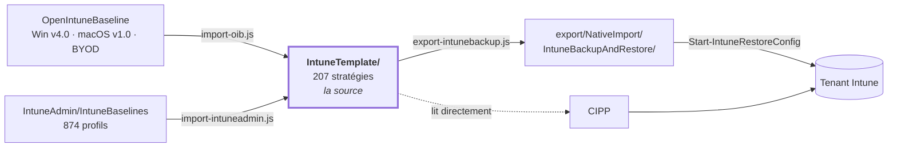

[Nederlands](README.md) · [English](README.en.md) · **Français**

# IntuneBackup

`IntuneTemplate/` est la source : les stratégies Intune convenues au format de modèle CIPP (une ligne
Table Storage avec une chaîne `JSON`/`RAWJson` imbriquée). Depuis août 2026, le contenu provient
en grande partie d'[OpenIntuneBaseline](https://github.com/SkipToTheEndpoint/OpenIntuneBaseline)
(Windows v4.0, macOS v1.0, BYOD), complété par ce que cette baseline couvre en plus. Windows v4.0 a été
repris avant la publication officielle — voir [`ANALYSE.md`](docs/ANALYSE.fr.md#itération-oib-windows-v40-14-septembre-2026).

207 stratégies sur quatre plateformes :

| | Settings Catalog | ADMX | Device config | Compliance | App Protection | total |
|---|---|---|---|---|---|---|
| [Windows](IntuneTemplate/WIN/README.fr.md) | 124 | 1 | 6 | 11 | – | **142** |
| [macOS](IntuneTemplate/MAC/README.fr.md) | 30 | – | 3 | 4 | – | **37** |
| [iOS](IntuneTemplate/IOS/README.fr.md) | 8 | – | 2 | 3 | 1 | **14** |
| [Android](IntuneTemplate/AND/README.fr.md) | 3 | – | 2 | 8 | 1 | **14** |



**[OVERZICHT.md](docs/OVERZICHT.fr.md)** est le résumé à partager : ce qu'il contient, ce qui a changé
et ce qui reste à faire dans le tenant.

**[STRUCTUUR.md](docs/STRUCTUUR.fr.md)** est le plan : quel dossier contient quoi, quel script lit et
écrit quoi, et à quels systèmes le dépôt est lié.

**[AVD.md](docs/AVD.fr.md)** indique pour chaque stratégie Windows si elle a aussi sa place sur les hôtes de session
Azure Virtual Desktop, avec le filtre d'affectation qui fait la distinction et le plan de déploiement pour AVD.

**[PLAYBOOK.md](docs/PLAYBOOK.fr.md)** est le guide de déploiement pour les ingénieurs : déployer la
baseline via CIPP dans un tenant client avec les trois classes d'appareils (commune, physique, AVD)
et leurs filtres, la migration depuis un ancien ensemble, les contrôles et le dépannage, et la
convention de nommage.

**[COMPLIANCE.md](docs/COMPLIANCE.fr.md)** est la justification destinée à un RSSI ou à un auditeur : pour chaque mesure
de l'annexe A de l'ISO/IEC 27001:2022, chaque mesure NIS2 (art. 21, par. 2), chaque safeguard CIS Controls v8.1 et chaque
sous-catégorie NIST CSF 2.0, quelles stratégies la mettent en œuvre techniquement, dans quelle phase — et ce qui
reste organisationnel. Généré par `scripts/generate-compliance.js` à partir des `controls` de
`_manifest.json` et du vocabulaire de `IntuneTemplate/_controls.json` ; `check-scope.js` refuse une
stratégie sans étiquette ou avec une étiquette inconnue. Ce qui est dans git ne concerne qu'Intune ; les
stratégies Conditional Access du dépôt CA-Policies (cloné à côté de celui-ci sous `../CA-Policies`)
s'y ajoutent avec `--ca ../CA-Policies/controls/ca-controls.json` — nécessaire pour une image honnête
de NIS2 (j), car la MFA dépend presque entièrement de ce dépôt. Voir [`scripts/README.md`](scripts/README.fr.md#le-volet-ca-de-compliancemd).

Chaque stratégie touchée par une stratégie Conditional Access — conformité, app protection, Windows Hello,
les plug-ins SSO — a dans son README une section **Conditional Access** : quelles stratégies CA s'appuient
sur elle et ce qui casse là-bas si vous la modifiez. Le lien est maintenu dans `docs/policies.json` du
dépôt CA-Policies ; une copie est conservée ici dans `IntuneTemplate/_ca.json`.

**Tout ce qui concerne une plateforme est regroupé.** À côté des modèles CIPP (`SettingsCatalog/`,
`AdministrativeTemplates/`, `DeviceConfigurations/`, `CompliancePolicies/`, `AppProtection/`),
`IntuneTemplate/<PLATFORME>/` contient aussi les éléments qui ne sont pas un type de stratégie CIPP,
dans des dossiers qui suivent les menus du portail Intune : `Enrollment/` (Autopilot, profils ADE,
restrictions), `EndpointSecurity/` (App Control, intégration Defender), `PlatformScripts/`,
`Remediations/`, `ComplianceScripts/`, `Apps/`, `AppConfiguration/` et `AssignmentFilters/`. Si un
élément comporte plusieurs sujets distincts, chacun a son sous-dossier. Le README de chaque plateforme
([Windows](IntuneTemplate/WIN/README.fr.md), [macOS](IntuneTemplate/MAC/README.fr.md),
[iOS/iPadOS](IntuneTemplate/IOS/README.fr.md), [Android](IntuneTemplate/AND/README.fr.md)) les liste
sous *Autres éléments* ; chaque dossier a son propre README avec les instructions de déploiement. Le
pipeline ne lit que les modèles `Baseline_*.json`. `export-intunebackup.js` copie les profils ADE et
les scripts shell macOS dans l'export en tant que fichiers annexes (sidecar) ; CIPP, `check-scope.js`
et `Set-BaselineAssignment.ps1` ne font rien des autres éléments.

Chaque dossier possède un README avec les détails : [`IntuneTemplate/`](IntuneTemplate/README.fr.md) (avec
un tableau par plateforme), [`scripts/`](scripts/README.fr.md) et [`export/`](export/README.fr.md).

Les scripts shell et de plateforme pour Azure Files font la même chose sous deux formes : un **mappage de lecteur n'est pas une stratégie**. Aucun
des 18 329 settingDefinitionId du settings catalog ne mappe un lecteur réseau, et Group
Policy Preferences → Drive Maps n'est pas de l'ADMX et ne peut donc pas être ingéré. Pour fournir un partage à un
groupe d'utilisateurs, on utilise un script en contexte utilisateur affecté à un
groupe d'utilisateurs.

L'application McAfee figure ici pour une seule raison : McAfee met **Microsoft Defender en mode passif**. Les
règles ASR, Controlled Folder Access, Network Protection et Remote Encryption Protection de cette
baseline reposent toutes sur un moteur Defender actif. Si elles arrivent sur un appareil avec McAfee,
Intune les indique comme réussies alors que rien n'est appliqué.

## Deux paramètres du tenant qui ne sont pas des stratégies

La baseline ne peut pas les définir et `check-scope.js` ne les voit pas, mais sans ces deux-là une
partie du reste ne fait rien. Définissez-les avant de commencer les affectations.

| Paramètre | Où | Pourquoi |
|---|---|---|
| **Marquer les appareils sans stratégie de conformité affectée comme → Non conforme** | Intune → Appareils → Conformité → Paramètres de stratégie de conformité | Vaut *Conforme* par défaut. Un appareil qui échappe à *toute* affectation à cause d'un filtre, d'un groupe d'exclusion ou d'un utilisateur principal manquant compte alors comme conforme et passe Conditional Access sans problème. Les stratégies de conformité de cette baseline n'y changent rien — elles ne sont évaluées qu'une fois qu'une est affectée. Voir [Rozemuller](https://rozemuller.com/why-does-this-intune-device-have-no-compliance-policy-assigned/). |
| **Connecteur Defender for Endpoint** | Intune → Endpoint Security → Microsoft Defender for Endpoint | Nécessaire pour l'intégration via `WIN - D - Defender EDR Policy` et pour un contrôle du score de risque de Defender. Ce contrôle ne figure volontairement pas dans la baseline — OpenIntuneBaseline v4.0 ne l'a pas non plus ; `WIN - U - Compliance Defender Real Time Protection` et `Defender Security Intelligence` contrôlent ce qui se trouve *sur* l'appareil et fonctionnent sans connecteur. Si vous voulez malgré tout prendre en compte le score de risque, activez d'abord le connecteur : sans lui, le score n'arrive jamais et le contrôle reste muet, sans verdict. |

Sur macOS, le volet Defender est un troisième cas : ce contrôle n'existe pas en tant que paramètre et nécessite un
script — voir [`IntuneTemplate/MAC/ComplianceScripts/`](IntuneTemplate/MAC/ComplianceScripts/README.fr.md).

À côté de chaque modèle se trouve un fichier markdown listant **chaque paramètre que cette stratégie définit** — par exemple
[Windows Hello for Business](IntuneTemplate/WIN/SettingsCatalog/Baseline_WIN_D_Windows_Hello_for_Business.fr.md).
Également généré, il ne peut donc pas diverger du JSON voisin.

**Une seule baseline.** Jusqu'en septembre 2026, trois ensembles coexistaient — `IntuneTemplate/`,
`ISMSTemplate/` et `BASELINE2/`. Ils ont été fusionnés : tout se trouve désormais dans `IntuneTemplate/`
sous le préfixe `Baseline_`. Ce que faisaient les dossiers séparés, c'est maintenant le champ `fase` de
[`_manifest.json`](IntuneTemplate/_manifest.json) qui le fait.

| Phase | Signification | Nombre |
|---:|---|---:|
| 1 | **Immédiat** — déployer dès que la baseline est dans le tenant. Aucun effet perceptible, ou des effets qui ne demandent aucune préparation. | 106 |
| 2 | **Pilote** — d'abord sur un groupe pilote. Modifie quelque chose que l'utilisateur remarque, ou peut casser quelque chose que vous voulez voir d'abord. | 42 |
| 3 | **En attente d'un prérequis** — prête, mais ne fait rien aujourd'hui. Les stratégies de conformité iOS et Android attendent la première inscription. | 26 |
| 4 | **Groupe dédié** — destinée à un groupe spécifique, pas à tous les appareils. `faseGroep` indique lequel. | 18 |
| 5 | **Ne pas déployer** — alternative à une stratégie qui, elle, *est* déployée. L'affecter provoque un Conflict. | 15 |

Seule la phase 1 figure dans `_assignments.json`. `check-scope.js` veille à ce que les deux ne
divergent pas : une stratégie de phase 1 sans affectation n'est silencieusement pas déployée, et une
stratégie de phase 5 *avec* affectation provoque un Conflict, après quoi le paramètre contesté n'est appliqué par aucune
des deux stratégies. Toute stratégie au-delà de la phase 1 a un `faseWaarom` obligatoire.

Chaque stratégie Windows a en outre un **`doelgroep`** (classe cible) : `alle`, `fysiek` ou `avd`.
En phases 1 et 2, une stratégie `fysiek` ou `avd` reçoit un filtre d'inclusion (`WIN - Physical`,
`WIN - AVD Multi-session`) et son propre paquet ; `_assignments.json` contient ce filtre par son
nom (`filterDisplayName`). Voir [PLAYBOOK.fr.md](docs/PLAYBOOK.fr.md) et [AVD.fr.md](docs/AVD.fr.md).

La phase détermine aussi le **paquet CIPP** d'une stratégie — le champ `Package` du modèle,
sur lequel CIPP regroupe ses baselines. Voir [déployer via une baseline CIPP](#déployer-via-une-baseline-cipp).

**[`ANALYSE.md`](docs/ANALYSE.fr.md)** consigne comment le complément de septembre 2026 a vu le jour :
quelles sources ont été comparées, les 509 paramètres qu'IntuneAdmin définit en plus de cette baseline, pourquoi
14 d'entre eux ont été retenus, et — surtout — ce qui n'y figure volontairement *pas* et pourquoi.

## Organisation

```
IntuneTemplate/        la source : les stratégies au format de modèle CIPP
  _manifest.json      par stratégie : objectif, origine, phase, normes, écarts par rapport à la source
  _assignments.json   cible d'affectation par stratégie de phase 1
  _controls.json      vocabulaire pour ISO 27001, NIS2, CIS et NIST CSF
  _licenties.json     quels contrôles une licence permet de couvrir
  _renames.json       anciens noms dans le tenant (source pour Rename-BaselinePolicy.ps1)
  _ca.json            quelles stratégies CA s'appuient sur une stratégie (copie du dépôt CA-Policies)
  _i18n/              traductions anglaises et françaises des textes issus des données
  WIN/  SettingsCatalog/  AdministrativeTemplates/  DeviceConfigurations/  CompliancePolicies/
        Enrollment/  EndpointSecurity/  PlatformScripts/  Remediations/  Apps/
  MAC/  SettingsCatalog/  DeviceConfigurations/  CompliancePolicies/
        Enrollment/  EndpointSecurity/  PlatformScripts/  ComplianceScripts/
  IOS/  SettingsCatalog/  DeviceConfigurations/  CompliancePolicies/  AppProtection/
        Enrollment/  AppConfiguration/
  AND/  SettingsCatalog/  DeviceConfigurations/  CompliancePolicies/  AppProtection/
        Enrollment/  AppConfiguration/  AssignmentFilters/
BaselineTemplate/      la baseline CIPP (générée)
AppTemplate/           templates d'application CIPP (générés depuis IntuneTemplate/)
export/NativeImport/   export de restauration pour IntuneBackupAndRestore (généré)
docs/                  vue d'ensemble, conformité, analyse, plan et structure
scripts/               le pipeline et les scripts de tenant
```

Voir [STRUCTUUR.md](docs/STRUCTUUR.fr.md#dossiers) pour le contenu de chaque dossier et qui le lit.

Le dossier se déduit du nom de fichier (plateforme) et du `Type` CIPP (type de stratégie) et ne
porte donc aucune information qui ne figure pas aussi dans le fichier. C'est voulu : le dossier sert à
parcourir et à filtrer par plateforme, pas à constituer une seconde vérité susceptible de
diverger. `check-scope.js` vérifie que chaque fichier est à sa place.

Cinq types de stratégie, distingués par `.Type` dans le modèle :

| `.Type` | Dossier | Endpoint Graph | Dossier IntuneBackupAndRestore |
|---|---|---|---|
| `Catalog` | `SettingsCatalog` | `deviceManagement/configurationPolicies` | `Settings Catalog` |
| `Admin` | `AdministrativeTemplates` | `deviceManagement/groupPolicyConfigurations` | `Administrative Templates` |
| `Device` | `DeviceConfigurations` | `deviceManagement/deviceConfigurations` | `Device Configurations` |
| `deviceCompliancePolicies` | `CompliancePolicies` | `deviceManagement/deviceCompliancePolicies` | `Device Compliance Policies` |
| `AppProtection` | `AppProtection` | `deviceAppManagement/managedAppPolicies` | `App Protection Policies` |

## Nommage

```
[Baseline] - <WIN|MAC|IOS|AND> - <D|U> - <Item>      nom de la stratégie dans le tenant
Baseline_<WIN|MAC|IOS|AND>_<D|U>_<Item>.json              nom de fichier
```

`[Baseline] - ` est le préfixe de [`IntuneTemplate/_organisation.json`](IntuneTemplate/_organisation.json) ;
il précède aussi chaque package CIPP et chaque baseline. Un préfixe propre se définit avec
`node scripts/set-organisation.js --prefix "Contoso - "`, pas à la main : voir
[scripts/README.fr.md](scripts/README.fr.md#un-préfixe-propre).

Le préfixe `Baseline_` reste obligatoire : `export-intunebackup.js`, `generate-docs.js` et
`Set-BaselineAssignment.ps1` filtrent tous trois dessus. Un fichier qui perd ce préfixe
disparaît silencieusement des trois pipelines.

**Quand D et quand U.** Pour le Settings Catalog Windows, la portée découle du
`settingDefinitionId`, pas du sujet : tout ce qui porte le préfixe `user_` est de portée utilisateur, le
reste de portée appareil (attention aux ids `vendor_msft_` sans préfixe device — ils sont de portée appareil).
Une stratégie ne contient jamais les deux au niveau supérieur. Une stratégie mixte ne peut pas être affectée
sans ambiguïté, et lors du dépannage on ne voit pas si un paramètre n'arrive pas parce que
l'appareil ou parce que l'utilisateur est hors portée.

Pour macOS, iOS, Android et les autres types de stratégie, le settingDefinitionId ne dit rien de la
portée (`com.apple.*`), ou le fichier ne contient aucun paramètre. Là, D/U est un
choix quant à la cible d'affectation — comme OpenIntuneBaseline utilise aussi ces lettres — et
`check-scope.js` ne contrôle que la convention de nommage.

Deux conséquences, toutes deux visibles dans `_manifest.json` :

- *Device Guard, Credential Guard and HVCI*, *Power and Device Lock* et *Windows
  Sandbox* d'OIB y portent `U` parce qu'OIB les affecte aux utilisateurs (entre autres pour éviter un redémarrage en plein
  Autopilot). Leurs paramètres sont de portée appareil, ici ce sont donc des `D`.
- *Windows Spotlight and Org Messages* d'OIB est mixte et a été scindé ici en
  `WIN - U - Windows Spotlight` et `WIN - D - Cloud Optimized Content`.

Une exception qui ne contredit pas la règle : Intune place certains paramètres comme **enfant**
sous un parent de l'autre portée (`allowwindowsconsumerfeatures` et `allowwindowstips`
se trouvent sous « Allow Windows Spotlight », de portée utilisateur). Ils ne peuvent pas être configurés séparément et
suivent leur parent ; `check-scope.js` les signale et les laisse en place.

## Contrôles

```bash
node scripts/check-scope.js            # échoue en cas de problème de portée, de nom, de dossier ou de conflit
node scripts/check-scope.js --report   # uniquement la synthèse
```

Six contrôles : portée mixte, convention de nommage, nom de fichier vs nom de stratégie, emplacement dans le
bon dossier, concordance du champ `Package` avec la phase et l'affectation, et — nouveau depuis
l'import OIB — si deux stratégies *affectées* définissent le même paramètre
sur une valeur **différente**. Ce dernier cas provoque un *Conflict* dans Intune, après quoi le
paramètre n'est appliqué par aucune des deux stratégies. La même valeur issue de deux stratégies n'est
pas un conflit mais une double maintenance, et est signalée à part. Pour macOS, on signale seulement que
plusieurs stratégies fournissent le même payload : Apple fusionne les profils, c'est normal là-bas.

S'exécute comme première étape de `.github/workflows/generate-baseline.yml` et est bloquant.

## Dérivés d'une seule source

| Cible | Chemin | Script |
|---|---|---|
| Format de restauration pour IntuneBackupAndRestore | `export/NativeImport/IntuneBackupAndRestore/` | `node scripts/export-intunebackup.js` |
| Baseline CIPP (stages et paquets) | `BaselineTemplate/Baseline.json` | `node scripts/generate-baseline-template.js` |
| Templates d'application CIPP (apps Win32 par script) | `AppTemplate/*.json` | `node scripts/generate-app-templates.js` |
| Templates DLP CIPP (Purview) | `DlpCompliancePolicyTemplate/*.json` | `node scripts/generate-dlp-templates.js` |
| CIPP | *aucune conversion* — CIPP lit `IntuneTemplate/` directement | |

**En cas de modification dans `IntuneTemplate/` :** `.github/workflows/generate-baseline.yml`
régénère `export/NativeImport/IntuneBackupAndRestore/`, `BaselineTemplate/Baseline.json` et la
documentation générée automatiquement et ouvre une PR à cet effet — vérifiez le diff (stratégies
nouvelles ou supprimées, paramètres modifiés) avant de fusionner.

## Mettre à jour OpenIntuneBaseline

```bash
git -c core.longpaths=true clone --depth 1 https://github.com/SkipToTheEndpoint/OpenIntuneBaseline .oib-source
node scripts/import-oib.js --dry-run
node scripts/import-oib.js
```

> **Depuis le 14 septembre 2026, l'importeur est de nouveau idempotent :** une deuxième exécution n'écrit rien. Le
> travail manuel qu'une exécution complète annulait auparavant figure désormais dans le manifeste (`dropSettings`,
> `veldOverrides`, aussi avec `toevoegen` pour les champs que la source ne fournit pas), les stratégies sans source
> et sans `type` conservent leur propre Type, et `auditRuleInformation` issu d'exports plus récents est supprimé.
> Relisez néanmoins le `--dry-run` à chaque nouvelle version d'OIB.

`IntuneTemplate/_manifest.json` détermine où atterrit chaque stratégie OIB, avec pour chaque stratégie la
raison en cas d'écart. `.oib-source/` est dans le gitignore : les modèles générés sont le
résultat, et une seconde copie d'un dépôt externe ne ferait que vieillir ici.

`core.longpaths=true` est nécessaire sous Windows — OIB a des noms de fichiers qui dépassent MAX_PATH.

Cinq choses que l'importeur fait délibérément :

1. **Les GUID sont conservés.** Le RowKey/GUID identifie la ligne de modèle CIPP ; un
   modèle réécrit qui recevrait un nouveau GUID produirait, à la synchronisation suivante, un
   second modèle portant le même nom.
2. **Nos propres paramètres inconnus d'OIB sont conservés.** La stratégie BitLocker de cette baseline couvre aussi
   les lecteurs fixes et amovibles, OIB seulement le lecteur du système ; écraser aveuglément désactiverait
   cela silencieusement. La règle : un paramètre de premier niveau de l'ancien modèle est conservé,
   sauf si ce settingDefinitionId apparaît *quelque part* dans l'ensemble OIB importé. L'exécution indique
   précisément ce qui a été repris.
3. **Les écarts volontaires par rapport à OIB sont conservés.** Le point 2 ne sauve que les paramètres qu'OIB
   ne connaît *pas*. Une *valeur* différente sur un paramètre qu'OIB définit *bien* — l'œil de révélation du mot de passe,
   l'action Defender en cas de menace faible — serait annulée silencieusement à chaque import. Ils
   figurent donc comme `overrides` dans le manifeste, avec un `reason` obligatoire :

   ```json
   "overrides": [
     {
       "settingDefinitionId": "device_vendor_msft_policy_config_credentialsui_disablepasswordreveal",
       "value": "device_vendor_msft_policy_config_credentialsui_disablepasswordreveal_1",
       "reason": "CIS L1; het onthulknopje maakt meekijken triviaal."
     },
     {
       "parent": "vendor_msft_firewall_mdmstore_domainprofile_enablefirewall",
       "settingDefinitionId": "vendor_msft_firewall_mdmstore_domainprofile_allowlocalpolicymerge",
       "value": "vendor_msft_firewall_mdmstore_domainprofile_allowlocalpolicymerge_false",
       "reason": "OIB zet local policy merge alleen op het openbare profiel."
     }
   ]
   ```

   Sans `parent`, le paramètre doit déjà figurer dans la source OIB et seule la valeur est
   remplacée ; *avec* `parent`, il est ajouté comme enfant. Si le point d'ancrage disparaît d'une
   nouvelle version d'OIB, **l'import s'arrête avec une erreur** au lieu de laisser l'override tomber
   silencieusement — ce dernier cas est le plus dangereux, car le fichier semble toujours correct
   alors que la raison a disparu. L'exécution énumère chaque override appliqué.
4. **La clé PPPC obsolète `Allowed` est supprimée.** Le payload TCC d'Apple comporte deux
   clés pour la même décision : `Allowed` (macOS 10.14) et `Authorization` (macOS 11+).
   Elles ne peuvent pas figurer ensemble dans une même règle. OIB fournit les deux, et macOS rejette alors le
   payload TCC **entier** : Intune signale `10022` sur chaque champ de cette règle et l'application n'obtient
   aucun droit — pas même celui qui était correctement défini. Cela touchait les stratégies macOS pour
   OneDrive et Defender for Endpoint. Voir [OpenIntuneBaseline issue
   #62](https://github.com/SkipToTheEndpoint/OpenIntuneBaseline/issues/62) ; elle est toujours
   ouverte, donc cela se produit à chaque import plutôt qu'une seule fois dans les modèles.
   L'exécution indique ce qui a été supprimé.
5. **Idempotent.** Lors d'une deuxième exécution, le fichier cible lui-même est la source de ces paramètres
   repris, donc même entrée → même sortie.

Quatre éléments d'OIB n'ont volontairement pas été repris (la variante d'audit ASR, les driver
update profiles, l'anneau de mise à jour 3 et Windows 365) — avec leur raison, dans `"excluded"` du manifeste.

## Restaurer dans un tenant

**Via CIPP :** faites pointer le dépôt de modèles vers ce dépôt. Les cinq valeurs de `.Type`
correspondent toutes à un `TemplateType` du `Set-CIPPIntunePolicy` de CIPP. Après la synchronisation, les 207
modèles figurent dans CIPP sous Tenant Administration → Templates.

### Déployer via une baseline CIPP

Dans CIPP, les modèles ne font qu'être présents ; le déploiement est l'affaire d'une **baseline** (Tenant Administration →
Baselines). Une baseline se compose de *standards*, et le standard qui déploie ces stratégies s'appelle
**Intune Template Package** : il déploie en une fois *chaque* modèle portant la même valeur `Package`,
et redétermine cette appartenance à chaque exécution. Une nouvelle stratégie dans ce dépôt
entre donc d'elle-même dans la baseline — rien n'est à cliquer dans CIPP.

Les options de déploiement d'un tel standard sont copiées telles quelles sur chaque membre : **un paquet égale une
cible d'affectation**. C'est pourquoi tous les modèles ne portent pas le même `Package`. La répartition découle de la
phase et de la cible d'affectation et figure dans le [README d'`IntuneTemplate`](IntuneTemplate/README.fr.md#packages-cipp) ;
`set-packages.js` écrit le champ, `check-scope.js` le surveille.

Toute cette organisation se trouve dans le dépôt sous forme de fichier : [`BaselineTemplate/Baseline.json`](BaselineTemplate/Baseline.json).
Il arrive affecté au tenant fictif `Exported Template`, donc rien n'est déployé
tant que vous n'avez pas choisi vous-même des tenants. Voir le [README de BaselineTemplate](BaselineTemplate/README.fr.md). Si vous
préférez la construire à la main : ajoutez un *Intune Template Package* par paquet avec l'affectation
de ce tableau.

**Attention — ce fichier n'est pas repris par la liaison automatique.** La synchronisation planifiée
(`New-CIPPTemplateRun`) récupère chaque `.json` et le fait passer par `Import-CommunityTemplate`, sans
regarder `TemplateType` ; seul le bouton Import de **Tools → Community Repos** connaît
l'aiguillage vers l'import de baseline. Les stratégies de `IntuneTemplate/` arrivent donc d'elles-mêmes,
la baseline elle-même se récupère une fois avec ce bouton — et à nouveau lorsqu'elle change, ce que le
catalogue signale par un *UpdateAvailable*. Entre-temps, la synchronisation automatique en fait la même
ligne de modèle sans nom que pour les autres fichiers non-stratégie ; celle-ci ne fait rien et peut être supprimée dans
CIPP.

Les stages qu'elle contient :

| Stage | Paquets | Passage à *ce* stage |
|---:|---|---|
| 1 · Immédiat | `[Baseline] - Baseline-Devices`, `-Devices-Physical`, `-Devices-AVD`, `[Baseline] - Baseline-Users`, `-Users-Physical`, `[Baseline] - Baseline-ADE-token` et les paquets de groupe `[Baseline] - Baseline-SEC-*` (phase 4, un par groupe) | — le stage 1 s'applique toujours |
| 2 · Pilote | `[Baseline] - Baseline-Pilot`, `[Baseline] - Baseline-Pilot-Physical` | `success` (tout le stage 1 est conforme) **et** `time` de deux semaines |
| 3 · En attente d'un prérequis | `[Baseline] - Baseline-Wacht` | `manual` — quelqu'un le fait avancer |

Les stages suivants s'empilent sur le stage 1, et la condition appartient au stage dans lequel un tenant
**entre**, pas à celui qu'il quitte. CIPP en connaît cinq : `time`, `variable`,
`group`, `success` et `manual`. Placez un paquet dans exactement un stage : le même modèle deux
fois avec une cible d'affectation différente se heurte à la détection de conflits de CIPP. Faites donc
grandir le pilote via le **groupe** `SEC-Baseline-Pilot` et non via un stage supplémentaire.

Notez où se trouve l'export de restauration : `export/**NativeImport**/IntuneBackupAndRestore/`. Ce
mot dans le chemin n'est pas une description mais une exclusion. CIPP récupère la liste des fichiers avec
`git/trees?recursive=1` et ignore exactement deux choses : les fichiers qui ne se terminent pas par `.json`,
et les chemins contenant `NativeImport`. Il n'existe pas de paramètre de sous-dossier. Sans ce mot,
CIPP importerait *aussi* ces 293 fichiers JSON — les mêmes 207 stratégies plus leurs 85 affectations et le
profil ADE embarqué, mais sans `RowKey`, dont CIPP ferait alors un **second** modèle
portant le même nom et son propre GUID.
OpenIntuneBaseline utilise le même dossier pour la même raison.

`BaselineTemplate/Baseline.json` fait aussi partie de cette liste, mais uniquement pour la synchronisation *automatique* :
celle-ci ne regarde pas `TemplateType` et en fait donc aussi une ligne sans nom. Via Tools →
Community Repos → Import, il *est* reconnu comme baseline. Voir
[ci-dessous](#déployer-via-une-baseline-cipp).

Ce qui reste, ce sont les fichiers qui sont bien des `.json` mais pas des stratégies :

- les fichiers `_` de `IntuneTemplate/`, y compris les traductions dans `_i18n/` ;
- les fichiers des autres éléments (`Enrollment/`, `AppConfiguration/` etc.) : profils ADE, corps
  Graph pour les restrictions, la configuration d'applications et les filtres, App Control et la
  partie JSON du contrôle de conformité ;
- avec la synchronisation automatique, aussi `BaselineTemplate/Baseline.json`.

CIPP en fait une seule ligne sans nom et sans type (ils se confondent parce que la
déduplication se fait sur `Displayname`, vide pour tous ces fichiers). Cette ligne ne fait rien ;
on peut la nettoyer en la supprimant dans CIPP. Les placer sous un chemin `NativeImport` n'est pas possible :
les scripts les lisent là où ils se trouvent.

**Via IntuneBackupAndRestore** (testé avec le module 4.0.1) :

```powershell
Start-IntuneRestoreConfig      -Path '<repo>\export\NativeImport\IntuneBackupAndRestore'
Start-IntuneRestoreAssignments -Path '<repo>\export\NativeImport\IntuneBackupAndRestore' -RestoreById $false
Invoke-IntuneRestoreAppProtectionPolicyAssignment -Path '<repo>\export\NativeImport\IntuneBackupAndRestore' -RestoreById $false
```

`-RestoreById $false` est obligatoire : l'export ne contient volontairement aucun id de tenant, le module
doit donc faire la correspondance sur le nom de la stratégie. C'est aussi le seul mode qui fonctionne entre tenants — un id du
tenant A ne pointe vers rien dans le tenant B.

La troisième ligne n'est pas un oubli : dans la 4.0.1, `Start-IntuneRestoreAssignments` appelle bien les
affectations du Settings Catalog, de l'ADMX, des device configurations et de la conformité, mais **pas**
celles d'App Protection. Sans cet appel séparé, les deux stratégies MAM sont bien présentes, mais
sans affectation — et elles ne protègent alors rien.

Seule la phase 1 a une affectation dans l'export. Tout le reste revient sans affectation et
s'affecte ensuite selon sa phase — voir [Affecter dans un tenant](#affecter-dans-un-tenant).
Les 21 stratégies de phase 1 dotées d'un filtre d'affectation (`fysiek`, `avd`) reviennent aussi
sans affectation : le module restaure `target` tel quel et ne peut pas rechercher un filtre par son
nom, et un id de filtre est propre au tenant. Affectez-les ensuite avec
`Set-BaselineAssignment.ps1 -AllDevices -Doelgroep fysiek,avd -CreateFilters` (et `-AllUsers`), ou
exportez pour un seul tenant avec `--filter-ids <fichier>` vers un dossier hors de git.

L'exporteur écrit les affectations d'app protection sous la forme attendue par le module :
nom de fichier `<guid> - <policynaam>.json` (le module lit comme nom tout ce qui suit le premier
` - `) et la liste dans une propriété `value` au lieu d'un tableau nu. Pour les autres
types de stratégie, le nom de fichier est le nom de la stratégie et le contenu *est* un tableau nu.

**Valeurs propres au tenant :** les modèles et l'export n'en contiennent aucune. L'intégration EDR
passe par le connecteur Defender : `onboarding_fromconnector` est défini sur l'espace réservé `Microsoft ATP connector
enabled` (non chiffré), et Intune renseigne lui-même le véritable package d'intégration du tenant
tant que le connecteur est activé. Jusqu'en septembre 2026, `Baseline_WIN_D_Defender_for_Endpoint_EDR`
portait le jeton d'intégration chiffré (`encryptedValueToken`) d'un seul tenant ; il a été remplacé
par la même valeur de connecteur. Cette stratégie est en phase 5, à côté de `Baseline_WIN_D_Defender_EDR_Policy`,
qui est celle déployée. Là où une valeur de tenant *est* nécessaire figure un jeton CIPP (`%OrganizationId%`) — seul
CIPP le remplace ; lors d'une restauration avec IntuneBackupAndRestore, vous le renseignez à la main.

## Affecter dans un tenant

```powershell
.\scripts\Set-BaselineAssignment.ps1 -Scope D -AllDevices -WhatIf   # simulation
.\scripts\Set-BaselineAssignment.ps1 -Scope D -AllDevices
.\scripts\Set-BaselineAssignment.ps1 -Scope U -AllUsers
.\scripts\Set-BaselineAssignment.ps1 -Platform MAC -Scope D -AllDevices
.\scripts\Set-BaselineAssignment.ps1 -GroupName 'SEC-Baseline-Pilot'
.\scripts\Set-BaselineAssignment.ps1 -GroupId '<object-id>' -Exclude
```

Pose en une fois une affectation sur les stratégies de baseline correspondant à cette cible, à travers les cinq
types de stratégie (chacun avec son propre endpoint Graph). Lesquelles découle de la phase, comme
pour les paquets CIPP : `-AllDevices` et `-AllUsers` prennent la phase 1 avec cette cible dans
`_assignments.json`, `-GroupName 'SEC-Baseline-Pilot'` prend le pilote, et un groupe de
`faseGroep` prend les stratégies de phase 4 de ce groupe. Le script n'affecte jamais de lui-même les phases 3 et 5
— jusqu'en septembre 2026, `-AllDevices` le faisait, alternatives et pilote compris.
`-IgnoreFase` prend tout malgré tout, pour un tenant de test ; `-Exclude` s'applique toujours à toutes les stratégies.

Les groupes `SEC-*` (`SEC-Baseline-Pilot`, `SEC-Update-Ring1`, `SEC-Shared-Devices`, …) sont des
noms par défaut, pas une exigence. S'ils portent un autre nom dans le tenant, voir
[le README de BaselineTemplate](BaselineTemplate/README.fr.md#ce-que-vous-faites-ensuite-vous-même) pour savoir où les renommer.

`-Scope D|U` filtre ensuite sur la portée indiquée dans le nom, `-Platform` sur la plateforme. Les stratégies qui
ne suivent pas la convention de nommage échappent à *tout* filtre ; le script le signale explicitement
au lieu de les ignorer silencieusement.

App Protection est un cas à part : on trouve les stratégies via `managedAppPolicies`, mais
l'affectation n'est possible que via la collection propre à la plateforme (`iosManagedAppProtections` /
`androidManagedAppProtections`). Le script fait cette traduction à partir du `@odata.type`.

Les affectations sont **complétées**, pas remplacées. Le `/assign` de Graph écrase toujours la
liste complète, donc le script lit d'abord les affectations existantes et envoie (POST) la
fusion ; une cible déjà présente ne crée pas de doublon. Avec `-Replace`, vous
supprimez au contraire les existantes. Une stratégie `fysiek` ou `avd` en phase 1 ou 2 reçoit
automatiquement son filtre d'inclusion, recherché par son nom dans le tenant ; `-CreateFilters`
crée un filtre manquant depuis `IntuneTemplate/WIN/AssignmentFilters/`, `-Doelgroep alle|fysiek|avd`
limite l'exécution à une classe. Un `-FilterId` + `-FilterType` explicite s'applique à toutes les
stratégies de l'exécution.

Les stratégies absentes du tenant sont signalées, pas créées — déployez-les d'abord via
CIPP ou `Start-IntuneRestoreConfig`.

### Stratégies sans affectation

Tout ce qui est au-delà de la phase 1 ne reçoit volontairement pas d'affectation. Quelles stratégies
sont concernées et pourquoi figure par phase dans [OVERZICHT.md](docs/OVERZICHT.fr.md#dabord-en-pilote) (le pilote) et dans
[COMPLIANCE.md](docs/COMPLIANCE.fr.md#choix-de-lorganisation-et-risques-résiduels) (phases 2 à 5, avec le
`faseWaarom` du manifeste). La phase 5 est à chaque fois une *alternative* à une stratégie qui, elle, *est*
affectée, et non un complément à celle-ci : deux stratégies affectées qui définissent le même paramètre sur
une valeur différente provoquent dans Intune un Conflict, après quoi le paramètre n'est appliqué par aucune
des deux. `check-scope.js` y veille.

```powershell
.\scripts\Set-BaselineAssignment.ps1 -Name '[Baseline] - WIN - D - Windows Update Ring 1 Pilot' -GroupName 'SEC-Update-Ring1'
.\scripts\Set-BaselineAssignment.ps1 -Name '[Baseline] - WIN - D - Windows Hello for Business Multi User' -GroupName 'SEC-Shared-Devices'
```

La variante WHfB pour appareils partagés est la seule que l'on peut affecter *à côté* de son pendant :
les quatre paramètres qui se recoupent y ont la même valeur, il n'y a donc rien qui puisse
entrer en conflit — elle ajoute seulement `DisablePostLogonProvisioning`.

### Ce qu'il faut d'abord mettre en pilote

Le reste de la baseline est prudent sur le fond, mais ces stratégies modifient un comportement qui
touche directement les utilisateurs ou les anciens systèmes. OpenIntuneBaseline dit la même chose : c'est un
point de départ, pas une configuration de production clé en main.

C'est la phase 2, et la liste — avec pour chaque stratégie le pourquoi — se trouve dans
[OVERZICHT.md](docs/OVERZICHT.fr.md#dabord-en-pilote). Elle est générée à partir de `faseWaarom` dans le
manifeste. Jusqu'en septembre 2026, une liste distincte figurait ici, et elle a divergé : neuf des
stratégies qui y figuraient étaient en phase 1 et étaient tout simplement déployées sur tous les appareils via `[Baseline] - Baseline-Devices`.
Windows Hello for Business entre en pilote en tant que paire, device *et* user — l'une en
pilote et l'autre pour tout le monde rend le pilote inutile.

## Ramener une sauvegarde d'un tenant vers la source

```powershell
node scripts/import-intunebackup.js "C:\Temp\BaselineIntuneBackup" [--overwrite] [--dry-run]
```

Convertit un export IntuneBackupAndRestore vers `IntuneTemplate/`. Par défaut, seules
les stratégies qui n'existent pas encore sont ajoutées ; les modèles existants sont conservés sauf si vous passez
`--overwrite`. Un export d'un tenant n'est en effet pas automatiquement plus récent que ce qui se trouve
ici — écraser aveuglément annule silencieusement une modification de la baseline.

Une stratégie qui existe déjà ici conserve son chemin et son GUID ; les nouvelles stratégies sont classées par
plateforme et type de stratégie d'après leur nom. Les noms qui ne suivent pas la convention sont signalés, pas
devinés.

L'importeur refuse en outre les exports Settings Catalog tronqués (`settingCount` diffère du
nombre de paramètres exportés). Cela arrive réellement : Graph pagine par défaut la
propriété de navigation settings à 25, et un export qui n'en tient pas compte produit une stratégie
à laquelle, lors de la restauration, manque la plus grande partie de ses paramètres.

## Mettre à jour le tenant

Les stratégies figurent encore dans le tenant sous leur ancien nom. `IntuneTemplate/_renames.json` consigne
comment elles s'appelaient et ce qui leur correspond aujourd'hui :

```powershell
.\scripts\Rename-BaselinePolicy.ps1 -WhatIf     # première exécution obligatoire
.\scripts\Rename-BaselinePolicy.ps1
```

Le renommage se fait par un `PATCH` : l'id de la stratégie, les affectations et l'historique d'affectation
restent intacts. `Start-IntuneRestoreConfig` crée les stratégies par nom et placerait un doublon sous le nouveau
nom à côté de l'ancien.

Trois règles de `_renames.json` exigent un travail manuel et sont seulement signalées par le script :

- **replace** — le type de stratégie change, un PATCH est donc impossible. `Windows Firewall` est devenu un
  modèle Endpoint Security et `Microsoft Office Updates` est passé de l'ADMX au Settings
  Catalog. L'ancienne stratégie doit disparaître avant que la nouvelle soit ajoutée.
- **retire** — disparaît entièrement ; `replacedBy` indique où se trouvent désormais les paramètres.
- **doublon / les deux présents** (`DUPLICATE` / `BOTH PRESENT` dans la sortie) — l'ancien et le nouveau nom existent tous deux. Déterminer d'abord lequel
  est le vrai.
