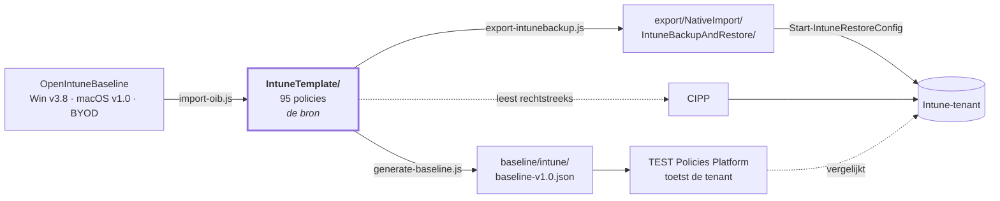

# IntuneBackup

`IntuneTemplate/` is de bron: de afgesproken Intune-policies in CIPP-templateformaat (Table
Storage-rij met een genestelde `JSON`/`RAWJson`-string). De inhoud komt sinds augustus 2026
grotendeels uit [OpenIntuneBaseline](https://github.com/SkipToTheEndpoint/OpenIntuneBaseline)
(Windows v3.8, macOS v1.0, BYOD), aangevuld met wat deze baseline extra dekt.

95 policies over vier platformen:

| | Settings Catalog | ADMX | Device config | Compliance | App Protection | totaal |
|---|---|---|---|---|---|---|
| [Windows](IntuneTemplate/WIN/README.md) | 64 | 1 | 4 | 4 | – | **73** |
| [macOS](IntuneTemplate/MAC/README.md) | 17 | – | – | 3 | – | **20** |
| [iOS](IntuneTemplate/IOS/README.md) | – | – | – | – | 1 | **1** |
| [Android](IntuneTemplate/AND/README.md) | – | – | – | – | 1 | **1** |



**[OVERZICHT.md](OVERZICHT.md)** is de samenvatting om te delen: wat er in zit, wat er veranderde
en wat er in de tenant nog moet gebeuren.

Per map staat er een README met de details: [`IntuneTemplate/`](IntuneTemplate/README.md) (met
een tabel per platform), [`scripts/`](scripts/README.md), [`export/`](export/README.md) en
[`baseline/`](baseline/README.md).

Naast elk template staat een markdown met **élke instelling die die policy zet** — bijvoorbeeld
[Windows Hello for Business](IntuneTemplate/WIN/SettingsCatalog/Baseline_WIN_D_Windows_Hello_for_Business.md).
Ook gegenereerd, dus die kan niet uit de pas lopen met de JSON ernaast.

## Indeling

```
IntuneTemplate/
  _assignments.json     toewijzingsdoel per policy
  _oib-manifest.json    welke OIB-policy waar landt (bron voor scripts/import-oib.js)
  _renames.json         hoe policies in de tenant heetten (bron voor Rename-BaselinePolicy.ps1)
  WIN/  SettingsCatalog/ AdministrativeTemplates/ DeviceConfigurations/ CompliancePolicies/
  MAC/  SettingsCatalog/ CompliancePolicies/
  IOS/  AppProtection/
  AND/  AppProtection/
```

De map is afleidbaar uit de bestandsnaam (platform) en het CIPP-`Type` (policytype) en draagt
dus geen informatie die niet ook in het bestand staat. Dat is bewust: de map is er om in te
bladeren en per platform te kunnen filteren, niet als tweede waarheid die uit de pas kan
lopen. `check-scope.js` controleert dat elk bestand op zijn plek staat.

Vijf policytypes, onderscheiden door `.Type` in het template:

| `.Type` | Map | Graph-endpoint | IntuneBackupAndRestore-map |
|---|---|---|---|
| `Catalog` | `SettingsCatalog` | `deviceManagement/configurationPolicies` | `Settings Catalog` |
| `Admin` | `AdministrativeTemplates` | `deviceManagement/groupPolicyConfigurations` | `Administrative Templates` |
| `Device` | `DeviceConfigurations` | `deviceManagement/deviceConfigurations` | `Device Configurations` |
| `deviceCompliancePolicies` | `CompliancePolicies` | `deviceManagement/deviceCompliancePolicies` | `Device Compliance Policies` |
| `AppProtection` | `AppProtection` | `deviceAppManagement/managedAppPolicies` | `App Protection Policies` |

## Naamgeving

```
[Baseline] - <WIN|MAC|IOS|AND> - <D|U> - <Item>      policynaam in de tenant
Baseline_<WIN|MAC|IOS|AND>_<D|U>_<Item>.json         bestandsnaam
```

De prefix `Baseline_` blijft verplicht: `generate-baseline.js`, `export-intunebackup.js` en
`Set-BaselineAssignment.ps1` filteren er alle drie op. Een bestand dat die prefix verliest
verdwijnt stilzwijgend uit alle drie de pijplijnen.

**Wanneer D en wanneer U.** Bij Windows Settings Catalog volgt de scope uit de
`settingDefinitionId`, niet uit het onderwerp: alles met prefix `user_` is user-scoped, de
rest device-scoped (let op `vendor_msft_`-ids zonder device-prefix — die zijn device-scoped).
Eén policy bevat nooit beide op topniveau. Een gemengde policy kun je niet eenduidig
toewijzen, en bij troubleshooting zie je niet of een instelling niet aankomt omdat het
apparaat of omdat de gebruiker buiten scope valt.

Bij macOS, iOS, Android en bij de andere policytypes zégt de settingDefinitionId niets over
scope (`com.apple.*`) of staan er helemaal geen settings in het bestand. Daar is D/U een
keuze over het toewijzingsdoel — zoals OpenIntuneBaseline de letters ook gebruikt — en
controleert `check-scope.js` alleen de naamconventie.

Twee gevolgen daarvan, allebei zichtbaar in `_oib-manifest.json`:

- OIB's *Device Guard, Credential Guard and HVCI*, *Power and Device Lock* en *Windows
  Sandbox* heten daar `U` omdat OIB ze aan gebruikers toewijst (o.a. om een herstart midden
  in Autopilot te vermijden). Hun instellingen zijn device-scoped, dus hier zijn het `D`.
- OIB's *Windows Spotlight and Org Messages* is gemengd en is hier gesplitst in
  `WIN - U - Windows Spotlight` en `WIN - D - Cloud Optimized Content`.

Een uitzondering die de regel niet breekt: Intune hangt sommige instellingen als **kind**
onder een parent van de andere scope (`allowwindowsconsumerfeatures` en `allowwindowstips`
zitten onder de user-scoped "Allow Windows Spotlight"). Die zijn niet los te configureren en
reizen mee met hun parent; `check-scope.js` meldt ze en laat ze staan.

## Controles

```bash
node scripts/check-scope.js            # faalt bij scope-, naam-, map- of conflictproblemen
node scripts/check-scope.js --report   # alleen het overzicht
```

Vijf controles: gemengde scope, naamconventie, bestandsnaam vs. policynaam, plaatsing in de
juiste map, en — nieuw sinds de OIB-import — of twee tóégewezen policies dezelfde instelling
op een **andere** waarde zetten. Dat laatste levert in Intune een *Conflict* op, waarna de
instelling door géén van beide policies wordt toegepast. Dezelfde waarde uit twee policies is
geen conflict maar dubbel onderhoud, en wordt apart gemeld. Bij macOS wordt alleen gemeld dat
meerdere policies dezelfde payload leveren: Apple voegt profielen samen, daar is dat normaal.

Draait als eerste stap in `.github/workflows/generate-baseline.yml` en is blokkerend.

## Drie afgeleiden uit één bron

| Doel | Pad | Script |
|---|---|---|
| Baseline-checks voor TEST Policies Platform | `baseline/intune/baseline-v1.0.json` | `node scripts/generate-baseline.js` |
| Restore-formaat voor IntuneBackupAndRestore | `export/NativeImport/IntuneBackupAndRestore/` | `node scripts/export-intunebackup.js` |
| CIPP | *geen conversie* — CIPP leest `IntuneTemplate/` rechtstreeks | |

## OpenIntuneBaseline bijwerken

```bash
git -c core.longpaths=true clone --depth 1 https://github.com/SkipToTheEndpoint/OpenIntuneBaseline .oib-source
node scripts/import-oib.js --dry-run
node scripts/import-oib.js
```

`IntuneTemplate/_oib-manifest.json` bepaalt welke OIB-policy waar landt, met per policy de
reden als er iets afwijkt. `.oib-source/` is gitignored: de gegenereerde templates zijn het
resultaat, en een tweede kopie van een externe repo zou hier alleen maar verouderen.

`core.longpaths=true` is op Windows nodig — OIB heeft bestandsnamen die over MAX_PATH gaan.

Drie dingen die de importer bewust doet:

1. **GUID's blijven behouden.** De RowKey/GUID identificeert de CIPP-templaterij; een
   herschreven template dat een nieuwe GUID zou krijgen levert bij de volgende sync een
   tweede template met dezelfde naam op.
2. **Eigen instellingen die OIB niet kent blijven staan.** Onze BitLocker-policy dekt ook
   vaste en verwisselbare schijven, OIB alleen de OS-schijf; klakkeloos overschrijven zou dat
   stilzwijgend uitzetten. De regel: een top-level instelling uit het oude template blijft,
   tenzij die settingDefinitionId érgens in de geïmporteerde OIB-set voorkomt. De run meldt
   precies wat er is overgenomen.
3. **Idempotent.** Bij een tweede run is het doelbestand zelf de bron voor die overgenomen
   instellingen, dus zelfde input → zelfde output.

Zes OIB-policies zijn bewust niet overgenomen (audit-varianten, 24H2-alternatieven, driver
update profiles, Windows 365) — met reden, in `"excluded"` in het manifest.

## Terugzetten in een tenant

**Via CIPP:** wijs de template-repository aan op deze repository. Alle vijf de `.Type`-waarden
komen overeen met een `TemplateType` in CIPP's `Set-CIPPIntunePolicy`.

Let op waar de restore-export staat: `export/**NativeImport**/IntuneBackupAndRestore/`. Dat
woord in het pad is geen beschrijving maar een uitsluiting. CIPP haalt de bestandslijst op met
`git/trees?recursive=1` en negeert precies twee dingen: bestanden die niet op `.json` eindigen,
en paden waarin `NativeImport` voorkomt. Er is geen submap-instelling. Zonder dat woord zou
CIPP die 186 bestanden óók importeren — dezelfde 95 policies plus hun assignments, maar zonder
`RowKey`, waar CIPP dan een **tweede** template van maakt met dezelfde naam en een eigen GUID.
OpenIntuneBaseline gebruikt dezelfde map om dezelfde reden.

Wat overblijft: `baseline/intune/baseline-v1.0.json` en de drie `_`-bestanden in
`IntuneTemplate/` zijn wél `.json` maar geen policy. CIPP maakt daar één rij van zonder naam
en zonder type (ze vallen op elkaar terug omdat de ontdubbeling op `Displayname` matcht, en
die is bij alle vier leeg). Die rij doet niets; opruimen kan door 'm in CIPP te verwijderen.
`baseline-v1.0.json` kan niet mee onder een `NativeImport`-pad — het TEST Policies Platform
haalt dat bestand op zijn huidige pad op.

**Via IntuneBackupAndRestore** (getest tegen module 4.0.1):

```powershell
Start-IntuneRestoreConfig      -Path '<repo>\export\NativeImport\IntuneBackupAndRestore'
Start-IntuneRestoreAssignments -Path '<repo>\export\NativeImport\IntuneBackupAndRestore' -RestoreById $false
Invoke-IntuneRestoreAppProtectionPolicyAssignment -Path '<repo>\export\NativeImport\IntuneBackupAndRestore' -RestoreById $false
```

`-RestoreById $false` is verplicht: de export bevat bewust geen tenant-id's, dus de module
moet op policynaam matchen. Dat is ook de enige modus die cross-tenant klopt — een id uit
tenant A wijst in tenant B nergens naar.

De derde regel is geen vergetelheid: `Start-IntuneRestoreAssignments` roept in 4.0.1 wél de
assignments van Settings Catalog, ADMX, device configurations en compliance aan, maar **niet**
die van App Protection. Zonder die losse aanroep staan de twee MAM-policies er wel, maar
zonder toewijzing — en dan beschermen ze niets.

De exporter schrijft de app protection-assignments in de vorm die de module verwacht:
bestandsnaam `<guid> - <policynaam>.json` (de module leest de naam als alles ná het eerste
` - `) en de lijst in een `value`-property in plaats van een kale array. Bij de andere
policytypes is de bestandsnaam de policynaam en is de inhoud wél een kale array.

## Toewijzen in een tenant

```powershell
.\scripts\Set-BaselineAssignment.ps1 -Scope D -AllDevices -WhatIf   # dry run
.\scripts\Set-BaselineAssignment.ps1 -Scope D -AllDevices
.\scripts\Set-BaselineAssignment.ps1 -Scope U -AllUsers
.\scripts\Set-BaselineAssignment.ps1 -Platform MAC -Scope D -AllDevices
.\scripts\Set-BaselineAssignment.ps1 -GroupName 'SEC-Baseline-Pilot'
.\scripts\Set-BaselineAssignment.ps1 -GroupId '<object-id>' -Exclude
```

Zet in één keer een assignment op alle baseline-policies, over de vijf policytypes heen (elk
met een eigen Graph-endpoint). `-Scope D|U` filtert op de scope in de naam, `-Platform` op het
platform. Policies die de naamconventie niet volgen vallen buiten élk filter; het script
waarschuwt daar expliciet over in plaats van ze stil over te slaan.

App Protection is een geval apart: je vindt de policies via `managedAppPolicies`, maar
toewijzen kan alleen via de platformspecifieke collectie (`iosManagedAppProtections` /
`androidManagedAppProtections`). Het script vertaalt dat op basis van de `@odata.type`.

Assignments worden **aangevuld**, niet vervangen. Graph's `/assign` overschrijft altijd de
volledige lijst, dus het script leest eerst de bestaande assignments en POST't de
samenvoeging; een target dat er al op staat levert geen duplicaat op. Met `-Replace` gooi je
de bestaande juist weg. Optioneel `-FilterId` + `-FilterType` voor een assignmentfilter.

Policies die niet in de tenant staan worden gemeld, niet aangemaakt — rol ze eerst uit via
CIPP of `Start-IntuneRestoreConfig`.

### Vier policies staan bewust zonder assignment

`Windows Update Ring 1 Pilot`, `Windows Update Ring 2 UAT`, `Defender Update Ring 1 Pilot` en
`Defender Update Ring 2 UAT` zetten dezelfde instellingen als hun ring 3 met andere waarden.
Alle drie de ringen op All Devices zou een conflict opleveren; ring 1 en 2 horen op een
pilot- respectievelijk UAT-groep:

```powershell
.\scripts\Set-BaselineAssignment.ps1 -Name '[Baseline] - WIN - D - Windows Update Ring 1 Pilot' -GroupName 'SEC-Update-Ring1'
```

### Wat je eerst in een pilot zet

De rest van de baseline is inhoudelijk conservatief, maar deze policies veranderen gedrag dat
gebruikers of oude systemen direct raken. OpenIntuneBaseline zegt hetzelfde: het is een
startpunt, geen kant-en-klare productieconfiguratie.

| Policy | Waarom |
|---|---|
| `WIN - D - Disable NTLM` | breekt oude on-prem toepassingen en apparaten die geen Kerberos spreken |
| `WIN - D - Administrator Protection` | Windows 11 24H2+; verandert het UAC-gedrag van beheerders |
| `WIN - D - Device Guard and Credential Guard` | vraagt een herstart en kan oude drivers blokkeren |
| `WIN - D - In-Box App Removal` | verwijdert ingebouwde apps; controleer of niemand ze gebruikt |
| `WIN - D - Windows Hello for Business` | vereist een TPM en een PIN van minimaal 6 tekens |
| `WIN - D - Script File Associations` | .js/.vbs/.hta openen voortaan in Kladblok |
| `MAC - D - FileVault` | versleutelt de schijf; regel eerst de herstelsleutel-escrow |

## Een backup uit een tenant terugbrengen naar de bron

```powershell
node scripts/import-intunebackup.js "C:\Temp\BaselineIntuneBackup" [--overwrite] [--dry-run]
```

Zet een IntuneBackupAndRestore-export om naar `IntuneTemplate/`. Standaard worden alleen
policies toegevoegd die er nog niet zijn; bestaande templates blijven staan tenzij je
`--overwrite` meegeeft. Een export uit een tenant is namelijk niet automatisch verser dan wat
hier ligt — met blind overschrijven draai je een baselinewijziging stilzwijgend terug.

Een policy die hier al bestaat houdt zijn pad en GUID; nieuwe policies worden ingedeeld op
platform en policytype uit hun naam. Namen die de conventie niet volgen worden gemeld, niet
gegokt.

De importer weigert bovendien afgekapte Settings Catalog-exports (`settingCount` wijkt af van
het aantal geëxporteerde settings). Dat gebeurt echt: Graph pagineert de
settings-navigatieproperty standaard op 25, en een export die dat niet volgt levert een policy
op die bij restore het grootste deel van zijn instellingen mist.

## De tenant bijwerken

De policies staan in de tenant nog onder hun oude naam. `IntuneTemplate/_renames.json` legt
vast hoe ze heetten en wat er nu bij hoort:

```powershell
.\scripts\Rename-BaselinePolicy.ps1 -WhatIf     # verplichte eerste run
.\scripts\Rename-BaselinePolicy.ps1
```

Hernoemen gebeurt met een `PATCH`: het policy-id, de assignments en de toewijzingsgeschiedenis
blijven intact. `Start-IntuneRestoreConfig` maakt policies aan op naam en zou onder de nieuwe
naam een duplicaat naast de oude zetten.

Drie regels in `_renames.json` vragen om handwerk en worden door het script alleen gemeld:

- **replace** — het policytype verandert, dus een PATCH kan niet. `Windows Firewall` werd een
  Endpoint Security-template en `Microsoft Office Updates` ging van ADMX naar Settings
  Catalog. De oude policy moet weg vóór de nieuwe erbij komt.
- **retire** — gaat helemaal weg; `replacedBy` zegt waar de instellingen nu staan.
- **duplicaat / beide aanwezig** — oude en nieuwe naam bestaan allebei. Eerst uitzoeken welke
  de echte is.

**Let op:** de `settings-catalog-match`-checks matchen op inhoud, niet op naam. Een
achtergebleven oude policy houdt zijn check dus groen, ook als de nieuwe nooit is aangemaakt.
De baseline-check is geen vangnet voor deze migratie.

## checkId's

`checkId`-nummers komen uit `CHECK_NUMBERS` in `scripts/generate-baseline.js`, niet uit de
alfabetische bestandsvolgorde — anders verschuift één nieuw template alle ID's erna, terwijl
het platform, findings en uitzonderingen ernaar verwijzen. Een nieuw bestand krijgt
automatisch het eerstvolgende vrije nummer en de run meldt welk; zet dat vast in de map.

Om dezelfde reden bestaat `CHECK_ID_SLUGS`: de suffix achter het nummer komt normaal uit de
bestandsnaam, dus zonder die map zou hernoemen naar `Baseline_WIN_D_BitLocker` van
`INTUNE-BASE-011-Bitlocker` een `INTUNE-BASE-011-WINDBitLocker` maken. Nieuwe policies krijgen
hun slug wél uit de bestandsnaam: scope + onderwerp, met het platform ervoor als het niet
Windows is (`INTUNE-BASE-038-MACDFileVault`, `INTUNE-BASE-104-UMicrosoftStore`). De scope zit
erin omdat er D/U-paren van hetzelfde onderwerp bestaan.

### Vijf checkId's zijn opgeheven

Hun policy is opgegaan in een OIB-policy die meer dekt. De nummers worden niet opnieuw
uitgedeeld — een oude finding aan een andere check koppelen is erger dan een gat in de reeks.

| checkId | Ging op in |
|---|---|
| `008-AdministrativeTemplates` | Internet Explorer Legacy, Security Hardening, Printing, Remote Desktop and RPC, Legacy Hardening |
| `017-LanManWorkstation` | Security Hardening |
| `023-Search` | Windows Feature Configuration |
| `025-SystemServices` | Security Hardening |
| `028-OnedriveKnownFolderMove` | Microsoft OneDrive (029) |

Twee checkId's zijn van onderwerp verschoven maar behouden: `024-Smartscreen` hangt nu aan
*Enhanced Phishing Protection* en `021-OfficeUpdates` aan de Settings Catalog-variant van
Office Updates.

### Welke types een check opleveren

`"Catalog"` wordt `type: "settings-catalog-match"`, `"Admin"` wordt
`type: "group-policy-definition-match"`. `"Device"`, `"deviceCompliancePolicies"` en
`"AppProtection"` leveren **geen** check op: de platform-engine heeft er geen matcher voor, en
een rule met een onbekend type is een check die stilzwijgend niets test. Voor compliance en
app protection dekken de generieke checks 001–006 dit vandaag af (bestaat er een
compliance-policy, is die toegewezen, vereist die encryptie). Die policies zijn wel gewoon
uitrolbaar via CIPP en IntuneBackupAndRestore.

**Let op bij `"Admin"`/ADMX:** de Graph-endpoint hiervoor
(`deviceManagement/groupPolicyConfigurations`) is beta-only en de fetch-/matchinglogica in de
platform-engine is nog niet tegen een echte tenant getest — zie TODO.md in `sjkanon/Platform`.
Er is nog één ADMX-policy over (de Edge-zoekmachine); Office Updates is juist naar Settings
Catalog verhuisd om deze reden.

**Per-tenant waarden:** het EDR-onboarding-token in `Baseline_WIN_D_Defender_for_Endpoint_EDR`
is een `encryptedValueToken` die alleen in de brontenant betekenis heeft. De baselinegenerator
slaat 'm over; bij een restore in een andere tenant moet je die instelling handmatig opnieuw
koppelen.

**Bij een wijziging in `IntuneTemplate/`:** `.github/workflows/generate-baseline.yml`
regenereert `baseline/intune/baseline-v1.0.json` én `export/NativeImport/IntuneBackupAndRestore/`
automatisch en opent daar een PR voor — controleer de diff (nieuwe/verwijderde checks,
gewijzigde instellingen) vóór je merget.
