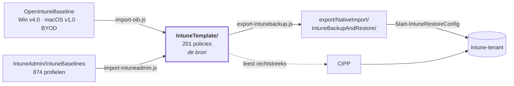

**Nederlands** · [English](README.en.md) · [Français](README.fr.md)

# IntuneBackup

`IntuneTemplate/` is de bron: de afgesproken Intune-policies in CIPP-templateformaat (Table
Storage-rij met een genestelde `JSON`/`RAWJson`-string). De inhoud komt sinds augustus 2026
grotendeels uit [OpenIntuneBaseline](https://github.com/SkipToTheEndpoint/OpenIntuneBaseline)
(Windows v4.0, macOS v1.0, BYOD), aangevuld met wat deze baseline extra dekt. Windows v4.0 is
overgenomen vóór de officiële release — zie [`ANALYSE.md`](docs/ANALYSE.md#ronde-oib-windows-v40-14-september-2026).

201 policies over vier platformen:

| | Settings Catalog | ADMX | Device config | Compliance | App Protection | totaal |
|---|---|---|---|---|---|---|
| [Windows](IntuneTemplate/WIN/README.md) | 118 | 1 | 6 | 11 | – | **136** |
| [macOS](IntuneTemplate/MAC/README.md) | 30 | – | 3 | 4 | – | **37** |
| [iOS](IntuneTemplate/IOS/README.md) | 8 | – | 2 | 3 | 1 | **14** |
| [Android](IntuneTemplate/AND/README.md) | 3 | – | 2 | 8 | 1 | **14** |


```mermaid
flowchart LR
  OIB["OpenIntuneBaseline<br/>Win v4.0 · macOS v1.0 · BYOD"]
  T["<b>IntuneTemplate/</b><br/>201 policies<br/><i>de bron</i>"]
  EX["export/NativeImport/<br/>IntuneBackupAndRestore/"]
  TENANT[("Intune-tenant")]

  OIB -->|import-oib.js| T
  T -->|export-intunebackup.js| EX
  T -.->|leest rechtstreeks| CIPP[CIPP]
  EX -->|Start-IntuneRestoreConfig| TENANT
  CIPP --> TENANT

  IA["IntuneAdmin/IntuneBaselines<br/>874 profielen"] -->|import-intuneadmin.js| T

  style T stroke-width:3px
```

**[OVERZICHT.md](docs/OVERZICHT.md)** is de samenvatting om te delen: wat er in zit, wat er veranderde
en wat er in de tenant nog moet gebeuren.

**[STRUCTUUR.md](docs/STRUCTUUR.md)** is de plattegrond: welke map wat bevat, welk script wat leest en
schrijft, en aan welke systemen de repo vastzit.

**[COMPLIANCE.md](docs/COMPLIANCE.md)** is de verantwoording voor een CISO of auditor: per ISO/IEC 27001:2022
Annex A-control, per NIS2-maatregel (art. 21 lid 2), per CIS Controls v8.1-safeguard en per NIST CSF
2.0-subcategorie welke policies hem technisch invullen, in welke fase — en wat
organisatorisch nodig blijft. Gegenereerd door `scripts/generate-compliance.js` uit de `controls` in
`_manifest.json` en de vocabulaire in `IntuneTemplate/_controls.json`; `check-scope.js` weigert een
policy zonder of met een onbekend label. Wat er in git staat gaat alleen over Intune; de
Conditional Access-policies uit de CA-Policies-repo (naast deze gekloond als `../CA-Policies`)
komen erbij met `--ca ../CA-Policies/controls/ca-controls.json` — nodig voor een eerlijk beeld van
NIS2 (j), want MFA hangt vrijwel helemaal aan die repo. Zie [`scripts/README.md`](scripts/README.md#de-ca-kant-van-compliancemd).

Bij elke policy die een Conditional Access-policy raakt — compliance, app protection, Windows Hello,
de SSO-plug-ins — staat in zijn README een sectie **Conditional Access**: welke CA-policies erop
leunen en wat er daar misgaat als je hem wijzigt. De koppeling wordt bijgehouden in
`docs/policies.json` van de CA-Policies-repo; hier staat een kopie in `IntuneTemplate/_ca.json`.

**Per platform staat alles bij elkaar.** In `IntuneTemplate/<PLATFORM>/` staan naast de
CIPP-templates (`SettingsCatalog/`, `AdministrativeTemplates/`, `DeviceConfigurations/`,
`CompliancePolicies/`, `AppProtection/`) ook de onderdelen die geen CIPP-policytype zijn, in mappen
die de menu's van de Intune-portal volgen: `Enrollment/` (Autopilot, ADE-profielen, restricties),
`EndpointSecurity/` (App Control, Defender-onboarding), `PlatformScripts/`, `Remediations/`,
`ComplianceScripts/`, `Apps/`, `AppConfiguration/` en `AssignmentFilters/`. Heeft een onderdeel
meer losse onderwerpen, dan krijgt elk een submap. De README van elk platform
([Windows](IntuneTemplate/WIN/README.md), [macOS](IntuneTemplate/MAC/README.md),
[iOS/iPadOS](IntuneTemplate/IOS/README.md), [Android](IntuneTemplate/AND/README.md)) somt ze op onder
*Overige onderdelen*; elke map heeft een eigen README met uitrolinstructie. De pijplijn leest alleen
de `Baseline_*.json`-templates. De ADE-profielen en de macOS-shellscripts kopieert
`export-intunebackup.js` als sidecar mee in de export; CIPP, `check-scope.js` en
`Set-BaselineAssignment.ps1` doen niets met de overige onderdelen.

Per map staat er een README met de details: [`IntuneTemplate/`](IntuneTemplate/README.md) (met
een tabel per platform), [`scripts/`](scripts/README.md) en [`export/`](export/README.md).

De shell- en platformscripts voor Azure Files doen hetzelfde in twee vormen: een **drive
mapping is geen policy**. Geen van de 18.329 settingDefinitionId's in de settings catalog
koppelt een netwerkschijf, en Group
Policy Preferences → Drive Maps is geen ADMX en dus niet te ingesten. Wie een share bij een
groep gebruikers wil krijgen, doet dat met een script in gebruikerscontext dat aan een
gebruikersgroep is toegewezen.

De McAfee-app hoort er om één reden bij: McAfee zet **Microsoft Defender in passive mode**. De
ASR-regels, Controlled Folder Access, Network Protection en Remote Encryption Protection uit deze
baseline leunen allemaal op een actieve Defender-engine. Komen ze aan op een apparaat met McAfee,
dan staan ze in Intune als geslaagd terwijl er niets wordt uitgevoerd.

## Twee tenantinstellingen die geen policy zijn

De baseline kan ze niet zetten en `check-scope.js` ziet ze niet, maar zonder deze twee doet een
deel van de rest niets. Zet ze vóór je gaat toewijzen.

| Instelling | Waar | Waarom |
|---|---|---|
| **Apparaten zonder toegewezen compliancebeleid markeren als → Niet-compliant** | Intune → Apparaten → Compliancebeleid → Nalevingsbeleidsinstellingen | Staat standaard op *Compliant*. Een apparaat dat door een filter, een uitsluitingsgroep of een ontbrekende primaire gebruiker buiten élke toewijzing valt, telt dan als compliant en komt gewoon door Conditional Access. De compliance-policies in deze baseline zeggen daar niets over — die worden pas geëvalueerd als er één is toegewezen. Zie [Rozemuller](https://rozemuller.com/why-does-this-intune-device-have-no-compliance-policy-assigned/). |
| **Defender for Endpoint-connector** | Intune → Endpoint Security → Microsoft Defender for Endpoint | Nodig voor de onboarding via `WIN - D - Defender EDR Policy` en voor een toets op de risicoscore uit Defender. Die toets zit bewust niet in de baseline — ook OpenIntuneBaseline v4.0 heeft hem niet; `WIN - U - Compliance Defender Real Time Protection` en `Defender Security Intelligence` toetsen wat er óp het apparaat staat en werken zonder connector. Wil je de risicoscore toch meewegen, zet dan eerst de connector aan: zonder komt de score nooit binnen en is de toets stil zonder oordeel. |

Op macOS is de Defender-kant een derde geval: die toets bestaat niet als instelling en vraagt een
script — zie [`IntuneTemplate/MAC/ComplianceScripts/`](IntuneTemplate/MAC/ComplianceScripts/README.md).

Naast elk template staat een markdown met **élke instelling die die policy zet** — bijvoorbeeld
[Windows Hello for Business](IntuneTemplate/WIN/SettingsCatalog/Baseline_WIN_D_Windows_Hello_for_Business.md).
Ook gegenereerd, dus die kan niet uit de pas lopen met de JSON ernaast.

**Eén baseline.** Tot september 2026 stonden er drie sets naast elkaar — `IntuneTemplate/`,
`ISMSTemplate/` en `BASELINE2/`. Die zijn samengevoegd: alles staat nu in `IntuneTemplate/`
onder de `Baseline_`-prefix. Wat de aparte mappen deden, doet nu het veld `fase` in
[`_manifest.json`](IntuneTemplate/_manifest.json).

| Fase | Wat het betekent | Aantal |
|---:|---|---:|
| 1 | **Nu** — uitrollen zodra de baseline in de tenant staat. Geen merkbare gevolgen, of gevolgen die geen voorbereiding vragen. | 102 |
| 2 | **Pilot** — eerst op een pilotgroep. Verandert iets dat een gebruiker merkt, of kan iets breken dat je eerst wilt zien. | 42 |
| 3 | **Wacht op voorwaarde** — klaar, maar doet vandaag niets. De iOS- en Android-compliancepolicies wachten op de eerste inschrijving. | 26 |
| 4 | **Eigen groep** — hoort op een specifieke groep, niet op alle apparaten. `faseGroep` zegt welke. | 16 |
| 5 | **Niet uitrollen** — alternatief voor een policy die wél wordt uitgerold. Toewijzen levert een Conflict op. | 15 |

Alleen fase 1 staat in `_assignments.json`. `check-scope.js` bewaakt dat die twee niet uit
elkaar lopen: een fase-1-policy zonder toewijzing wordt stilzwijgend niet uitgerold, en een
fase-5-policy mét toewijzing levert een Conflict op waarna de betwiste instelling door géén van
beide policies wordt toegepast. Elke policy boven fase 1 heeft een verplichte `faseWaarom`.

De fase bepaalt ook het **CIPP-pakket** van een policy — het veld `Package` in het template,
waarop CIPP zijn baselines groepeert. Zie [uitrollen via een CIPP-baseline](#uitrollen-via-een-cipp-baseline).

**[`ANALYSE.md`](docs/ANALYSE.md)** legt vast hoe de aanvulling van september 2026 tot stand kwam:
welke bronnen zijn vergeleken, de 509 instellingen die IntuneAdmin meer zet dan deze baseline, waarom er
14 van overbleven, en — belangrijker — wat er bewust *niet* in zit en waarom.

## Indeling

```
IntuneTemplate/        de bron: de policies in CIPP-templateformaat
  _manifest.json      per policy: doel, herkomst, fase, normen, afwijkingen van de bron
  _assignments.json   toewijzingsdoel per fase-1-policy
  _controls.json      vocabulaire voor ISO 27001, NIS2, CIS en NIST CSF
  _licenties.json     welke controls met een licentie in te vullen zijn
  _renames.json       vroegere namen in de tenant (bron voor Rename-BaselinePolicy.ps1)
  _ca.json            welke CA-policies op een policy leunen (kopie uit de CA-Policies-repo)
  _i18n/              Engelse en Franse vertalingen van de teksten uit de data
  WIN/  SettingsCatalog/  AdministrativeTemplates/  DeviceConfigurations/  CompliancePolicies/
        Enrollment/  EndpointSecurity/  PlatformScripts/  Remediations/  Apps/
  MAC/  SettingsCatalog/  DeviceConfigurations/  CompliancePolicies/
        Enrollment/  EndpointSecurity/  PlatformScripts/  ComplianceScripts/
  IOS/  SettingsCatalog/  DeviceConfigurations/  CompliancePolicies/  AppProtection/
        Enrollment/  AppConfiguration/
  AND/  SettingsCatalog/  DeviceConfigurations/  CompliancePolicies/  AppProtection/
        Enrollment/  AppConfiguration/  AssignmentFilters/
BaselineTemplate/      de CIPP-baseline (gegenereerd)
AppTemplate/           CIPP-applicatietemplates (gegenereerd uit IntuneTemplate/)
export/NativeImport/   restore-export voor IntuneBackupAndRestore (gegenereerd)
docs/                  overzicht, compliance, analyse, plan en structuur
scripts/               de pijplijn en de tenantscripts
```

Zie [STRUCTUUR.md](docs/STRUCTUUR.md#mappen) voor wat elke map bevat en wie hem leest.

De map is afleidbaar uit de bestandsnaam (platform) en het CIPP-`Type` (policytype) en draagt
dus geen informatie die niet ook in het bestand staat. Dat is bewust: de map is er om in te
bladeren en per platform te kunnen filteren, niet als tweede waarheid die uit de pas kan
lopen. `check-scope.js` controleert dat elk bestand op zijn plek staat.

Vijf policytypes, onderscheiden door `.Type` in het template:

| `.Type` | Map | Graph-endpoint | IntuneBackupAndRestore-map |
|---|---|---|---|
| `Catalog` | `SettingsCatalog` | `deviceManagement/configurationPolicies` | `Settings Catalog` |
| `Admin` | `AdministrativeTemplates` | `deviceManagement/groupPolicyConfigurations` | `Administrative Templates` |
| `Device` | `DeviceConfigurations` | `deviceManagement/deviceConfigurations` | `Device Configurations` |
| `deviceCompliancePolicies` | `CompliancePolicies` | `deviceManagement/deviceCompliancePolicies` | `Device Compliance Policies` |
| `AppProtection` | `AppProtection` | `deviceAppManagement/managedAppPolicies` | `App Protection Policies` |

## Naamgeving

```
CXNM - Standard - <WIN|MAC|IOS|AND> - <D|U> - <Item>      policynaam in de tenant
Baseline_<WIN|MAC|IOS|AND>_<D|U>_<Item>.json              bestandsnaam
```

De prefix `Baseline_` blijft verplicht: `export-intunebackup.js`, `generate-docs.js` en
`Set-BaselineAssignment.ps1` filteren er alle drie op. Een bestand dat die prefix verliest
verdwijnt stilzwijgend uit alle drie de pijplijnen.

**Wanneer D en wanneer U.** Bij Windows Settings Catalog volgt de scope uit de
`settingDefinitionId`, niet uit het onderwerp: alles met prefix `user_` is user-scoped, de
rest device-scoped (let op `vendor_msft_`-ids zonder device-prefix — die zijn device-scoped).
Eén policy bevat nooit beide op topniveau. Een gemengde policy kun je niet eenduidig
toewijzen, en bij troubleshooting zie je niet of een instelling niet aankomt omdat het
apparaat of omdat de gebruiker buiten scope valt.

Bij macOS, iOS, Android en bij de andere policytypes zégt de settingDefinitionId niets over
scope (`com.apple.*`) of staan er helemaal geen settings in het bestand. Daar is D/U een
keuze over het toewijzingsdoel — zoals OpenIntuneBaseline de letters ook gebruikt — en
controleert `check-scope.js` alleen de naamconventie.

Twee gevolgen daarvan, allebei zichtbaar in `_manifest.json`:

- OIB's *Device Guard, Credential Guard and HVCI*, *Power and Device Lock* en *Windows
  Sandbox* heten daar `U` omdat OIB ze aan gebruikers toewijst (o.a. om een herstart midden
  in Autopilot te vermijden). Hun instellingen zijn device-scoped, dus hier zijn het `D`.
- OIB's *Windows Spotlight and Org Messages* is gemengd en is hier gesplitst in
  `WIN - U - Windows Spotlight` en `WIN - D - Cloud Optimized Content`.

Een uitzondering die de regel niet breekt: Intune hangt sommige instellingen als **kind**
onder een parent van de andere scope (`allowwindowsconsumerfeatures` en `allowwindowstips`
zitten onder de user-scoped "Allow Windows Spotlight"). Die zijn niet los te configureren en
reizen mee met hun parent; `check-scope.js` meldt ze en laat ze staan.

## Controles

```bash
node scripts/check-scope.js            # faalt bij scope-, naam-, map- of conflictproblemen
node scripts/check-scope.js --report   # alleen het overzicht
```

Zes controles: gemengde scope, naamconventie, bestandsnaam vs. policynaam, plaatsing in de
juiste map, of het veld `Package` klopt met de fase en de toewijzing, en — nieuw sinds de
OIB-import — of twee tóégewezen policies dezelfde instelling
op een **andere** waarde zetten. Dat laatste levert in Intune een *Conflict* op, waarna de
instelling door géén van beide policies wordt toegepast. Dezelfde waarde uit twee policies is
geen conflict maar dubbel onderhoud, en wordt apart gemeld. Bij macOS wordt alleen gemeld dat
meerdere policies dezelfde payload leveren: Apple voegt profielen samen, daar is dat normaal.

Draait als eerste stap in `.github/workflows/generate-baseline.yml` en is blokkerend.

## Afgeleiden uit één bron

| Doel | Pad | Script |
|---|---|---|
| Restore-formaat voor IntuneBackupAndRestore | `export/NativeImport/IntuneBackupAndRestore/` | `node scripts/export-intunebackup.js` |
| CIPP-baseline (stages en pakketten) | `BaselineTemplate/Baseline.json` | `node scripts/generate-baseline-template.js` |
| CIPP-applicatietemplates (Win32-script-apps) | `AppTemplate/*.json` | `node scripts/generate-app-templates.js` |
| CIPP | *geen conversie* — CIPP leest `IntuneTemplate/` rechtstreeks | |

**Bij een wijziging in `IntuneTemplate/`:** `.github/workflows/generate-baseline.yml`
regenereert `export/NativeImport/IntuneBackupAndRestore/`, `BaselineTemplate/Baseline.json` en de
gegenereerde documentatie automatisch en opent daar een PR voor — controleer de diff (nieuwe of
verwijderde policies, gewijzigde instellingen) vóór je merget.

## OpenIntuneBaseline bijwerken

```bash
git -c core.longpaths=true clone --depth 1 https://github.com/SkipToTheEndpoint/OpenIntuneBaseline .oib-source
node scripts/import-oib.js --dry-run
node scripts/import-oib.js
```

> **Sinds 14 september 2026 is de importer weer idempotent:** een tweede run schrijft niets. Het
> handwerk dat een volledige run eerder terugdraaide staat nu in het manifest (`dropSettings`,
> `veldOverrides`, ook met `toevoegen` voor velden die de bron niet levert), policies zonder bron
> en zonder `type` houden hun eigen Type, en `auditRuleInformation` uit nieuwere exports gaat eruit.
> Kijk de `--dry-run` desondanks na bij elke nieuwe OIB-versie.

`IntuneTemplate/_manifest.json` bepaalt welke OIB-policy waar landt, met per policy de
reden als er iets afwijkt. `.oib-source/` is gitignored: de gegenereerde templates zijn het
resultaat, en een tweede kopie van een externe repo zou hier alleen maar verouderen.

`core.longpaths=true` is op Windows nodig — OIB heeft bestandsnamen die over MAX_PATH gaan.

Vijf dingen die de importer bewust doet:

1. **GUID's blijven behouden.** De RowKey/GUID identificeert de CIPP-templaterij; een
   herschreven template dat een nieuwe GUID zou krijgen levert bij de volgende sync een
   tweede template met dezelfde naam op.
2. **Eigen instellingen die OIB niet kent blijven staan.** De BitLocker-policy van deze baseline dekt ook
   vaste en verwisselbare schijven, OIB alleen de OS-schijf; klakkeloos overschrijven zou dat
   stilzwijgend uitzetten. De regel: een top-level instelling uit het oude template blijft,
   tenzij die settingDefinitionId érgens in de geïmporteerde OIB-set voorkomt. De run meldt
   precies wat er is overgenomen.
3. **Bewuste afwijkingen van OIB blijven staan.** Punt 2 redt alleen instellingen die OIB
   *niet* kent. Een andere wáárde op een instelling die OIB wél zet — het wachtwoord-oogje,
   de Defender-actie bij een lage dreiging — zou elke import stilzwijgend terugdraaien. Die
   staan daarom als `overrides` in het manifest, met een verplichte `reason`:

   ```json
   "overrides": [
     {
       "settingDefinitionId": "device_vendor_msft_policy_config_credentialsui_disablepasswordreveal",
       "value": "device_vendor_msft_policy_config_credentialsui_disablepasswordreveal_1",
       "reason": "CIS L1; het onthulknopje maakt meekijken triviaal."
     },
     {
       "parent": "vendor_msft_firewall_mdmstore_domainprofile_enablefirewall",
       "settingDefinitionId": "vendor_msft_firewall_mdmstore_domainprofile_allowlocalpolicymerge",
       "value": "vendor_msft_firewall_mdmstore_domainprofile_allowlocalpolicymerge_false",
       "reason": "OIB zet local policy merge alleen op het openbare profiel."
     }
   ]
   ```

   Zonder `parent` moet de instelling al in de OIB-bron staan en wordt alleen de waarde
   vervangen; mét `parent` wordt hij als kind toegevoegd. Verdwijnt het ankerpunt uit een
   nieuwe OIB-versie, dan **stopt de import met een fout** in plaats van de override stil te
   laten vervallen — dat laatste is het gevaarlijkst, want dan klopt het bestand nog steeds
   terwijl de reden weg is. De run somt elke toegepaste override op.
4. **De verouderde PPPC-sleutel `Allowed` gaat eruit.** Apple's TCC-payload kent twee
   sleutels voor hetzelfde besluit: `Allowed` (macOS 10.14) en `Authorization` (macOS 11+).
   Ze mogen niet samen in één regel staan. OIB levert ze allebei aan, en macOS wijst dan de
   **hele** TCC-payload af: Intune meldt `10022` op elk veld van die regel en de app krijgt
   geen enkel recht — ook niet het recht dat wél goed stond. Trof de macOS-policies voor
   OneDrive en Defender for Endpoint. Zie [OpenIntuneBaseline issue
   #62](https://github.com/SkipToTheEndpoint/OpenIntuneBaseline/issues/62); die staat nog
   open, dus dit gebeurt bij elke import opnieuw in plaats van eenmalig in de templates. De
   run meldt wat er is weggehaald.
5. **Idempotent.** Bij een tweede run is het doelbestand zelf de bron voor die overgenomen
   instellingen, dus zelfde input → zelfde output.

Vier onderdelen van OIB zijn bewust niet overgenomen (de ASR-auditvariant, de driver update
profiles, update-ring 3 en Windows 365) — met reden, in `"excluded"` in het manifest.

## Terugzetten in een tenant

**Via CIPP:** wijs de template-repository aan op deze repository. Alle vijf de `.Type`-waarden
komen overeen met een `TemplateType` in CIPP's `Set-CIPPIntunePolicy`. Na de sync staan de 201
templates in CIPP onder Tenant Administration → Templates.

### Uitrollen via een CIPP-baseline

Templates in CIPP staan er alleen; uitrollen doet een **baseline** (Tenant Administration →
Baselines). Een baseline bestaat uit *standards*, en de standard die deze policies uitrolt heet
**Intune Template Package**: die rolt in één keer élk template uit dat dezelfde `Package`-waarde
draagt, en bepaalt dat lidmaatschap bij iedere run opnieuw. Een nieuwe policy in deze repo
schuift dus vanzelf de baseline in — er hoeft in CIPP niets te worden aangeklikt.

De deploy-opties van zo'n standard worden letterlijk op elk lid gekopieerd: **één pakket is één
toewijzingsdoel**. Daarom draagt niet elk template dezelfde `Package`. De verdeling volgt uit de
fase en het toewijzingsdoel en staat in de [`IntuneTemplate`-README](IntuneTemplate/README.md#cipp-pakketten);
`set-packages.js` schrijft het veld, `check-scope.js` bewaakt het.

Die hele indeling staat als bestand in de repo: [`BaselineTemplate/Baseline.json`](BaselineTemplate/Baseline.json).
Hij komt binnen toegewezen aan de placeholder-tenant `Exported Template`, dus er rolt niets uit
tot je zelf tenants kiest. Zie de [BaselineTemplate-README](BaselineTemplate/README.md). Wie hem
liever met de hand opbouwt: voeg per pakket één *Intune Template Package* toe met de toewijzing
uit die tabel.

**Let op — dit bestand komt niet mee met de automatische koppeling.** De geplande sync
(`New-CIPPTemplateRun`) haalt elk `.json` op en duwt het door `Import-CommunityTemplate`, zonder
naar `TemplateType` te kijken; alleen de Import-knop op **Tools → Community Repos** kent de
afsplitsing naar de baseline-import. De policies in `IntuneTemplate/` komen dus vanzelf binnen,
de baseline zelf haal je één keer met die knop op — en opnieuw wanneer hij verandert, waar de
catalogus een *UpdateAvailable* bij toont. De automatische sync maakt er intussen dezelfde
naamloze templaterij van als van de andere niet-policybestanden; die doet niets en kun je in
CIPP verwijderen.

De stages die erin zitten:

| Stage | Pakketten | Doorschuiven naar déze stage |
|---:|---|---|
| 1 · Nu | `CXNM - Standard - Baseline-Devices`, `CXNM - Standard - Baseline-Users`, `CXNM - Standard - Baseline-ADE-token` en de acht groepspakketten `CXNM - Standard - Baseline-SEC-*` (fase 4, één per groep) | — stage 1 geldt altijd |
| 2 · Pilot | `CXNM - Standard - Baseline-Pilot` | `success` (alles uit stage 1 is compliant) **en** `time` van twee weken |
| 3 · Wacht op voorwaarde | `CXNM - Standard - Baseline-Wacht` | `manual` — iemand zet 'm door |

Latere stages stapelen op stage 1, en de conditie hoort bij de stage die een tenant
**binnengaat**, niet bij de stage die hij verlaat. CIPP kent er vijf: `time`, `variable`,
`group`, `success` en `manual`. Zet een pakket in precies één stage: hetzelfde template twee
keer met een ander toewijzingsdoel botst op CIPP's conflictdetectie. Laat de pilot daarom
groeien via de **groep** `SEC-Baseline-Pilot` en niet via een extra stage.

Let op waar de restore-export staat: `export/**NativeImport**/IntuneBackupAndRestore/`. Dat
woord in het pad is geen beschrijving maar een uitsluiting. CIPP haalt de bestandslijst op met
`git/trees?recursive=1` en negeert precies twee dingen: bestanden die niet op `.json` eindigen,
en paden waarin `NativeImport` voorkomt. Er is geen submap-instelling. Zonder dat woord zou
CIPP die 304 JSON-bestanden óók importeren — dezelfde 201 policies plus hun 102 assignments en het
meegereisde ADE-profiel, maar zonder `RowKey`, waar CIPP dan een **tweede** template van maakt
met dezelfde naam en een eigen GUID.
OpenIntuneBaseline gebruikt dezelfde map om dezelfde reden.

`BaselineTemplate/Baseline.json` hoort ook in dat rijtje, maar alleen bij de *automatische*
sync: die kijkt niet naar `TemplateType` en maakt er dus ook een naamloze rij van. Via Tools →
Community Repos → Import wordt hij wél als baseline herkend. Zie
[hieronder](#uitrollen-via-een-cipp-baseline).

Wat overblijft zijn de bestanden die wél `.json` zijn maar geen policy:

- de `_`-bestanden in `IntuneTemplate/`, inclusief de vertalingen in `_i18n/`;
- de bestanden in de overige onderdelen (`Enrollment/`, `AppConfiguration/` enz.): ADE-profielen,
  Graph-bodies voor restricties, app-configuratie en filters, App Control en het JSON-deel van de
  compliance-check;
- bij de automatische sync ook `BaselineTemplate/Baseline.json`.

CIPP maakt daar één rij van zonder naam en zonder type (ze vallen op elkaar terug omdat de
ontdubbeling op `Displayname` matcht, en die is bij al deze bestanden leeg). Die rij doet niets;
opruimen kan door 'm in CIPP te verwijderen. Onder een `NativeImport`-pad zetten kan niet:
de scripts lezen ze op hun eigen plek.

**Via IntuneBackupAndRestore** (getest tegen module 4.0.1):

```powershell
Start-IntuneRestoreConfig      -Path '<repo>\export\NativeImport\IntuneBackupAndRestore'
Start-IntuneRestoreAssignments -Path '<repo>\export\NativeImport\IntuneBackupAndRestore' -RestoreById $false
Invoke-IntuneRestoreAppProtectionPolicyAssignment -Path '<repo>\export\NativeImport\IntuneBackupAndRestore' -RestoreById $false
```

`-RestoreById $false` is verplicht: de export bevat bewust geen tenant-id's, dus de module
moet op policynaam matchen. Dat is ook de enige modus die cross-tenant klopt — een id uit
tenant A wijst in tenant B nergens naar.

De derde regel is geen vergetelheid: `Start-IntuneRestoreAssignments` roept in 4.0.1 wél de
assignments van Settings Catalog, ADMX, device configurations en compliance aan, maar **niet**
die van App Protection. Zonder die losse aanroep staan de twee MAM-policies er wel, maar
zonder toewijzing — en dan beschermen ze niets.

Alleen fase 1 heeft een assignment in de export. Al het andere komt ongetoewezen terug en wijs
je daarna toe volgens zijn fase — zie [Toewijzen in een tenant](#toewijzen-in-een-tenant).

De exporter schrijft de app protection-assignments in de vorm die de module verwacht:
bestandsnaam `<guid> - <policynaam>.json` (de module leest de naam als alles ná het eerste
` - `) en de lijst in een `value`-property in plaats van een kale array. Bij de andere
policytypes is de bestandsnaam de policynaam en is de inhoud wél een kale array.

**Per-tenant waarden:** de templates en de export bevatten er geen. De EDR-onboarding loopt via
de Defender-connector: `onboarding_fromconnector` staat op de placeholder `Microsoft ATP connector
enabled` (niet versleuteld), en Intune vult het echte onboarding-pakket van de tenant zelf in
zolang de connector aanstaat. `Baseline_WIN_D_Defender_for_Endpoint_EDR` droeg tot september
2026 het versleutelde onboarding-token (`encryptedValueToken`) van één tenant; dat is vervangen
door dezelfde connector-waarde. Die policy staat in fase 5, naast `Baseline_WIN_D_Defender_EDR_Policy`
die uitrolt. Waar een tenantwaarde wél nodig is, staat een CIPP-token (`%OrganizationId%`) — dat
vervangt alleen CIPP; bij een restore met IntuneBackupAndRestore vul je het met de hand in.

## Toewijzen in een tenant

```powershell
.\scripts\Set-BaselineAssignment.ps1 -Scope D -AllDevices -WhatIf   # dry run
.\scripts\Set-BaselineAssignment.ps1 -Scope D -AllDevices
.\scripts\Set-BaselineAssignment.ps1 -Scope U -AllUsers
.\scripts\Set-BaselineAssignment.ps1 -Platform MAC -Scope D -AllDevices
.\scripts\Set-BaselineAssignment.ps1 -GroupName 'SEC-Baseline-Pilot'
.\scripts\Set-BaselineAssignment.ps1 -GroupId '<object-id>' -Exclude
```

Zet in één keer een assignment op de baseline-policies die bij dat doel horen, over de vijf
policytypes heen (elk met een eigen Graph-endpoint). Welke dat zijn volgt uit de fase, net als
bij de CIPP-pakketten: `-AllDevices` en `-AllUsers` nemen fase 1 met dat doel uit
`_assignments.json`, `-GroupName 'SEC-Baseline-Pilot'` neemt de pilot, en een groep uit
`faseGroep` neemt de fase 4-policies van die groep. Fase 3 en 5 wijst het script nooit vanzelf
toe — tot september 2026 deed `-AllDevices` dat wel, alternatieven en pilot incluis.
`-IgnoreFase` neemt toch alles, voor een testtenant; `-Exclude` gaat altijd op alle policies.

De `SEC-*`-groepen (`SEC-Baseline-Pilot`, `SEC-Update-Ring1`, `SEC-Shared-Devices`, …) zijn
standaardnamen, geen vereiste. Heten ze in de tenant anders, zie dan
[de BaselineTemplate-README](BaselineTemplate/README.md#wat-je-erna-zelf-doet) voor waar je ze hernoemt.

`-Scope D|U` filtert daarna op de scope in de naam, `-Platform` op het platform. Policies die
de naamconventie niet volgen vallen buiten élk filter; het script waarschuwt daar expliciet
over in plaats van ze stil over te slaan.

App Protection is een geval apart: je vindt de policies via `managedAppPolicies`, maar
toewijzen kan alleen via de platformspecifieke collectie (`iosManagedAppProtections` /
`androidManagedAppProtections`). Het script vertaalt dat op basis van de `@odata.type`.

Assignments worden **aangevuld**, niet vervangen. Graph's `/assign` overschrijft altijd de
volledige lijst, dus het script leest eerst de bestaande assignments en POST't de
samenvoeging; een target dat er al op staat levert geen duplicaat op. Met `-Replace` gooi je
de bestaande juist weg. Optioneel `-FilterId` + `-FilterType` voor een assignmentfilter.

Policies die niet in de tenant staan worden gemeld, niet aangemaakt — rol ze eerst uit via
CIPP of `Start-IntuneRestoreConfig`.

### Policies zonder assignment

Alles boven fase 1 krijgt bewust geen assignment. Welke policies dat zijn en waarom, staat per
fase in [OVERZICHT.md](docs/OVERZICHT.md#eerst-in-een-pilot) (de pilot) en in
[COMPLIANCE.md](docs/COMPLIANCE.md#organisatiekeuzes-en-restrisicos) (fase 2 t/m 5, met de
`faseWaarom` uit het manifest). Fase 5 is telkens een *alternatief* voor een policy die wél is
toegewezen, geen aanvulling erop: twee toegewezen policies die dezelfde instelling op een andere
waarde zetten leveren in Intune een Conflict op, waarna de instelling door géén van beide wordt
toegepast. `check-scope.js` bewaakt dat.

```powershell
.\scripts\Set-BaselineAssignment.ps1 -Name 'CXNM - Standard - WIN - D - Windows Update Ring 1 Pilot' -GroupName 'SEC-Update-Ring1'
.\scripts\Set-BaselineAssignment.ps1 -Name 'CXNM - Standard - WIN - D - Windows Hello for Business Multi User' -GroupName 'SEC-Shared-Devices'
```

De WHfB-variant voor gedeelde apparaten is de enige die je náást zijn tegenhanger kunt
toewijzen: de vier overlappende instellingen staan daar op dezelfde waarde, dus er valt niets
te botsen — hij voegt alleen `DisablePostLogonProvisioning` toe.

### Wat je eerst in een pilot zet

De rest van de baseline is inhoudelijk conservatief, maar deze policies veranderen gedrag dat
gebruikers of oude systemen direct raken. OpenIntuneBaseline zegt hetzelfde: het is een
startpunt, geen kant-en-klare productieconfiguratie.

Dat is fase 2, en de lijst staat — met per policy het waarom — in
[OVERZICHT.md](docs/OVERZICHT.md#eerst-in-een-pilot). Hij wordt gegenereerd uit `faseWaarom` in het
manifest. Tot september 2026 stond hier een eigen lijst, en die liep uit de pas: negen van de
policies erop stonden in fase 1 en rolden via `CXNM - Standard - Baseline-Devices` gewoon naar alle apparaten.
Windows Hello for Business gaat daarbij als paar de pilot in, device én user — de een in de
pilot en de ander op iedereen maakt de pilot zinloos.

## Een backup uit een tenant terugbrengen naar de bron

```powershell
node scripts/import-intunebackup.js "C:\Temp\BaselineIntuneBackup" [--overwrite] [--dry-run]
```

Zet een IntuneBackupAndRestore-export om naar `IntuneTemplate/`. Standaard worden alleen
policies toegevoegd die er nog niet zijn; bestaande templates blijven staan tenzij je
`--overwrite` meegeeft. Een export uit een tenant is namelijk niet automatisch verser dan wat
hier ligt — met blind overschrijven draai je een baselinewijziging stilzwijgend terug.

Een policy die hier al bestaat houdt zijn pad en GUID; nieuwe policies worden ingedeeld op
platform en policytype uit hun naam. Namen die de conventie niet volgen worden gemeld, niet
gegokt.

De importer weigert bovendien afgekapte Settings Catalog-exports (`settingCount` wijkt af van
het aantal geëxporteerde settings). Dat gebeurt echt: Graph pagineert de
settings-navigatieproperty standaard op 25, en een export die dat niet volgt levert een policy
op die bij restore het grootste deel van zijn instellingen mist.

## De tenant bijwerken

De policies staan in de tenant nog onder hun oude naam. `IntuneTemplate/_renames.json` legt
vast hoe ze heetten en wat er nu bij hoort:

```powershell
.\scripts\Rename-BaselinePolicy.ps1 -WhatIf     # verplichte eerste run
.\scripts\Rename-BaselinePolicy.ps1
```

Hernoemen gebeurt met een `PATCH`: het policy-id, de assignments en de toewijzingsgeschiedenis
blijven intact. `Start-IntuneRestoreConfig` maakt policies aan op naam en zou onder de nieuwe
naam een duplicaat naast de oude zetten.

Drie regels in `_renames.json` vragen om handwerk en worden door het script alleen gemeld:

- **replace** — het policytype verandert, dus een PATCH kan niet. `Windows Firewall` werd een
  Endpoint Security-template en `Microsoft Office Updates` ging van ADMX naar Settings
  Catalog. De oude policy moet weg vóór de nieuwe erbij komt.
- **retire** — gaat helemaal weg; `replacedBy` zegt waar de instellingen nu staan.
- **duplicaat / beide aanwezig** (`DUPLICATE` / `BOTH PRESENT` in de uitvoer) — oude en nieuwe naam bestaan allebei. Eerst uitzoeken welke
  de echte is.
