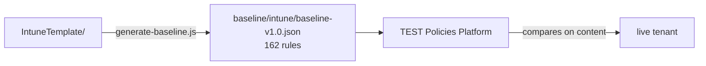

<!-- Generated by scripts/generate-docs.js — do not edit by hand. -->

[Nederlands](README.md) · **English** · [Français](README.fr.md)

# baseline/

**Generated — do not edit by hand.** `intune/baseline-v1.0.json` is the source for the
`intune` category in the baseline link of the TEST Policies Platform (Settings →
Baseline links). Anything you change here is gone again at the next
`node scripts/generate-baseline.js` — change `IntuneTemplate/` instead.

## What is in it

162 rules: 6 that come from the platform itself (checkId 001–006, device compliance and
app protection checks) plus 156 generated from `IntuneTemplate/`. Of these, 18 have severity
`high`, the rest `medium`.

| `type` | Count | From |
|---|---:|---|
| `settings-catalog-match` | 155 | every Settings Catalog policy, Windows and macOS |
| `group-policy-definition-match` | 1 | the only remaining ADMX policy |
| `device-encryption-required`, `compliance-policy-assigned`, `compliance-policy-min-os`, `app-protection-policy-exists`, `passcode-required`, `defender-enabled` | 6 | taken over from the platform (001–006) |

Per platform: Windows 115, macOS 30, iOS/iPadOS 8, Android 3.

Not every policy type produces a check. `Device`, `deviceCompliancePolicies` and
`AppProtection` have no matcher in the engine; a rule with an unknown type is a check
that silently tests nothing. For compliance and app protection, 001–006 cover it generically.

Settings with a CIPP token as value (`%OrganizationId%` and relatives) deliberately stay
out of the checks: CIPP fills them in per tenant at deployment, so the tenant holds the GUID and
not the token. A check that takes the token as the expected value is red by definition.

## Two things to know when reading a finding

**The checks match on content, not on name.** A policy the customer has named differently
simply counts — that is deliberate. The flip side: a leftover policy under an *old* name
keeps its check green, even if the new one was never created. The baseline is therefore no
safety net for a name migration; see [PLAN.en.md](../PLAN.en.md#phase-3--tenant-migration).

**checkIds are external identifiers.** The platform, findings and exceptions refer
to them, so they do not change when a file is renamed. Six numbers have been retired
(008, 017, 023, 025, 028 and 144) and will not be issued again — see
`RETIRED_CHECK_NUMBERS` in [`scripts/generate-baseline.js`](../scripts/generate-baseline.js).

---

Back to the [main README](../README.en.md).
