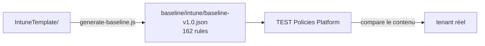

<!-- Généré par scripts/generate-docs.js — ne pas modifier à la main. -->

[Nederlands](README.md) · [English](README.en.md) · **Français**

# baseline/

**Généré — ne pas modifier à la main.** `intune/baseline-v1.0.json` est la source de la
catégorie `intune` dans le lien de baseline de la TEST Policies Platform (Paramètres →
Liens de baseline). Toute modification faite ici disparaît au prochain
`node scripts/generate-baseline.js` — modifiez plutôt `IntuneTemplate/`.

## Contenu

162 règles : 6 qui proviennent de la plateforme elle-même (checkId 001–006, contrôles de conformité des appareils et
de protection des applications) plus 156 générées à partir de `IntuneTemplate/`. Parmi elles, 18 ont la sévérité
`high`, les autres `medium`.

| `type` | Nombre | Provenance |
|---|---:|---|
| `settings-catalog-match` | 155 | chaque policy Settings Catalog, Windows et macOS |
| `group-policy-definition-match` | 1 | la seule policy ADMX restante |
| `device-encryption-required`, `compliance-policy-assigned`, `compliance-policy-min-os`, `app-protection-policy-exists`, `passcode-required`, `defender-enabled` | 6 | repris de la plateforme (001–006) |

Par plateforme : Windows 115, macOS 30, iOS/iPadOS 8, Android 3.

Tous les types de policy ne produisent pas un contrôle. `Device`, `deviceCompliancePolicies` et
`AppProtection` n'ont pas de correspondance dans le moteur ; une règle avec un type inconnu est un contrôle
qui ne teste silencieusement rien. Pour la conformité et la protection des applications, 001–006 couvrent le sujet de façon générique.

Les paramètres dont la valeur est un jeton CIPP (`%OrganizationId%` et apparentés) restent volontairement
hors des contrôles : CIPP les renseigne par tenant au déploiement, le tenant contient donc le GUID et
non le jeton. Un contrôle qui prend le jeton comme valeur attendue est rouge par définition.

## Deux choses à savoir en lisant un constat

**Les contrôles portent sur le contenu, pas sur le nom.** Une policy que le client a nommée autrement
compte quand même — c'est voulu. Revers de la médaille : une policy restée sous un *ancien* nom
garde son contrôle au vert, même si la nouvelle n'a jamais été créée. La baseline n'est donc pas un
filet de sécurité pour une migration de noms ; voir [PLAN.fr.md](../PLAN.fr.md#phase-3--migration-du-tenant).

**Les checkId sont des identifiants externes.** La plateforme, les constats et les exceptions y
font référence, ils ne changent donc pas quand un fichier est renommé. Six numéros ont été supprimés
(008, 017, 023, 025, 028 et 144) et ne seront pas réattribués — voir
`RETIRED_CHECK_NUMBERS` dans [`scripts/generate-baseline.js`](../scripts/generate-baseline.js).

---

Retour au [README principal](../README.fr.md).
