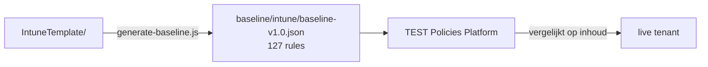

<!-- Gegenereerd door scripts/generate-docs.js — niet met de hand bijwerken. -->

# baseline/

**Gegenereerd — niet met de hand bijwerken.** `intune/baseline-v1.0.json` is de bron voor de
`intune`-categorie in de baseline-koppeling van het TEST Policies Platform (Instellingen →
Baseline-koppelingen). Wijzig je hier iets, dan is het bij de volgende
`node scripts/generate-baseline.js` weer weg — pas `IntuneTemplate/` aan.

## Wat erin zit

127 regels: 6 die uit het platform zelf komen (checkId 001–006, device-compliance- en
app-protection-checks) plus 121 gegenereerd uit `IntuneTemplate/`. Daarvan 18 met severity
`high`, de rest `medium`.

| `type` | Aantal | Uit |
|---|---:|---|
| `settings-catalog-match` | 120 | elke Settings Catalog-policy, Windows én macOS |
| `group-policy-definition-match` | 1 | de enige overgebleven ADMX-policy |
| `device-encryption-required`, `compliance-policy-assigned`, `compliance-policy-min-os`, `app-protection-policy-exists`, `passcode-required`, `defender-enabled` | 6 | overgenomen uit het platform (001–006) |

Per platform: Windows 100, macOS 21.

Niet elk policytype levert een check op. `Device`, `deviceCompliancePolicies` en
`AppProtection` hebben geen matcher in de engine; een regel met een onbekend type is een check
die stilzwijgend niets test. Voor compliance en app protection dekken 001–006 het generiek af.

Instellingen met een CIPP-token als waarde (`%OrganizationId%` en verwanten) blijven bewust
buiten de checks: CIPP vult die bij uitrol per tenant in, dus in de tenant staat de GUID en
niet het token. Een check die het token als verwachte waarde meeneemt is per definitie rood.

## Twee dingen om te weten bij het lezen van een finding

**De checks matchen op inhoud, niet op naam.** Een policy die de klant anders genoemd heeft
telt gewoon mee — dat is bewust. Keerzijde: een achtergebleven policy onder een óude naam
houdt zijn check groen, ook als de nieuwe nooit is aangemaakt. De baseline is daarom geen
vangnet voor een naamsmigratie; zie [PLAN.md](../PLAN.md#fase-3--tenant-migratie).

**checkId's zijn externe identifiers.** Het platform, findings en uitzonderingen verwijzen
ernaar, dus ze veranderen niet als een bestand hernoemd wordt. Zes nummers zijn opgeheven
(008, 017, 023, 025, 028 en 144) en worden niet opnieuw uitgedeeld — zie
`RETIRED_CHECK_NUMBERS` in [`scripts/generate-baseline.js`](../scripts/generate-baseline.js).

---

Terug naar de [hoofd-README](../README.md).
