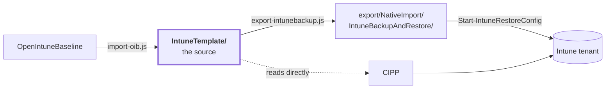

<!-- Generated by scripts/generate-docs.js — do not edit by hand. -->

[Nederlands](OVERZICHT.md) · **English** · [Français](OVERZICHT.fr.md)

# Intune baseline — overview

197 policies across 4 platforms, with
[OpenIntuneBaseline](https://github.com/SkipToTheEndpoint/OpenIntuneBaseline) as the source.
This is the summary; the details are in the [main README](../README.en.md) and per folder.

| | Count |
|---|---:|
| Policies | 197 |
| Without assignment (deliberately) | 96 |
| Deployed in the tenant | 0 |

## What is in it

| Platform | Settings Catalog | ADMX | Device config | Compliance | App Protection | Total |
|---|---:|---:|---:|---:|---:|---:|
| [Windows](../IntuneTemplate/WIN/README.en.md) | 114 | 1 | 6 | 11 | – | **132** |
| [macOS](../IntuneTemplate/MAC/README.en.md) | 30 | – | 3 | 4 | – | **37** |
| [iOS/iPadOS](../IntuneTemplate/IOS/README.en.md) | 8 | – | 2 | 3 | 1 | **14** |
| [Android](../IntuneTemplate/AND/README.en.md) | 3 | – | 2 | 8 | 1 | **14** |

Each platform has a table with **every policy, what it does and where it lands**:
- [Windows](../IntuneTemplate/WIN/README.en.md) — 132 policies
- [macOS](../IntuneTemplate/MAC/README.en.md) — 37 policies
- [iOS/iPadOS](../IntuneTemplate/IOS/README.en.md) — 14 policies
- [Android](../IntuneTemplate/AND/README.en.md) — 14 policies

## Compliance framework

197 of the 197 policies reference ISO/IEC 27001:2022 Annex A, NIS2 art. 21(2),
CIS Controls v8.1 and NIST CSF 2.0; together the policies in phase 1 touch 31 of the 93 Annex A controls.
Per control and per NIS2 point what the baseline enforces, how it is verified and what the organisation
has to arrange itself: [COMPLIANCE.en.md](COMPLIANCE.en.md).

## One source, two derivatives

Changes are made in `IntuneTemplate/`. The rest is generated and rebuilt by CI.

## What changed in August 2026

From 24 in-house policies to the current set.

| | Count | |
|---|---:|---|
| Rewritten on OIB content | 15 | Edge Security went from 2 to 54 settings, Defender Antivirus from 11 to 28, Audit from 23 to 40 |
| New | 75 | including Windows Hello for Business, Credential Guard, Local Administrators, Office Security, 7 compliance policies, 20 macOS policies, 2 BYOD MAM |
| Merged into another policy | 6 | Administrative Templates (300 settings) split up; Network Security, System Services, Windows Search and OneDrive KFM absorbed |
| Carried over unchanged | 5 | where OIB has no counterpart: EDR onboarding, Outlook autoconfiguration, Edge search engine, update ring 3, user experience |

Settings that only the own baseline had — encryption of fixed and removable drives,
for example — were kept during a rewrite instead of silently
disappearing.

## What the comparison with IntuneAdmin produced

At the end of August 2026 the set was laid next to [IntuneAdmin/IntuneBaselines](https://github.com/IntuneAdmin/IntuneBaselines)
— 874 profiles, compared on settingDefinitionId and value. 654 settings appear in
both sets, 55 of them with a different value. That produced four new policies and three
adjustments:

| | |
|---|---|
| `WIN - D - Windows AI` | Recall and Click To Do off. OIB v4.0 has no Windows AI policy yet, so the baseline did not have one either. |
| `WIN - D - Removable Storage` | writing to USB storage and WPD devices blocked; removable media was not restricted anywhere. |
| `WIN - U - Windows Hello for Business` | WHfB per user alongside the existing per-device policy. |
| `WIN - D - Windows Hello for Business Multi User` | WHfB for shared devices, without provisioning right after sign-in. |
| `WIN - D - Windows Firewall` | *local policy merge* was only set on the public profile; now also on domain and private. |
| `WIN - D - Login and Lock Screen` | the password reveal button is turned off — the only hard CIS L1 deviation without a functional reason. |
| `WIN - D - Defender Antivirus` | low and medium threats to quarantine instead of block and remove: a false positive can then be reverted. |

In addition, the three CIPP standard templates for Defender lost their assignment. They set
the same settings as their OIB counterpart to a different value — 19 conflicts in total,
16 of them ASR rules. On a conflict Intune applies the setting from neither policy,
so those 16 rules were effectively off.

What deliberately stays different from CIS and IntuneAdmin: telemetry on *Optional* (Endpoint Analytics
and Windows Update reporting rely on it) and location on (Find my device, time zone). Both
are explained in the `doel` field of their policy.

## What the macOS review produced

At the end of August 2026 the macOS set was reviewed as a whole. That produced two new policies
and three corrections:

| | |
|---|---|
| `MAC - D - Enrollment Profile Administrator / Standard User Affinity` | two ADE enrolment profiles that differ in exactly one setting: whether the signed-in account becomes administrator or standard user. Alternatives to each other, so neither is assigned. |
| `MAC - D - Software Updates` | from the classic `com.apple.softwareupdate` payload to declarative update management (DDM, macOS 14+): deferral of 7 days for minor, 14 for major and 21 for system updates, Rapid Security Responses on including rollback. |
| `MAC - D - Defender for Endpoint` | the organisation name of the content filter was set to *JAMF Software* — a leftover from the Jamf profiles the MDE documentation relies on. The user sees that name in System Settings → Network → Filters. |
| `MAC - U - Compliance Device Health` and `Device Security` | carried each other's description. Device Health checks System Integrity Protection; Device Security checks encryption, the firewall and Gatekeeper. |

One gap is deliberately left open: `MAC - U - Compliance Password` requires a password of
at least eight characters with a lock after fifteen minutes, but there is no configuration policy
that sets that on the Mac. A Mac without a screen lock is therefore reported as non-compliant
but does not get the setting enforced — that needs its own passcode policy.

## What still needs to happen

The repo is ready and the checks are green. The tenant has not been touched: the policies
there still carry their old name. The order is a dependency, not a suggestion —
step 4 before step 3 produces two policies that contradict each other.

| # | Step | |
|---:|---|---|
| 1 | Inventory | `Get-BaselinePolicyState.ps1` — still to be built |
| 2 | Rename | `Rename-BaselinePolicy.ps1 -WhatIf` first; PATCH, so id and assignments stay |
| 3 | Replace | Windows Firewall and Office Updates change policy type — manual work |
| 4 | Retire | delete Network Security, Windows Search, System Services, OneDrive KFM |
| 5 | Deploy | the new policies via CIPP or `Start-IntuneRestoreConfig` |
| 6 | Assign | `Set-BaselineAssignment.ps1 -Scope D -AllDevices` and `-Scope U -AllUsers` only take phase 1; the pilot follows with `-GroupName 'SEC-Baseline-Pilot'` |
| 7 | Inventory again | the list of orphaned policies must be empty |

## Pilot first

Phase 2 in `_manifest.json`. These policies are deployed via the package `Baseline-Pilot` to
`SEC-Baseline-Pilot`, and only to everyone once they move to phase 1 — a PR, because that
changes who they are deployed to. The reason per policy is the `faseWaarom` from the manifest.

| Policy | Why |
|---|---|
| `WIN - D - Access Control` | Users must type their full name instead of clicking it, and they see a banner. First adjust the banner text to your own organisation's name. |
| `WIN - D - Account Lockout` | The machine threshold puts a device into BitLocker recovery after ten failed attempts. That is recoverable (the key is stored in Entra ID) but generates a helpdesk ticket; check in the pilot how often it happens. |
| `WIN - D - Administrator Protection` | Changes how an administrator works: no more permanently elevated rights, but a confirmation per action. Scripts and tools that silently rely on administrator rights will notice. Windows 11 24H2 and later; on older builds it does nothing. |
| `WIN - D - Cryptography` | An internal system that only speaks TLS 1.0/1.1 becomes unreachable. That is intended, but it has to be known. |
| `WIN - D - Device Guard and Credential Guard` | Requires a restart, and memory integrity (HVCI) does not load drivers that were not built for it — think of old VPN, printer and dock drivers. Check in the pilot that everything still starts. |
| `WIN - D - Disable NTLM` | Refuses all NTLM, inbound and outbound. Whatever cannot use Kerberos breaks: applications that connect by IP address, devices outside the domain, and shares for which the device gets no Kerberos ticket — an Entra-joined device opening a share on Entra Domain Services falls back to NTLM. Before the pilot, read Microsoft-Windows-NTLM/Operational on a few Windows 11 24H2 devices (4020/4021 outbound, 4022/4023 inbound): that logging is enabled there by default and shows what would break. |
| `WIN - D - Enrollment Hardening` | Affects the initial setup of a device, not a running device. Test on one Autopilot device: without a network the user cannot proceed, and that is intended — but it must match how devices are deployed in your organisation. |
| `WIN - D - In-Box App Removal` | Removes built-in apps, including from devices already in use. Check in the pilot whether anyone misses one. |
| `WIN - D - Kernel DMA Protection` | A dock or eGPU without DMA remapping no longer works. Test with the docks present in the fleet. |
| `WIN - D - Logon Hardening` | Users will now have to press CTRL+ALT+DEL before the sign-in screen. Communicate this before the broad deployment. |
| `WIN - D - Microsoft Edge DNS over HTTPS Automatic` | Automatic is the Edge default, but once enforced the user can no longer turn it off or choose their own resolver. Test on the pilot group whether internal names and any web proxy/DNS filter keep working. |
| `WIN - D - Network Authentication Hardening` | Closing PKU2U breaks Remote Desktop to another Entra-joined device with Entra credentials via the old sign-in method, and P-node breaks NetBIOS name resolution via broadcast in a network without DNS or WINS. Pilot group first. |
| `WIN - D - Printing Hardening` | Windows Protected Print drops printers that have no Mopria driver. Inventory the printer fleet first. |
| `WIN - D - Remote Access Hardening` | Check that no management script or monitoring tool relies on winrs. Enter-PSSession and Invoke-Command keep working, winrs does not. |
| `WIN - D - Removable Storage` | Writing to USB sticks, external drives and phones is blocked, and a user notices that immediately. Note: until this policy is broadly deployed, removable storage is not restricted anywhere — BitLocker deliberately leaves removabledrivesrequireencryption off, because this block covers it. |
| `WIN - D - Script File Associations` | Double-clicking a .js, .vbs or .hta file will now open Notepad. A logon or installation script started that way will then do nothing; check in the pilot whether such scripts are in circulation. |
| `WIN - D - Security Log Monitoring` | Module logging for all modules (*) produces a lot of event 4103 in Microsoft-Windows-PowerShell/Operational. First check on the pilot group what that does to log volume and any SIEM ingest; see extras/windows/remediations/event-log-sizes for the log size. |
| `WIN - D - Windows AI Features Restricted` | Users see the AI buttons in Paint disappear. That is intended, but it is visible and deserves an announcement. Choose per organisation between this one and the Permitted variant — never assign both. |
| `WIN - D - Windows Component Hardening` | Noticeable in two places: 'Continue on this device' (Continue experiences) disappears, and a kiosk device that uses AutoAdminLogon no longer signs in automatically. Pilot group first; keep kiosks out of this policy. |
| `WIN - D - Windows Hello for Business` | Every user is guided through PIN setup at their next sign-in, and a device without a TPM does not get WHfB. Goes into the pilot together with WIN - U - Windows Hello for Business: one in the pilot and the other on everyone makes the pilot pointless. |
| `WIN - D - Windows Hello Passkey PIN Complexity Alphanumeric` | Goes into the pilot together with WIN - D - Windows Hello for Business and WIN - U - Windows Hello for Business — they are in the same phase and await this same decision. Assigning complexity to users without WHfB set up does nothing; conversely, a user with WHfB but without this policy falls back to six digits. Watch the number of PIN resets in the pilot: that is the cost of this variant. There are four PIN complexity policies and only one may ever be assigned: `WIN - D - Windows Hello Passkey PIN Complexity Alphanumeric` / `Numeric` (the passkey-named set) and `WIN - D - Windows Hello PIN Complexity Alphanumeric` / `Numeric` (the generic, older one). Two assigned policies that set the same setting to a different value produce a Conflict in Intune, after which neither is applied. |
| `WIN - U - AI Usage Control Restricted` | Takes over the Edge URL block list from Microsoft Edge User Experience — that setting has already been removed there. Check in the pilot that no legitimate site is blocked. Choose per organisation between this one and the Permitted variant; never assign both. |
| `WIN - U - Compliance OS Version` | A device below the minimum becomes non-compliant and thereby loses access via Conditional Access. First check in the reporting how many devices this affects — the answer should be zero, but you must have seen that rather than assumed it. Grace period is 72 hours. |
| `WIN - U - File Sharing Restrictions` | A user who is used to sharing a folder from their profile via File Explorer will see that option disappear. Sharing via OneDrive and Teams keeps working. |
| `WIN - U - Microsoft Edge Management` | Reverses precedence: policy from the Edge Management Service then wins over the Edge policy from this baseline. Anyone with the Edge Administrator role can therefore override settings from Microsoft Edge Security and User Experience. First record who has that role before this is broadly deployed. |
| `WIN - U - Microsoft Outlook Cached Mode Managed` | Affects every existing profile: Outlook rebuilds the OST and a shared mailbox in the profile goes from cached to online. That is visible — the first synchronisation takes time and bandwidth, and anyone used to working offline in a shared mailbox notices it immediately. Pilot group first, and check there how many profiles have a shared mailbox. |
| `WIN - U - Microsoft Teams` | Blocks signing in with an account from another tenant. That is intended, but anyone using a second work account in Teams notices it immediately — check in the pilot whether that occurs. |
| `WIN - U - Windows Hello for Business` | Belongs with WIN - D - Windows Hello for Business and goes into the pilot together with it — on all users it would still set up WHfB on every device, and then the pilot tests nothing. |
| `MAC - D - Apple Intelligence Restricted` | Users see Writing Tools, summaries, Genmoji, Image Playground and the ChatGPT integration disappear. That is intended, but it is visible and deserves an announcement. Choose per organisation between this one and the Permitted variant — never assign both. |
| `MAC - D - FileVault` | Encrypts the disk and asks the user to cooperate. Check in the pilot that the recovery key actually appears in Intune before you deploy broadly. |
| `MAC - D - Login Window` | At the login window, users must type their account name instead of clicking their name. Announce it. After a restart the user still sees the account list of the FileVault unlock screen; this setting applies to the login window after that (sign out, switch users). |
| `MAC - D - Passcode and Screen Lock` | Users with a shorter or simpler password must change it at their next sign-in. |
| `MAC - D - Recovery Lock` | Anyone who needs recoveryOS — reinstalling macOS, Disk Utility from recovery, another startup disk — must from now on request the password from the service desk. Check in the pilot that the password is visible in Intune before you deploy broadly. |
| `MAC - D - Restrictions Hardening` | Starting an unsigned app via right-click → Open is no longer possible, and a user can no longer install a profile or certificate by hand (for example from a VPN vendor, a test environment or a Wi-Fi portal). Inventory in the pilot who does that now; those installations should go through Intune from now on. |
| `MAC - D - Screensaver` | Anyone used to getting the screen back without a password within a minute of the screen saver must now use their password or Touch ID straight away. Noticeable, not breaking; pilot and announce first. |
| `MAC - D - Software Updates` | Updates are installed automatically and enforced no later than 30 days after release with a restart at 12:30 — including for a new major version of macOS. Check in the pilot how the restart time falls and whether business apps can handle the new major version. Beta enrolment is no longer possible. |
| `MAC - U - Compliance OS Version` | A Mac below macOS 14 becomes non-compliant and loses access via Conditional Access. OVERZICHT.md already mentions that older Macs do not get the update profile; this policy makes that visible instead of silent. First check how many Macs it affects. Grace period is 72 hours. |
| `AND - U - Corporate AI Restricted` | Users lose Circle to Search and Gemini's screen context on the work profile or the whole device. Whether that fits is an organisational decision about generative AI, as with Windows AI Restricted; pilot group first, and do not assign for an organisation that allows these assistants. |
| `AND - U - Corporate Data Protection` | Users notice it immediately: no screenshots, no files via Bluetooth, and a fully managed device can no longer be reset by the user — IT has to wipe it. Pilot group first; without fully managed or corporate-owned work profile enrolment it does nothing. |

96 are without assignment: the 39 above, 26 awaiting a prerequisite,
16 for a dedicated group and 15 that are not deployed. The last two are an
*alternative* to a policy that is assigned, not an addition to it: update rings
1 and 2 for Windows and Defender set the same settings as ring 3 with different values, the
three CIPP standard templates for Defender do the same as their OIB counterpart, the
WHfB variant for shared devices belongs on a group of shared devices, and the two
macOS enrolment profiles differ in exactly one setting. All of them on All Devices would
produce a conflict, after which Intune applies the disputed setting from neither
policy; they belong on a dedicated group.
