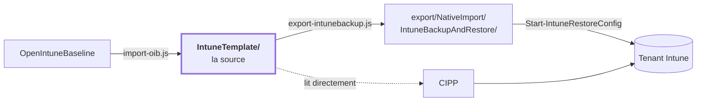

<!-- Généré par scripts/generate-docs.js — ne pas modifier à la main. -->

[Nederlands](OVERZICHT.md) · [English](OVERZICHT.en.md) · **Français**

# Baseline Intune — vue d'ensemble

207 policies sur 4 plateformes, avec
[OpenIntuneBaseline](https://github.com/SkipToTheEndpoint/OpenIntuneBaseline) comme source.
Ceci est le résumé ; les détails se trouvent dans le [README principal](../README.fr.md) et dans chaque dossier.

| | Nombre |
|---|---:|
| Policies | 207 |
| Sans affectation (volontairement) | 101 |
| Déployées dans le tenant | 0 |

## Contenu

| Platform | Settings Catalog | ADMX | Device config | Compliance | App Protection | Total |
|---|---:|---:|---:|---:|---:|---:|
| [Windows](../IntuneTemplate/WIN/README.fr.md) | 124 | 1 | 6 | 11 | – | **142** |
| [macOS](../IntuneTemplate/MAC/README.fr.md) | 30 | – | 3 | 4 | – | **37** |
| [iOS/iPadOS](../IntuneTemplate/IOS/README.fr.md) | 8 | – | 2 | 3 | 1 | **14** |
| [Android](../IntuneTemplate/AND/README.fr.md) | 3 | – | 2 | 8 | 1 | **14** |

Chaque plateforme dispose d'un tableau avec **chaque policy, ce qu'elle fait et où elle atterrit** :
- [Windows](../IntuneTemplate/WIN/README.fr.md) — 142 policies
- [macOS](../IntuneTemplate/MAC/README.fr.md) — 37 policies
- [iOS/iPadOS](../IntuneTemplate/IOS/README.fr.md) — 14 policies
- [Android](../IntuneTemplate/AND/README.fr.md) — 14 policies

## Référentiel de conformité

207 des 207 policies renvoient à l'ISO/IEC 27001:2022 Annexe A, à NIS2 art. 21(2),
aux CIS Controls v8.1 et au NIST CSF 2.0 ; ensemble, les policies de la phase 1 couvrent 32 des 93 mesures de l'Annexe A.
Par mesure et par point NIS2 : ce que la baseline impose, comment c'est vérifié et ce que l'organisation
doit régler elle-même : [COMPLIANCE.fr.md](COMPLIANCE.fr.md).

## Une source, deux dérivés

Les modifications se font dans `IntuneTemplate/`. Le reste est généré et reconstruit par la CI.

## Ce qui a changé en août 2026

De 24 policies maison à l'ensemble actuel.

| | Nombre | |
|---|---:|---|
| Réécrites sur le contenu OIB | 15 | Edge Security est passé de 2 à 54 paramètres, Defender Antivirus de 11 à 28, Audit de 23 à 40 |
| Nouvelles | 75 | notamment Windows Hello for Business, Credential Guard, Local Administrators, Office Security, 7 policies de conformité, 20 policies macOS, 2 BYOD MAM |
| Fusionnées dans une autre policy | 6 | Administrative Templates (300 paramètres) éclaté ; Network Security, System Services, Windows Search et OneDrive KFM absorbés |
| Reprises sans changement | 5 | là où OIB n'a pas d'équivalent : onboarding EDR, configuration automatique d'Outlook, moteur de recherche Edge, anneau de mise à jour 3, expérience utilisateur |

Les paramètres que seule la baseline propre avait — le chiffrement des disques fixes et amovibles,
par exemple — ont été conservés lors d'une réécriture au lieu de disparaître
silencieusement.

## Ce qu'a donné la comparaison avec IntuneAdmin

Fin août 2026, l'ensemble a été comparé à [IntuneAdmin/IntuneBaselines](https://github.com/IntuneAdmin/IntuneBaselines)
— 874 profils, comparés sur settingDefinitionId et valeur. 654 paramètres figurent dans
les deux ensembles, dont 55 avec une valeur différente. Cela a donné quatre nouvelles policies et trois
ajustements :

| | |
|---|---|
| `WIN - D - Windows AI` | Recall et Click To Do désactivés. OIB v4.0 n'a pas encore de policy Windows AI, la baseline n'en avait donc pas non plus. |
| `WIN - D - Removable Storage` | écriture sur stockage USB et appareils WPD bloquée ; les supports amovibles n'étaient restreints nulle part. |
| `WIN - U - Windows Hello for Business` | WHfB par utilisateur, en plus de la policy par appareil existante. |
| `WIN - D - Windows Hello for Business Multi User` | WHfB pour les appareils partagés, sans provisionnement juste après la connexion. |
| `WIN - D - Windows Firewall` | *local policy merge* n'était défini que sur le profil public ; désormais aussi sur domaine et privé. |
| `WIN - D - Login and Lock Screen` | le bouton d'affichage du mot de passe est désactivé — le seul écart CIS L1 strict sans raison fonctionnelle. |
| `WIN - D - Defender Antivirus` | menaces faibles et moyennes en quarantaine au lieu de bloquer et supprimer : un faux positif peut alors être annulé. |

En outre, les trois templates standard CIPP pour Defender ont perdu leur affectation. Ils définissaient
les mêmes paramètres que leur équivalent OIB avec une autre valeur — 19 conflits au total,
dont 16 règles ASR. En cas de conflit, Intune n'applique le paramètre d'aucune des deux policies,
ces 16 règles étaient donc de fait désactivées.

Ce qui reste volontairement différent de CIS et IntuneAdmin : télémétrie sur *Facultatif* (Endpoint Analytics
et les rapports Windows Update en dépendent) et localisation activée (Localiser mon appareil, fuseau horaire). Les deux
sont justifiés dans le champ `doel` de leur policy.

## Ce qu'a donné la revue macOS

Fin août 2026, l'ensemble macOS a été revu dans sa totalité. Cela a donné deux nouvelles policies
et trois corrections :

| | |
|---|---|
| `MAC - D - Enrollment Profile Administrator / Standard User Affinity` | deux profils d'inscription ADE qui diffèrent d'un seul paramètre : le compte connecté devient-il administrateur ou utilisateur standard. Alternatives l'un de l'autre, donc aucun n'est affecté. |
| `MAC - D - Software Updates` | du payload classique `com.apple.softwareupdate` à la gestion déclarative des mises à jour (DDM, macOS 14+) : report de 7 jours pour les mises à jour mineures, 14 pour les majeures et 21 pour les mises à jour système, Rapid Security Responses activées avec retour arrière. |
| `MAC - D - Defender for Endpoint` | le nom d'organisation du filtre de contenu était *JAMF Software* — un reste des profils Jamf sur lesquels s'appuie la documentation MDE. L'utilisateur voit ce nom dans Réglages Système → Réseau → Filtres. |
| `MAC - U - Compliance Device Health` et `Device Security` | portaient la description l'une de l'autre. Device Health vérifie System Integrity Protection ; Device Security vérifie le chiffrement, le pare-feu et Gatekeeper. |

Une lacune est volontairement laissée ouverte : `MAC - U - Compliance Password` exige un mot de passe
d'au moins huit caractères avec verrouillage après quinze minutes, mais aucune policy de configuration
ne le définit sur le Mac. Un Mac sans verrouillage d'écran est donc signalé comme non conforme
sans que le paramètre lui soit imposé — cela nécessite une policy de code d'accès dédiée.

## Ce qui reste à faire

Le dépôt est prêt et les contrôles sont au vert. Le tenant n'a pas été touché : les policies
y portent encore leur ancien nom. L'ordre est une dépendance, pas une suggestion —
l'étape 4 avant l'étape 3 produit deux policies qui se contredisent.

| # | Étape | |
|---:|---|---|
| 1 | Inventorier | `Get-BaselinePolicyState.ps1` — reste à construire |
| 2 | Renommer | `Rename-BaselinePolicy.ps1 -WhatIf` d'abord ; PATCH, donc l'id et les affectations sont conservés |
| 3 | Remplacer | Windows Firewall et Office Updates changent de type de policy — travail manuel |
| 4 | Supprimer | supprimer Network Security, Windows Search, System Services, OneDrive KFM |
| 5 | Déployer | les nouvelles policies via CIPP ou `Start-IntuneRestoreConfig` |
| 6 | Affecter | `Set-BaselineAssignment.ps1 -Scope D -AllDevices` et `-Scope U -AllUsers` ne prennent que la phase 1 ; le pilote suit avec `-GroupName 'SEC-Baseline-Pilot'` |
| 7 | Inventorier à nouveau | la liste des policies orphelines doit être vide |

## D'abord en pilote

Phase 2 dans `_manifest.json`. Ces policies sont déployées via le package `[Baseline] - Baseline-Pilot` vers
`SEC-Baseline-Pilot`, et à tout le monde seulement lorsqu'elles passent en phase 1 — une PR, car cela
change à qui elles sont déployées. La raison pour chaque policy est le `faseWaarom` du manifeste.

| Policy | Pourquoi |
|---|---|
| `WIN - D - Access Control` | Les utilisateurs doivent saisir leur nom complet au lieu de cliquer dessus, et ils voient une bannière. Adaptez d'abord le texte de la bannière au nom de votre organisation. |
| `WIN - D - Account Lockout` | Le seuil machine place un appareil en récupération BitLocker après dix tentatives échouées. C'est récupérable (la clé est stockée dans Entra ID) mais cela génère une demande au support ; vérifiez pendant le pilote à quelle fréquence cela se produit. |
| `WIN - D - Administrator Protection` | Change la façon de travailler d'un administrateur : plus de droits élevés en permanence, mais une confirmation pour chaque action. Les scripts et outils qui s'appuient silencieusement sur les droits d'administrateur le remarqueront. Windows 11 24H2 et versions ultérieures ; sur les builds plus anciens, il ne fait rien. |
| `WIN - D - Bluetooth Allowed Services` | Une liste d'autorisation désactive tout ce qui n'y figure pas, et on ne sait quels appareils Bluetooth sont utilisés qu'en regardant. Dans le pilote, testez au moins une souris, un clavier, un casque (classique et LE Audio), un appel via Phone Link avec un iPhone et un téléphone Android, et une connexion par passkey avec le code QR. Ne s'applique qu'après un redémarrage. |
| `WIN - D - Cryptography` | Un système interne qui ne parle que TLS 1.0/1.1 devient inaccessible. C'est voulu, mais il faut le savoir. |
| `WIN - D - Device Guard and Credential Guard` | Nécessite un redémarrage, et l'intégrité de la mémoire (HVCI) ne charge pas les pilotes qui n'ont pas été conçus pour elle — pensez aux anciens pilotes VPN, d'imprimante et de station d'accueil. Vérifiez pendant le pilote que tout démarre encore. |
| `WIN - D - Disable NTLM` | Refuse tout NTLM, entrant et sortant. Ce qui ne peut pas passer par Kerberos casse : les applications qui se connectent par adresse IP, les appareils hors du domaine, et les partages pour lesquels l'appareil n'obtient pas de ticket Kerberos — un appareil joint à Entra qui ouvre un partage sur Entra Domain Services se rabat sur NTLM. Avant le pilote, consultez Microsoft-Windows-NTLM/Operational sur quelques appareils Windows 11 24H2 (4020/4021 sortant, 4022/4023 entrant) : cette journalisation y est activée par défaut et montre ce qui casserait. |
| `WIN - D - Enrollment Hardening` | Concerne la première installation d'un appareil, pas un appareil en service. Testez sur un appareil Autopilot : sans réseau, l'utilisateur ne peut pas aller plus loin, et c'est voulu — mais cela doit correspondre à la manière dont les appareils sont déployés chez vous. |
| `WIN - D - Google Chrome Extensions` | ExtensionInstallBlocklist '*' désactive aussi les extensions déjà installées : chaque utilisateur de Chrome perd ses extensions. Vérifiez d'abord lesquelles sont utilisées (Defender Vulnerability Management → Browser extensions) et ajoutez celles qui sont nécessaires à ExtensionInstallAllowlist dans une copie propre au tenant. |
| `WIN - D - Google Chrome Security` | Visible pour les utilisateurs de Chrome : la connexion au navigateur, la synchronisation et l'enregistrement de nouveaux mots de passe sont désactivés. Le débogage à distance l'est aussi, ce qui casse les tests automatisés (Puppeteer, Playwright, Selenium) sur le Chrome installé. D'abord sur le groupe pilote. |
| `WIN - D - In-Box App Removal` | Supprime les applications intégrées, y compris sur les appareils déjà en service. Vérifiez pendant le pilote si quelqu'un en regrette une. |
| `WIN - D - Kernel DMA Protection` | Une station d'accueil ou un eGPU sans remappage DMA ne fonctionne plus. Testez avec les stations d'accueil présentes dans le parc. |
| `WIN - D - Logon Hardening` | Les utilisateurs devront désormais appuyer sur CTRL+ALT+DEL avant l'écran de connexion. Communiquez-le avant le déploiement général. |
| `WIN - D - Microsoft Edge DNS over HTTPS Automatic` | Automatique est la valeur par défaut d'Edge, mais une fois imposée, l'utilisateur ne peut plus la désactiver ni choisir son propre résolveur. Testez sur le groupe pilote que les noms internes et un éventuel proxy web/filtre DNS continuent de fonctionner. |
| `WIN - D - Network Authentication Hardening` | Fermer PKU2U casse le Bureau à distance vers un autre appareil joint à Entra avec des identifiants Entra via l'ancienne méthode de connexion, et le mode P-node casse la résolution de noms NetBIOS par diffusion dans un réseau sans DNS ni WINS. D'abord sur le groupe pilote. |
| `WIN - D - Printing Hardening` | Windows Protected Print abandonne les imprimantes qui n'ont pas de pilote Mopria. Inventoriez d'abord le parc d'imprimantes. |
| `WIN - D - Remote Access Hardening` | Vérifiez qu'aucun script de gestion ni outil de supervision ne s'appuie sur winrs. Enter-PSSession et Invoke-Command continuent de fonctionner, winrs non. |
| `WIN - D - Removable Storage` | L'écriture sur les clés USB, les disques externes et les téléphones est bloquée, et un utilisateur le remarque immédiatement. Attention : tant que cette policy n'est pas déployée largement, le stockage amovible n'est restreint nulle part — BitLocker laisse volontairement removabledrivesrequireencryption désactivé, car ce blocage le couvre. |
| `WIN - D - Script File Associations` | Un double-clic sur un fichier .js, .vbs ou .hta ouvre désormais le Bloc-notes. Un script d'ouverture de session ou d'installation lancé de cette façon ne fait alors plus rien ; vérifiez pendant le pilote si de tels scripts circulent. |
| `WIN - D - Security Log Monitoring` | La journalisation des modules pour tous les modules (*) produit beaucoup d'événements 4103 dans Microsoft-Windows-PowerShell/Operational. Vérifiez d'abord sur le groupe pilote l'effet sur le volume des journaux et sur une éventuelle ingestion SIEM ; voir IntuneTemplate/WIN/Remediations/event-log-sizes pour la taille des journaux. |
| `WIN - D - Windows AI Features Restricted` | Les utilisateurs voient disparaître les boutons d'IA dans Paint. C'est voulu, mais c'est visible et mérite une annonce. Choisissez par organisation entre celle-ci et la variante Permitted — ne jamais affecter les deux. |
| `WIN - D - Windows Component Hardening` | Perceptible sur deux points : « Continuer sur cet appareil » (Continue experiences) disparaît, et un appareil kiosque qui fonctionne avec AutoAdminLogon ne se connecte plus automatiquement. D'abord sur le groupe pilote ; tenir les kiosques en dehors de cette policy. |
| `WIN - D - Windows Hello for Business` | Chaque utilisateur est guidé dans la configuration du PIN à sa prochaine connexion, et un appareil sans TPM n'obtient pas WHfB. Entre dans le pilote avec WIN - U - Windows Hello for Business : l'une dans le pilote et l'autre sur tout le monde rend le pilote inutile. |
| `WIN - D - Windows Hello Passkey PIN Complexity Alphanumeric` | Entre dans le pilote avec WIN - D - Windows Hello for Business et WIN - U - Windows Hello for Business — elles sont dans la même phase et attendent cette même décision. Affecter la complexité à des utilisateurs sans WHfB configuré ne fait rien ; à l'inverse, un utilisateur avec WHfB mais sans cette policy retombe sur six chiffres. Surveillez pendant le pilote le nombre de réinitialisations de PIN : c'est le coût de cette variante. Il existe quatre policies de complexité du PIN et une seule peut être affectée à la fois : `WIN - D - Windows Hello Passkey PIN Complexity Alphanumeric` / `Numeric` (l'ensemble nommé passkey) et `WIN - D - Windows Hello PIN Complexity Alphanumeric` / `Numeric` (l'ensemble générique, plus ancien). Deux policies affectées qui définissent le même paramètre avec une valeur différente produisent un Conflict dans Intune, après quoi aucune des deux n'est appliquée. |
| `WIN - U - AI Usage Control Restricted` | Reprend la liste de blocage d'URL d'Edge de Microsoft Edge User Experience — ce paramètre y a déjà été retiré. Vérifiez pendant le pilote qu'aucun site légitime n'est bloqué. Choisissez par organisation entre celle-ci et la variante Permitted ; ne jamais affecter les deux. |
| `WIN - U - Compliance OS Version` | Un appareil sous le seuil minimal devient non conforme et perd ainsi l'accès via Conditional Access. Vérifiez d'abord dans les rapports combien d'appareils sont concernés — la réponse devrait être zéro, mais il faut l'avoir constaté et non le supposer. Le délai de grâce est de 72 heures. |
| `WIN - U - File Sharing Restrictions` | Un utilisateur habitué à partager un dossier de son profil via l'Explorateur de fichiers verra cette option disparaître. Le partage via OneDrive et Teams continue de fonctionner. |
| `WIN - U - Microsoft Edge Management` | Inverse la priorité : la policy de l'Edge Management Service l'emporte alors sur la policy Edge de cette baseline. Toute personne ayant le rôle Edge Administrator peut donc écraser des paramètres de Microsoft Edge Security et User Experience. Consignez d'abord qui détient ce rôle avant le déploiement général. |
| `WIN - U - Microsoft Outlook Cached Mode Managed` | Concerne chaque profil existant : Outlook reconstruit l'OST et une boîte aux lettres partagée dans le profil passe du mode mis en cache au mode en ligne. C'est visible — la première synchronisation prend du temps et de la bande passante, et quiconque a l'habitude de travailler hors ligne dans une boîte partagée le remarque immédiatement. D'abord sur le groupe pilote, et vérifiez-y combien de profils ont une boîte aux lettres partagée. |
| `WIN - U - Microsoft Teams` | Bloque la connexion avec un compte d'un autre tenant. C'est voulu, mais quiconque utilise un second compte professionnel dans Teams le remarque immédiatement — vérifiez pendant le pilote si cela se produit. |
| `WIN - U - Windows Hello for Business` | Va de pair avec WIN - D - Windows Hello for Business et entre dans le pilote avec elle — sur tous les utilisateurs, elle configurerait quand même WHfB sur chaque appareil, et le pilote ne testerait alors rien. |
| `MAC - D - Apple Intelligence Restricted` | Les utilisateurs voient disparaître Writing Tools, les résumés, Genmoji, Image Playground et l'intégration ChatGPT. C'est voulu, mais c'est visible et mérite une annonce. Choisissez par organisation entre celle-ci et la variante Permitted — ne jamais affecter les deux. |
| `MAC - D - FileVault` | Chiffre le disque et demande pour cela la coopération de l'utilisateur. Vérifiez pendant le pilote que la clé de récupération apparaît bien dans Intune avant de déployer largement. |
| `MAC - D - Login Window` | Dans la fenêtre de connexion, les utilisateurs doivent saisir leur nom de compte au lieu de cliquer sur leur nom. À annoncer. Après un redémarrage, l'utilisateur voit toujours la liste des comptes de l'écran de déverrouillage FileVault ; ce paramètre s'applique à la fenêtre de connexion qui suit (déconnexion, changement d'utilisateur). |
| `MAC - D - Passcode and Screen Lock` | Les utilisateurs dont le mot de passe est plus court ou plus simple doivent le changer à leur prochaine connexion. |
| `MAC - D - Recovery Lock` | Quiconque a besoin de recoveryOS — réinstaller macOS, Utilitaire de disque depuis la récupération, un autre disque de démarrage — doit désormais demander le mot de passe au service desk. Vérifiez pendant le pilote que le mot de passe est visible dans Intune avant de déployer largement. |
| `MAC - D - Restrictions Hardening` | Lancer une application non signée via clic droit → Ouvrir n'est plus possible, et un utilisateur ne peut plus installer manuellement un profil ou un certificat (par exemple d'un fournisseur VPN, d'un environnement de test ou d'un portail Wi-Fi). Inventoriez pendant le pilote qui le fait actuellement ; ces installations doivent désormais passer par Intune. |
| `MAC - D - Screensaver` | Quiconque a l'habitude de retrouver l'écran sans mot de passe dans la minute suivant l'économiseur d'écran doit désormais utiliser immédiatement son mot de passe ou Touch ID. Perceptible, sans rien casser ; d'abord pilote et annonce. |
| `MAC - D - Software Updates` | Les mises à jour sont installées automatiquement et imposées au plus tard 30 jours après leur publication avec un redémarrage à 12:30 — y compris pour une nouvelle version majeure de macOS. Vérifiez pendant le pilote comment tombe le moment du redémarrage et si les applications métier supportent la nouvelle version majeure. L'inscription aux bêtas n'est plus possible. |
| `MAC - U - Compliance OS Version` | Un Mac sous macOS 14 devient non conforme et perd l'accès via Conditional Access. OVERZICHT.md mentionne déjà que les Mac plus anciens ne reçoivent pas le profil de mise à jour ; cette policy rend cela visible au lieu de silencieux. Vérifiez d'abord combien de Mac sont concernés. Le délai de grâce est de 72 heures. |
| `AND - U - Corporate AI Restricted` | Les utilisateurs perdent Circle to Search et le contexte d'écran de Gemini sur le profil professionnel ou sur tout l'appareil. Que cela convienne relève du choix de l'organisation concernant l'IA générative, comme pour Windows AI Restricted ; d'abord sur un groupe pilote, et ne pas affecter dans une organisation qui autorise ces assistants. |
| `AND - U - Corporate Data Protection` | Les utilisateurs le remarquent immédiatement : pas de captures d'écran, pas de fichiers via Bluetooth, et un appareil fully managed ne peut plus être réinitialisé par l'utilisateur — l'IT doit l'effacer. D'abord sur un groupe pilote ; sans inscription fully managed ou corporate-owned work profile, il ne fait rien. |

101 sont sans affectation : les 42 ci-dessus, 26 en attente d'un prérequis,
18 pour un groupe dédié et 15 qui ne sont pas déployées. Ces deux dernières catégories sont une
*alternative* à une policy affectée, pas un complément : les anneaux de mise à jour
1 et 2 pour Windows et Defender définissent les mêmes paramètres que l'anneau 3 avec d'autres valeurs, les
trois templates standard CIPP pour Defender font la même chose que leur équivalent OIB, la
variante WHfB pour appareils partagés va sur un groupe d'appareils partagés, et les deux
profils d'inscription macOS diffèrent d'un seul paramètre. Tout mettre sur All Devices
provoquerait un conflit, après quoi Intune n'applique le paramètre contesté d'aucune des deux
policies ; elles vont sur un groupe dédié.
