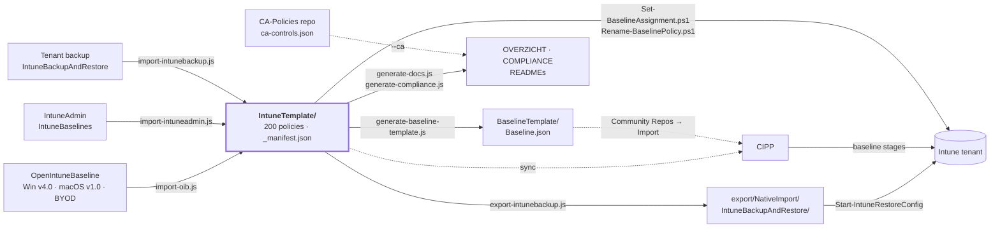

[Nederlands](STRUCTUUR.md) · **English** · [Français](STRUCTUUR.fr.md)

# Structure and connections

How this repo fits together and what it is connected to: which sources feed it, what is generated
from it, which systems read it and how it ends up in a tenant. For the *what* per policy:
[OVERZICHT.en.md](OVERZICHT.en.md). For the standards: [COMPLIANCE.en.md](COMPLIANCE.en.md).

## In short

- **One source:** `IntuneTemplate/` — 200 policies in CIPP template format, across Windows (135),
  macOS (37), iOS/iPadOS (14) and Android (14).
- **Three sources in:** OpenIntuneBaseline (94 policies), IntuneAdmin/IntuneBaselines (22) and
  our own work (84).
- **Two derivatives out:** a restore export for IntuneBackupAndRestore and the CIPP baseline.
  CIPP reads the templates directly itself.
- **Two routes to the tenant:** CIPP or the PowerShell module IntuneBackupAndRestore. Assigning
  and renaming is done with our own scripts via Microsoft Graph.
- **Nothing that is generated gets edited by hand.** A GitHub workflow regenerates it after
  every change in `IntuneTemplate/` and opens a PR for it.

## How it fits together



Solid arrows write; dotted lines only read.

## Folders

| Folder | What it contains | Created by | Picked up by |
|---|---|---|---|
| [`IntuneTemplate/`](../IntuneTemplate/README.en.md) | Per platform the policies (per policy type) and the other components (enrollment, endpoint security, scripts, remediations, apps, app configuration, filters), plus the `_` files that drive the policies | hand + import scripts | policies: all scripts, CIPP · other components: deploy as described in their README; `MAC/Enrollment/ade-profile/` and `MAC/PlatformScripts/` travel with the export as a sidecar |
| [`export/NativeImport/`](../export/README.en.md) | Restore format, with assignments | `export-intunebackup.js` | IntuneBackupAndRestore |
| [`BaselineTemplate/`](../BaselineTemplate/README.en.md) | The CIPP baseline: packages per stage | `generate-baseline-template.js` | CIPP (manual import) |
| `docs/` | Documentation: overview, compliance framework, analysis, plan and this structure | hand + `generate-docs.js`, `generate-compliance.js` | readers |
| [`scripts/`](../scripts/README.en.md) | The pipeline: import, checks, generation, tenant scripts | hand | GitHub workflow |
| `local/` | Deployment copies with filled-in secrets and tenant reports | hand | **not in git** (`.gitignore`) |

`.oib-source/` and `.intuneadmin-source/` are local checkouts of the external sources and are
not in git either.

### Inside `IntuneTemplate/`

```
IntuneTemplate/
  _manifest.json      per policy: purpose, origin, phase, standards, deviations from the source
  _assignments.json   assignment target per phase 1 policy
  _controls.json      vocabulary for ISO 27001, NIS2, CIS and NIST CSF
  _licenties.json     which controls can be covered with a licence
  _renames.json       former names in the tenant
  _ca.json            which CA policies rely on a policy (copy)
  _i18n/              English and French translations of the text in the data
  WIN/  SettingsCatalog/  AdministrativeTemplates/  DeviceConfigurations/  CompliancePolicies/
        Enrollment/  EndpointSecurity/  PlatformScripts/  Remediations/  Apps/  AssignmentFilters/
  MAC/  SettingsCatalog/  DeviceConfigurations/  CompliancePolicies/
        Enrollment/  EndpointSecurity/  PlatformScripts/  ComplianceScripts/
  IOS/  SettingsCatalog/  DeviceConfigurations/  CompliancePolicies/  AppProtection/
        Enrollment/  AppConfiguration/
  AND/  SettingsCatalog/  DeviceConfigurations/  CompliancePolicies/  AppProtection/
        Enrollment/  AppConfiguration/  AssignmentFilters/
```

Next to every `.json` template sits a generated `.md` listing every setting it applies.

## The files that drive everything

| File | Determines | Read by |
|---|---|---|
| `_manifest.json` | Per policy: `doel`, `herkomst` (oib · intuneadmin · eigen), `fase` + `faseWaarom`, `doelgroep` (Windows: `alle`, `fysiek`, `avd`), `controls`, `overrides` on the source, excluded source policies | all Node scripts except `export-intunebackup.js` and `sync-mirror.js`, `Set-BaselineAssignment.ps1` |
| `_assignments.json` | Who a phase 1 policy goes to (all devices, all users), with the assignment filter by name (`filterDisplayName`) for `fysiek` and `avd` | `set-packages.js`, `check-scope.js`, `export-intunebackup.js`, the generation scripts, `Set-BaselineAssignment.ps1` |
| `_controls.json` | Which standard labels exist and what they mean | `generate-compliance.js`, `generate-docs.js`, `check-scope.js` |
| `_licenties.json` | Which empty controls can be solved with a SKU rather than a process | `generate-compliance.js` |
| `_ca.json` | Per policy the CA policies that rely on it, and why — copy from `docs/policies.json` of the CA-Policies repo | `generate-docs.js` |
| `_renames.json` | What policies were called in the tenant: `rename`, `replace` or `retire` | `Rename-BaselinePolicy.ps1`, `check-scope.js`, `generate-docs.js` |
| `Package` (field in every template) | Which CIPP package the policy is deployed in | CIPP, guarded by `check-scope.js` |

## Phases and CIPP packages

The phase in `_manifest.json` determines whether and how a policy is deployed. `set-packages.js`
translates it into the CIPP package; `check-scope.js` guards that phase, assignment and package
agree.

| Phase | Meaning | Policies | CIPP package | CIPP stage |
|---:|---|---:|---|---:|
| 1 | Deploy now | 106 | `[Baseline] - Baseline-Devices`, `[Baseline] - Baseline-Users`, `[Baseline] - Baseline-ADE-token`; per class also `-Devices-Physical`, `-Users-Physical`, `-Devices-AVD` | 1 |
| 2 | Pilot first | 42 | `[Baseline] - Baseline-Pilot` → group `SEC-Baseline-Pilot`; `-Pilot-Physical` with filter | 2 |
| 3 | Awaiting prerequisite (e.g. first enrollment) | 26 | `[Baseline] - Baseline-Wacht`, not assigned | 3 |
| 4 | Dedicated group (`faseGroep`) | 18 | `[Baseline] - Baseline-SEC-<group>` | 1 |
| 5 | Do not deploy — alternative to another policy | 15 | none | – |

Moving on to stage 2 happens once everything from stage 1 is compliant **and** two weeks have
passed. Stage 3 is advanced by hand.

## Scripts and order

| Step | Script | Reads | Writes |
|---:|---|---|---|
| – | `import-oib.js` | `.oib-source/`, `_manifest.json` | `IntuneTemplate/` |
| – | `import-intuneadmin.js` | `.intuneadmin-source/`, `_manifest.json` | `IntuneTemplate/` |
| – | `import-intunebackup.js` | a tenant backup | `IntuneTemplate/` |
| 1 | `set-packages.js` | `_manifest.json`, `_assignments.json` | `Package` in every template |
| 2 | `check-scope.js` | everything in `IntuneTemplate/` | nothing — fails on errors |
| 3 | `export-intunebackup.js` | `IntuneTemplate/`, `_assignments.json` | `export/NativeImport/…` |
| 4 | `generate-baseline-template.js` | `_manifest.json`, `_assignments.json` | `BaselineTemplate/Baseline.json` |
| 5 | `generate-docs.js` | `IntuneTemplate/`, `../CA-Policies/docs/policies.json` if present, otherwise `_ca.json` | `docs/OVERZICHT.md`, READMEs, `.md` per policy, `_ca.json` |
| 6 | `generate-compliance.js` | `_manifest.json`, `_controls.json`, `_licenties.json` | `docs/COMPLIANCE.md` |
| – | `check-osversion.js` | OS minimums, endoflife.date | a report only |
| – | `Set-BaselineAssignment.ps1` | `_manifest.json`, `_assignments.json` | assignments in the tenant |
| – | `Deploy-BaselinePolicies.ps1` | `IntuneTemplate/`, `_manifest.json`, `_assignments.json` | policies and assignments in the tenant, without CIPP |
| – | `Rename-BaselinePolicy.ps1` | `_renames.json` | policy names in the tenant |

Locally you run steps 1 to 6 in this order. [`.github/workflows/generate-baseline.yml`](../.github/workflows/generate-baseline.yml)
runs after every change in `IntuneTemplate/`: first `check-scope.js`, then
`set-packages.js --check` instead of step 1 — CI does not silently correct a wrong package —
and then steps 3 to 6. All Node scripts in the pipeline share `scripts/lib/templates.js`.
Details: [scripts/README.en.md](../scripts/README.en.md).

## External connections

| System | Direction | How | Note |
|---|---|---|---|
| [OpenIntuneBaseline](https://github.com/SkipToTheEndpoint/OpenIntuneBaseline) | source → repo | `import-oib.js` on a local clone | Windows v4.0 taken from a branch at commit `f247604`; re-import once the tag exists |
| [IntuneAdmin/IntuneBaselines](https://github.com/IntuneAdmin/IntuneBaselines) | source → repo | `import-intuneadmin.js` | JSONs in UTF-16LE |
| CA-Policies repo (cloned next to this one as `../CA-Policies`) | repo ← CA | `generate-compliance.js --ca ../CA-Policies/controls/ca-controls.json` | Git holds the `--no-ca` version; CI cannot see the other repo |
| CA-Policies repo | repo ← CA, per policy | `generate-docs.js` reads `docs/policies.json` and writes at each Intune policy the CA policies that rely on it; the CA READMEs link back | CI reads the copy `_ca.json`; links go to `caRepoUrl` from `_organisation.json`; without a URL only the names |
| CIPP | repo → CIPP | template repository sync on this repo | `BaselineTemplate/Baseline.json` only comes along via Tools → Community Repos → Import |
| [IntuneBackupAndRestore](https://github.com/jseerden/IntuneBackupAndRestore) | repo → tenant | `Start-IntuneRestoreConfig` and `…Assignments` with `-RestoreById $false` | restore App Protection assignments separately |
| Microsoft Graph | repo → tenant | `Set-BaselineAssignment.ps1`, `Rename-BaselinePolicy.ps1` | `-WhatIf` first |
| endoflife.date | source → report | `check-osversion.js` | never fails, signal only |
| GitHub Actions | repo → repo | `generate-baseline.yml` opens a PR | the only workflow |
| Mirror clone | repo → mirror | `sync-mirror.js <targetfolder> --push` | Keeps its own history on that side, no force push; run it after the pipeline |

### Two things CIPP does differently from what you expect

- **`NativeImport` in a path excludes it from the sync.** That is why the restore export lives under
  `export/NativeImport/`. Without that word CIPP turns every policy into a second template.
- **Every other `.json` becomes one nameless template row.** That applies to the `_` files in
  `IntuneTemplate/` (including `_i18n/*.json`), the other components in `IntuneTemplate/<PLATFORM>/` — ADE profiles, Graph bodies and
  the JSON part of the compliance check — and, with the automatic sync, also
  `BaselineTemplate/Baseline.json`. That row does nothing and can be deleted in CIPP.

## Tenant settings that are not a policy

Set these two before assigning, otherwise part of the baseline does nothing:

1. **Devices with no compliance policy assigned → Not compliant** (Intune → Compliance policies →
   Compliance policy settings).
2. **Defender for Endpoint connector** on (Intune → Endpoint Security → Microsoft Defender for
   Endpoint).

## Conventions

- **Naming:** `[Baseline] - <WIN|MAC|IOS|AND> - <D|U> - <Item>` in the tenant,
  `Baseline_<PLATFORM>_<D|U>_<Item>.json` as a file. Without the `Baseline_` prefix a file
  silently drops out of every pipeline. Packages, filters, groups and CIPP variables: see
  [PLAYBOOK.en.md](PLAYBOOK.en.md#naming).
- **D or U:** for Windows Settings Catalog it follows from the `settingDefinitionId` (`user_` = U).
  Elsewhere it is a choice about the assignment target.
- **GUIDs stay the same** on every import; otherwise CIPP creates a second template.
- **Deviating from OpenIntuneBaseline** is done via `overrides` in `_manifest.json`, with a reason.
- **Never put secrets in git.** The repo is public; placeholders are named `…-INVULLEN` and are
  filled in under `local/`.
- **Generated, do not edit by hand:** `export/NativeImport/`, `BaselineTemplate/Baseline.json`,
  `docs/OVERZICHT.md`, `docs/COMPLIANCE.md`, the READMEs in `IntuneTemplate/` and the `.md` per policy.

## Further reading

| Document | For |
|---|---|
| [README.en.md](../README.en.md) | Full explanation: import, restore, assignment, CIPP |
| [OVERZICHT.en.md](OVERZICHT.en.md) | Summary to share |
| [COMPLIANCE.en.md](COMPLIANCE.en.md) | CISO or auditor |
| [ANALYSE.en.md](ANALYSE.en.md) | Why things are or are not in the baseline |
| [PLAN.en.md](PLAN.en.md) | What is still open, including the tenant migration |
| [AVD.en.md](AVD.en.md) | Which Windows policies also belong on the AVD session hosts, and the rollout plan |
| [PLAYBOOK.en.md](PLAYBOOK.en.md) | Runbook: deploying the baseline through CIPP per device class, migration, naming |
