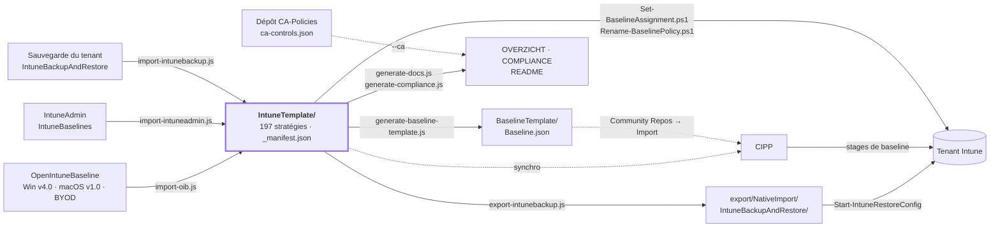

[Nederlands](STRUCTUUR.md) · [English](STRUCTUUR.en.md) · **Français**

# Structure et liaisons

Comment ce dépôt est organisé et à quoi il est relié : quelles sources l'alimentent, ce qui en est
généré, quels systèmes le lisent et comment il arrive dans un tenant. Pour le *quoi* par stratégie :
[OVERZICHT.fr.md](OVERZICHT.fr.md). Pour les normes : [COMPLIANCE.fr.md](COMPLIANCE.fr.md).

## En bref

- **Une seule source :** `IntuneTemplate/` — 197 stratégies au format de template CIPP, réparties
  entre Windows (132), macOS (37), iOS/iPadOS (14) et Android (14).
- **Trois sources en entrée :** OpenIntuneBaseline (94 stratégies), IntuneAdmin/IntuneBaselines (22)
  et travail propre (81).
- **Deux dérivés en sortie :** un export de restauration pour IntuneBackupAndRestore et la baseline
  CIPP. CIPP lit lui-même les templates directement.
- **Deux voies vers le tenant :** CIPP ou le module PowerShell IntuneBackupAndRestore. L'affectation
  et le renommage se font avec nos propres scripts via Microsoft Graph.
- **Rien de ce qui est généré n'est modifié à la main.** Un workflow GitHub le régénère après
  chaque modification dans `IntuneTemplate/` et ouvre une PR pour cela.

## Vue d'ensemble



Les flèches pleines écrivent ; les pointillés ne font que lire.

## Dossiers

| Dossier | Contenu | Créé par | Repris par |
|---|---|---|---|
| [`IntuneTemplate/`](../IntuneTemplate/README.fr.md) | Les stratégies, par plateforme et type de stratégie, plus les fichiers `_` qui les pilotent | main + scripts d'import | tous les scripts, CIPP |
| [`export/NativeImport/`](../export/README.fr.md) | Format de restauration, avec affectations | `export-intunebackup.js` | IntuneBackupAndRestore |
| [`BaselineTemplate/`](../BaselineTemplate/README.fr.md) | La baseline CIPP : packages par stage | `generate-baseline-template.js` | CIPP (import manuel) |
| [`StandardsTemplateV2/`](../StandardsTemplateV2/README.fr.md) | Standards CIPP pour les paramètres du tenant (incitation MFA, migration passkey) | main | CIPP |
| [`extras/`](../extras/README.fr.md) | Tout ce qui n'est pas un type de stratégie CIPP, par plateforme : profils et restrictions d'inscription, configuration d'applications, filtres, App Control, remédiations, scripts shell et de plateforme, scripts de conformité, applications Win32 | main | personne automatiquement — déployer selon le README ; `extras/macos/enrollment/` et `extras/macos/shell-scripts/` accompagnent l'export comme sidecar |
| `docs/` | Documentation : vue d'ensemble, référentiel de conformité, analyse, plan et cette structure | main + `generate-docs.js`, `generate-compliance.js` | lecteurs |
| [`scripts/`](../scripts/README.fr.md) | Le pipeline : import, contrôle, génération, scripts de tenant | main | workflow GitHub |
| `local/` | Copies de déploiement avec secrets renseignés et rapports de tenant | main | **pas dans git** (`.gitignore`) |

`.oib-source/` et `.intuneadmin-source/` sont des checkouts locaux des sources externes et ne sont
pas non plus dans git.

### À l'intérieur de `IntuneTemplate/`

```
IntuneTemplate/
  _manifest.json      par stratégie : objectif, origine, phase, normes, écarts par rapport à la source
  _assignments.json   cible d'affectation par stratégie de phase 1
  _controls.json      vocabulaire pour ISO 27001, NIS2, CIS et NIST CSF
  _licenties.json     quelles mesures peuvent être couvertes par une licence
  _renames.json       anciens noms dans le tenant
  _i18n/              traductions anglaises et françaises des textes des données
  WIN/  SettingsCatalog/  AdministrativeTemplates/  DeviceConfigurations/  CompliancePolicies/
  MAC/  SettingsCatalog/  DeviceConfigurations/  CompliancePolicies/
  IOS/  SettingsCatalog/  DeviceConfigurations/  CompliancePolicies/  AppProtection/
  AND/  SettingsCatalog/  DeviceConfigurations/  CompliancePolicies/  AppProtection/
```

À côté de chaque template `.json` se trouve un `.md` généré qui liste chaque paramètre qu'il définit.

## Les fichiers qui pilotent tout

| Fichier | Détermine | Lu par |
|---|---|---|
| `_manifest.json` | Par stratégie : `doel`, `herkomst` (oib · intuneadmin · eigen), `fase` + `faseWaarom`, `controls`, `overrides` sur la source, stratégies sources exclues | tous les scripts Node sauf `export-intunebackup.js` et `sync-mirror.js`, `Set-BaselineAssignment.ps1` |
| `_assignments.json` | À qui va une stratégie de phase 1 (tous les appareils, tous les utilisateurs) | `set-packages.js`, `check-scope.js`, `export-intunebackup.js`, les scripts de génération, `Set-BaselineAssignment.ps1` |
| `_controls.json` | Quels libellés de normes existent et ce qu'ils signifient | `generate-compliance.js`, `generate-docs.js`, `check-scope.js` |
| `_licenties.json` | Quelles mesures vides peuvent être résolues par un SKU plutôt que par un processus | `generate-compliance.js` |
| `_renames.json` | Comment les stratégies s'appelaient dans le tenant : `rename`, `replace` ou `retire` | `Rename-BaselinePolicy.ps1`, `check-scope.js`, `generate-docs.js` |
| `Package` (champ de chaque template) | Dans quel package CIPP la stratégie est déployée | CIPP, surveillé par `check-scope.js` |

## Phases et packages CIPP

La phase dans `_manifest.json` détermine si et comment une stratégie est déployée. `set-packages.js`
la traduit en package CIPP ; `check-scope.js` vérifie que phase, affectation et package concordent.

| Phase | Signification | Stratégies | Package CIPP | Stage CIPP |
|---:|---|---:|---|---:|
| 1 | Déployer immédiatement | 101 | `Baseline-Devices`, `Baseline-Users`, `Baseline-ADE-token` | 1 |
| 2 | D'abord en pilote | 39 | `Baseline-Pilot` → groupe `SEC-Baseline-Pilot` | 2 |
| 3 | En attente d'un prérequis (p. ex. première inscription) | 26 | `Baseline-Wacht`, non affecté | 3 |
| 4 | Groupe dédié (`faseGroep`) | 16 | `Baseline-SEC-<groupe>` | 1 |
| 5 | Ne pas déployer — alternative à une autre stratégie | 15 | aucun | – |

Le passage au stage 2 a lieu lorsque tout le stage 1 est conforme **et** que deux semaines se sont
écoulées. Le stage 3 est avancé manuellement.

## Scripts et ordre d'exécution

| Étape | Script | Lit | Écrit |
|---:|---|---|---|
| – | `import-oib.js` | `.oib-source/`, `_manifest.json` | `IntuneTemplate/` |
| – | `import-intuneadmin.js` | `.intuneadmin-source/`, `_manifest.json` | `IntuneTemplate/` |
| – | `import-intunebackup.js` | une sauvegarde de tenant | `IntuneTemplate/` |
| 1 | `set-packages.js` | `_manifest.json`, `_assignments.json` | `Package` dans chaque template |
| 2 | `check-scope.js` | tout `IntuneTemplate/` | rien — échoue en cas d'erreur |
| 3 | `export-intunebackup.js` | `IntuneTemplate/`, `_assignments.json` | `export/NativeImport/…` |
| 4 | `generate-baseline-template.js` | `_manifest.json`, `_assignments.json` | `BaselineTemplate/Baseline.json` |
| 5 | `generate-docs.js` | `IntuneTemplate/` | `docs/OVERZICHT.md`, README, `.md` par stratégie |
| 6 | `generate-compliance.js` | `_manifest.json`, `_controls.json`, `_licenties.json` | `docs/COMPLIANCE.md` |
| – | `check-osversion.js` | versions minimales d'OS, endoflife.date | un rapport uniquement |
| – | `Set-BaselineAssignment.ps1` | `_manifest.json`, `_assignments.json` | affectations dans le tenant |
| – | `Rename-BaselinePolicy.ps1` | `_renames.json` | noms des stratégies dans le tenant |

En local, on exécute les étapes 1 à 6 dans cet ordre. [`.github/workflows/generate-baseline.yml`](../.github/workflows/generate-baseline.yml)
s'exécute après chaque modification dans `IntuneTemplate/` : d'abord `check-scope.js`, puis
`set-packages.js --check` au lieu de l'étape 1 — la CI ne corrige pas en silence un mauvais
package — puis les étapes 3 à 6. Tous les scripts Node du pipeline partagent
`scripts/lib/templates.js`. Détails : [scripts/README.fr.md](../scripts/README.fr.md).

## Liaisons externes

| Système | Sens | Comment | Attention |
|---|---|---|---|
| [OpenIntuneBaseline](https://github.com/SkipToTheEndpoint/OpenIntuneBaseline) | source → dépôt | `import-oib.js` sur un clone local | Windows v4.0 repris d'une branche au commit `f247604` ; réimporter dès que le tag existe |
| [IntuneAdmin/IntuneBaselines](https://github.com/IntuneAdmin/IntuneBaselines) | source → dépôt | `import-intuneadmin.js` | JSON en UTF-16LE |
| Dépôt CA-Policies (cloné à côté de celui-ci sous `../CA-Policies`) | dépôt ← CA | `generate-compliance.js --ca ../CA-Policies/controls/ca-controls.json` | Git contient la version `--no-ca` ; la CI ne voit pas l'autre dépôt |
| CIPP | dépôt → CIPP | synchronisation du dépôt de templates sur ce dépôt | `BaselineTemplate/Baseline.json` n'est repris que via Tools → Community Repos → Import |
| [IntuneBackupAndRestore](https://github.com/jseerden/IntuneBackupAndRestore) | dépôt → tenant | `Start-IntuneRestoreConfig` et `…Assignments` avec `-RestoreById $false` | restaurer séparément les affectations App Protection |
| Microsoft Graph | dépôt → tenant | `Set-BaselineAssignment.ps1`, `Rename-BaselinePolicy.ps1` | d'abord `-WhatIf` |
| endoflife.date | source → rapport | `check-osversion.js` | n'échoue jamais, simple signal |
| GitHub Actions | dépôt → dépôt | `generate-baseline.yml` ouvre une PR | le seul workflow |
| Clone miroir | dépôt → miroir | `sync-mirror.js <dossiercible> --push` | Historique propre de ce côté, pas de force push ; à lancer après le pipeline |

### Deux choses que CIPP fait autrement que prévu

- **`NativeImport` dans un chemin l'exclut de la synchronisation.** C'est pourquoi l'export de
  restauration se trouve sous `export/NativeImport/`. Sans ce mot, CIPP fait de chaque stratégie un
  second template.
- **Tout autre `.json` devient une ligne de template sans nom.** Cela vaut pour les fichiers `_` de
  `IntuneTemplate/` (y compris `_i18n/*.json`), tout ce qui se trouve sous `extras/` — profils ADE,
  corps Graph et la partie JSON du contrôle de conformité — et, avec la synchronisation automatique,
  aussi `BaselineTemplate/Baseline.json`. Cette ligne ne fait rien et peut être supprimée dans CIPP.

## Paramètres du tenant qui ne sont pas une stratégie

Définissez ces deux paramètres avant l'affectation, sinon une partie de la baseline ne fait rien :

1. **Appareils sans stratégie de conformité → Non conforme** (Intune → Stratégies de conformité →
   Paramètres de stratégie de conformité).
2. **Connecteur Defender for Endpoint** activé (Intune → Endpoint Security → Microsoft Defender for
   Endpoint).

## Conventions

- **Nommage :** `[Baseline] - <WIN|MAC|IOS|AND> - <D|U> - <Item>` dans le tenant,
  `Baseline_<PLATFORM>_<D|U>_<Item>.json` comme fichier. Sans le préfixe `Baseline_`, un fichier
  disparaît silencieusement de tous les pipelines.
- **D ou U :** pour le Settings Catalog Windows, cela découle du `settingDefinitionId` (`user_` = U).
  Ailleurs, c'est un choix portant sur la cible d'affectation.
- **Les GUID restent identiques** à chaque import ; sinon CIPP crée un second template.
- **S'écarter d'OpenIntuneBaseline** se fait via `overrides` dans `_manifest.json`, avec une raison.
- **Jamais de secrets dans git.** Le dépôt est public ; les placeholders s'appellent `…-INVULLEN` et
  sont renseignés dans `local/`.
- **Généré, ne pas modifier à la main :** `export/NativeImport/`, `BaselineTemplate/Baseline.json`,
  `docs/OVERZICHT.md`, `docs/COMPLIANCE.md`, les README dans `IntuneTemplate/` et le `.md` par stratégie.

## Pour aller plus loin

| Document | Pour |
|---|---|
| [README.fr.md](../README.fr.md) | Explication complète : import, restauration, affectation, CIPP |
| [OVERZICHT.fr.md](OVERZICHT.fr.md) | Résumé à partager |
| [COMPLIANCE.fr.md](COMPLIANCE.fr.md) | RSSI ou auditeur |
| [ANALYSE.fr.md](ANALYSE.fr.md) | Pourquoi certaines choses sont ou ne sont pas dans la baseline |
| [PLAN.fr.md](PLAN.fr.md) | Ce qui reste ouvert, notamment la migration du tenant |
