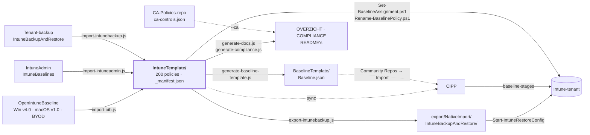

**Nederlands** · [English](STRUCTUUR.en.md) · [Français](STRUCTUUR.fr.md)

# Structuur en koppelingen

Hoe deze repo in elkaar zit en waar hij aan vastzit: welke bronnen hem voeden, wat eruit wordt
gegenereerd, welke systemen het lezen en hoe het in een tenant belandt. Voor het *wat* per policy:
[OVERZICHT.md](OVERZICHT.md). Voor de normen: [COMPLIANCE.md](COMPLIANCE.md).

## In het kort

- **Eén bron:** `IntuneTemplate/` — 200 policies in CIPP-templateformaat, over Windows (135),
  macOS (37), iOS/iPadOS (14) en Android (14).
- **Drie bronnen erin:** OpenIntuneBaseline (94 policies), IntuneAdmin/IntuneBaselines (22) en
  eigen werk (84).
- **Twee afgeleiden eruit:** een restore-export voor IntuneBackupAndRestore en de CIPP-baseline.
  CIPP leest de templates zelf rechtstreeks.
- **Twee wegen naar de tenant:** CIPP of de PowerShell-module IntuneBackupAndRestore. Toewijzen
  en hernoemen gaat met eigen scripts via Microsoft Graph.
- **Alles wat gegenereerd is, wordt niet met de hand bewerkt.** Een GitHub-workflow regenereert
  het na elke wijziging in `IntuneTemplate/` en opent daar een PR voor.

## Samenhang



Doorgetrokken pijlen schrijven; stippellijnen lezen alleen.

## Mappen

| Map | Wat erin staat | Gemaakt door | Opgepikt door |
|---|---|---|---|
| [`IntuneTemplate/`](../IntuneTemplate/README.md) | Per platform de policies (per policytype) en de overige onderdelen (inschrijving, endpoint security, scripts, remediations, apps, app-configuratie, filters), plus de `_`-bestanden die de policies sturen | hand + import-scripts | policies: alle scripts, CIPP · overige onderdelen: uitrollen volgens hun README; `MAC/Enrollment/ade-profile/` en `MAC/PlatformScripts/` gaan als sidecar mee in de export |
| [`export/NativeImport/`](../export/README.md) | Restore-formaat, met assignments | `export-intunebackup.js` | IntuneBackupAndRestore |
| [`BaselineTemplate/`](../BaselineTemplate/README.md) | De CIPP-baseline: pakketten per stage | `generate-baseline-template.js` | CIPP (handmatige import) |
| `docs/` | Documentatie: overzicht, normenkader (compliance), analyse, plan en deze structuur | hand + `generate-docs.js`, `generate-compliance.js` | lezers |
| [`scripts/`](../scripts/README.md) | De pijplijn: import, controle, generatie, tenantscripts | hand | GitHub-workflow |
| `local/` | Uitrolkopieën met ingevulde geheimen en tenantrapporten | hand | **niet in git** (`.gitignore`) |

`.oib-source/` en `.intuneadmin-source/` zijn lokale checkouts van de externe bronnen en staan ook
niet in git.

### Binnen `IntuneTemplate/`

```
IntuneTemplate/
  _manifest.json      per policy: doel, herkomst, fase, normen, afwijkingen van de bron
  _assignments.json   toewijzingsdoel per fase-1-policy
  _controls.json      vocabulaire voor ISO 27001, NIS2, CIS en NIST CSF
  _licenties.json     welke controls met een licentie in te vullen zijn
  _renames.json       vroegere namen in de tenant
  _ca.json            welke CA-policies op een policy leunen (kopie)
  _i18n/              Engelse en Franse vertalingen van de teksten uit de data
  WIN/  SettingsCatalog/  AdministrativeTemplates/  DeviceConfigurations/  CompliancePolicies/
        Enrollment/  EndpointSecurity/  PlatformScripts/  Remediations/  Apps/  AssignmentFilters/
  MAC/  SettingsCatalog/  DeviceConfigurations/  CompliancePolicies/
        Enrollment/  EndpointSecurity/  PlatformScripts/  ComplianceScripts/
  IOS/  SettingsCatalog/  DeviceConfigurations/  CompliancePolicies/  AppProtection/
        Enrollment/  AppConfiguration/
  AND/  SettingsCatalog/  DeviceConfigurations/  CompliancePolicies/  AppProtection/
        Enrollment/  AppConfiguration/  AssignmentFilters/
```

Naast elk `.json`-template staat een gegenereerde `.md` met élke instelling die hij zet.

## De bestanden die alles sturen

| Bestand | Bepaalt | Gelezen door |
|---|---|---|
| `_manifest.json` | Per policy: `doel`, `herkomst` (oib · intuneadmin · eigen), `fase` + `faseWaarom`, `controls`, `overrides` op de bron, uitgesloten bronpolicies | alle Node-scripts behalve `export-intunebackup.js` en `sync-mirror.js`, `Set-BaselineAssignment.ps1` |
| `_assignments.json` | Naar wie een fase-1-policy gaat (alle apparaten, alle gebruikers) | `set-packages.js`, `check-scope.js`, `export-intunebackup.js`, de generatiescripts, `Set-BaselineAssignment.ps1` |
| `_controls.json` | Welke normlabels bestaan en wat ze betekenen | `generate-compliance.js`, `generate-docs.js`, `check-scope.js` |
| `_licenties.json` | Welke lege controls met een SKU op te lossen zijn in plaats van met een proces | `generate-compliance.js` |
| `_ca.json` | Per policy de CA-policies die erop leunen, en waarom — kopie uit `docs/policies.json` van de CA-Policies-repo | `generate-docs.js` |
| `_renames.json` | Hoe policies in de tenant heetten: `rename`, `replace` of `retire` | `Rename-BaselinePolicy.ps1`, `check-scope.js`, `generate-docs.js` |
| `Package` (veld in elk template) | In welk CIPP-pakket de policy uitrolt | CIPP, bewaakt door `check-scope.js` |

## Fases en CIPP-pakketten

De fase in `_manifest.json` bepaalt of en hoe een policy uitrolt. `set-packages.js` vertaalt die
naar het CIPP-pakket; `check-scope.js` bewaakt dat fase, toewijzing en pakket kloppen.

| Fase | Betekenis | Policies | CIPP-pakket | CIPP-stage |
|---:|---|---:|---|---:|
| 1 | Nu uitrollen | 102 | `[Baseline] - Baseline-Devices`, `[Baseline] - Baseline-Users`, `[Baseline] - Baseline-ADE-token` | 1 |
| 2 | Eerst pilot | 41 | `[Baseline] - Baseline-Pilot` → groep `SEC-Baseline-Pilot` | 2 |
| 3 | Wacht op voorwaarde (bijv. eerste inschrijving) | 26 | `[Baseline] - Baseline-Wacht`, niet toegewezen | 3 |
| 4 | Eigen groep (`faseGroep`) | 16 | `[Baseline] - Baseline-SEC-<groep>` | 1 |
| 5 | Niet uitrollen — alternatief voor een andere policy | 15 | geen | – |

Doorschuiven naar stage 2 gebeurt als alles uit stage 1 compliant is **en** er twee weken voorbij
zijn. Stage 3 zet iemand met de hand door.

## Scripts en volgorde

| Stap | Script | Leest | Schrijft |
|---:|---|---|---|
| – | `import-oib.js` | `.oib-source/`, `_manifest.json` | `IntuneTemplate/` |
| – | `import-intuneadmin.js` | `.intuneadmin-source/`, `_manifest.json` | `IntuneTemplate/` |
| – | `import-intunebackup.js` | een tenant-backup | `IntuneTemplate/` |
| 1 | `set-packages.js` | `_manifest.json`, `_assignments.json` | `Package` in elk template |
| 2 | `check-scope.js` | alles in `IntuneTemplate/` | niets — faalt bij fouten |
| 3 | `export-intunebackup.js` | `IntuneTemplate/`, `_assignments.json` | `export/NativeImport/…` |
| 4 | `generate-baseline-template.js` | `_manifest.json`, `_assignments.json` | `BaselineTemplate/Baseline.json` |
| 5 | `generate-docs.js` | `IntuneTemplate/`, `../CA-Policies/docs/policies.json` als die er is, anders `_ca.json` | `docs/OVERZICHT.md`, README's, `.md` per policy, `_ca.json` |
| 6 | `generate-compliance.js` | `_manifest.json`, `_controls.json`, `_licenties.json` | `docs/COMPLIANCE.md` |
| – | `check-osversion.js` | OS-ondergrenzen, endoflife.date | alleen een rapport |
| – | `Set-BaselineAssignment.ps1` | `_manifest.json`, `_assignments.json` | toewijzingen in de tenant |
| – | `Rename-BaselinePolicy.ps1` | `_renames.json` | policynamen in de tenant |

Lokaal draai je stap 1 t/m 6 in deze volgorde. [`.github/workflows/generate-baseline.yml`](../.github/workflows/generate-baseline.yml)
draait na elke wijziging in `IntuneTemplate/` eerst `check-scope.js` en daarna
`set-packages.js --check` in plaats van stap 1 — een verkeerd pakket wordt in CI niet stil
gecorrigeerd — en dan stap 3 t/m 6. Alle Node-scripts in de pijplijn delen `scripts/lib/templates.js`.
Details: [scripts/README.md](../scripts/README.md).

## Externe koppelingen

| Systeem | Richting | Hoe | Let op |
|---|---|---|---|
| [OpenIntuneBaseline](https://github.com/SkipToTheEndpoint/OpenIntuneBaseline) | bron → repo | `import-oib.js` op een lokale clone | Windows v4.0 overgenomen van branch op commit `f247604`; opnieuw importeren zodra de tag er is |
| [IntuneAdmin/IntuneBaselines](https://github.com/IntuneAdmin/IntuneBaselines) | bron → repo | `import-intuneadmin.js` | JSON's in UTF-16LE |
| CA-Policies-repo (naast deze gekloond als `../CA-Policies`) | repo ← CA | `generate-compliance.js --ca ../CA-Policies/controls/ca-controls.json` | Git bevat de `--no-ca`-versie; CI ziet de andere repo niet |
| CA-Policies-repo | repo ← CA, per policy | `generate-docs.js` leest `docs/policies.json` en schrijft bij elke Intune-policy de CA-policies die erop leunen; de CA-README's linken terug | CI leest de kopie `_ca.json`; links gaan naar `caRepoUrl` uit `_organisation.json`; zonder URL alleen de namen |
| CIPP | repo → CIPP | template-repository-sync op deze repo | `BaselineTemplate/Baseline.json` komt alleen mee via Tools → Community Repos → Import |
| [IntuneBackupAndRestore](https://github.com/jseerden/IntuneBackupAndRestore) | repo → tenant | `Start-IntuneRestoreConfig` en `…Assignments` met `-RestoreById $false` | App Protection-assignments apart terugzetten |
| Microsoft Graph | repo → tenant | `Set-BaselineAssignment.ps1`, `Rename-BaselinePolicy.ps1` | eerst `-WhatIf` |
| endoflife.date | bron → rapport | `check-osversion.js` | faalt nooit, alleen signaal |
| GitHub Actions | repo → repo | `generate-baseline.yml` opent een PR | de enige workflow |
| Spiegelclone | repo → spiegel | `sync-mirror.js <doelmap> --push` | Eigen geschiedenis aan die kant, geen force-push; draai het ná de pijplijn |

### Twee dingen die CIPP anders doet dan je verwacht

- **`NativeImport` in een pad sluit het uit van de sync.** Daarom staat de restore-export onder
  `export/NativeImport/`. Zonder dat woord maakt CIPP van elke policy een tweede template.
- **Elk ander `.json` wordt één naamloze templaterij.** Dat geldt voor de `_`-bestanden in
  `IntuneTemplate/` (ook `_i18n/*.json`), de overige onderdelen in `IntuneTemplate/<PLATFORM>/` — ADE-profielen, Graph-bodies en
  het JSON-deel van de compliance-check — en bij de automatische sync ook
  `BaselineTemplate/Baseline.json`. Die rij doet niets en mag in CIPP weg.

## Tenantinstellingen die geen policy zijn

Zet deze twee vóór het toewijzen, anders doet een deel van de baseline niets:

1. **Apparaten zonder compliancebeleid → Niet-compliant** (Intune → Compliancebeleid →
   Nalevingsbeleidsinstellingen).
2. **Defender for Endpoint-connector** aan (Intune → Endpoint Security → Microsoft Defender for
   Endpoint).

## Afspraken

- **Naamgeving:** `[Baseline] - <WIN|MAC|IOS|AND> - <D|U> - <Item>` in de tenant,
  `Baseline_<PLATFORM>_<D|U>_<Item>.json` als bestand. Zonder `Baseline_`-prefix verdwijnt een
  bestand stil uit alle pijplijnen.
- **D of U:** bij Windows Settings Catalog volgt het uit de `settingDefinitionId` (`user_` = U).
  Elders is het een keuze over het toewijzingsdoel.
- **GUID's blijven gelijk** bij elke import; anders maakt CIPP een tweede template.
- **Afwijken van OpenIntuneBaseline** gaat via `overrides` in `_manifest.json`, met een reden.
- **Geheimen nooit in git.** De repo is publiek; placeholders heten `…-INVULLEN` en worden in
  `local/` ingevuld.
- **Gegenereerd, niet met de hand bewerken:** `export/NativeImport/`, `BaselineTemplate/Baseline.json`,
  `docs/OVERZICHT.md`, `docs/COMPLIANCE.md`, de README's in `IntuneTemplate/` en de `.md` per policy.

## Verder lezen

| Document | Voor |
|---|---|
| [README.md](../README.md) | Volledige uitleg: import, restore, toewijzen, CIPP |
| [OVERZICHT.md](OVERZICHT.md) | Samenvatting om te delen |
| [COMPLIANCE.md](COMPLIANCE.md) | CISO of auditor |
| [ANALYSE.md](ANALYSE.md) | Waarom wat wel en niet in de baseline zit |
| [PLAN.md](PLAN.md) | Wat nog open staat, o.a. de tenant-migratie |
| [AVD.md](AVD.md) | Welke Windows-policies ook op de AVD-sessiehosts horen, en het uitrolplan |
