[Nederlands](README.md) · **English** · [Français](README.fr.md)

# export/

The baseline from `IntuneTemplate/` in the format the PowerShell module
[IntuneBackupAndRestore](https://github.com/jseerden/IntuneBackupAndRestore) expects.

**The content of `NativeImport/` is generated — do not edit it by hand.** Anything you change
there is gone after the next `node scripts/export-intunebackup.js`. Only this README is
handwritten.

| Source | Export | Policies | Assignments |
|---|---|---:|---|
| `IntuneTemplate/` | `NativeImport/IntuneBackupAndRestore/` | 200 | 102, from `_assignments.json` (phase 1) |

303 JSON files in total: 200 policies, 102 assignment files and the macOS ADE profile that
travels along. CIPP does not need this folder; it reads `IntuneTemplate/` directly.

## Why `NativeImport` is in the path

Because CIPP knows that word as its only exclusion. A template repository is scanned with
`git/trees?recursive=1`, and only two things are filtered: the file must end in `.json`, and
the path must not contain `NativeImport`. A setting for "only look in this subfolder" does
not exist.

Without that word, CIPP would therefore import these 303 files as well. They contain the same
200 policies (plus their assignments and the ADE profile), but in Graph form without a
`RowKey` — and then CIPP falls back to guessing the policy type from the content and creates a
**second** template from it, with the same name and its own GUID. Two templates with the same
name is exactly the case CIPP itself has an error message for ("a same-named duplicate row
shadowed the one selected").

So the name is a misnomer — this is not a native import format — but it is the only hook CIPP
offers. OpenIntuneBaseline uses the same folder for the same reason: there too, the same
policies are in two formats in one repository.

```mermaid
flowchart LR
  T["IntuneTemplate/"] -->|export-intunebackup.js| E["export/NativeImport/IntuneBackupAndRestore/"]
  E -->|Start-IntuneRestoreConfig| P["policies in the tenant"]
  E -->|Start-IntuneRestoreAssignments<br/>-RestoreById $false| A["assignments"]
  E -->|Invoke-IntuneRestoreApp&#8203;ProtectionPolicyAssignment| M["MAM assignments"]
```



## Restoring

```powershell
Start-IntuneRestoreConfig      -Path '<repo>\export\NativeImport\IntuneBackupAndRestore'
Start-IntuneRestoreAssignments -Path '<repo>\export\NativeImport\IntuneBackupAndRestore' -RestoreById $false
Invoke-IntuneRestoreAppProtectionPolicyAssignment -Path '<repo>\export\NativeImport\IntuneBackupAndRestore' -RestoreById $false
```

`-RestoreById $false` is **mandatory**: the export deliberately contains no tenant IDs, so the
module has to match on policy name. That is also the only mode that is correct across tenants —
an ID from tenant A points nowhere in tenant B.

The third line is not an oversight. In module 4.0.1, `Start-IntuneRestoreAssignments` does call
the assignments of Settings Catalog, ADMX, device configurations and compliance, but **not**
those of App Protection. Without that separate call the two MAM policies are there, but
unassigned — and then they protect nothing.

The macOS ADE enrolment profile and the macOS shell scripts go through none of these calls: the
module does not know them. They travel along as sidecars and go in by hand or with a script of
their own — see below.

## Folders

| Folder | Content | Restore |
|---|---:|---|
| `Settings Catalog/` | 158 policies | `Invoke-IntuneRestoreConfigurationPolicy` |
| `Device Compliance Policies/` | 26 policies | `Invoke-IntuneRestoreDeviceCompliancePolicy` |
| `Device Configurations/` | 13 policies | `Invoke-IntuneRestoreDeviceConfiguration` |
| `App Protection Policies/` | 2 policies | `Invoke-IntuneRestoreAppProtectionPolicy` |
| `Administrative Templates/` | 1 policy | `Invoke-IntuneRestoreGroupPolicyConfiguration` |
| `Apple ADE Enrollment Profiles/` | 1 profile (sidecar, from `extras/macos/enrollment/`) | `scripts/New-MacOSEnrollmentPolicy.ps1` — see the README in that folder |
| `macOS Shell Scripts/` | 4 scripts (sidecar, from `extras/macos/shell-scripts/`) | by hand in Intune — see the README in that folder |

Each policy folder has an `Assignments/` subfolder for the policies that have one. Two forms,
both as the module itself writes them:

- **App Protection**: file name `<guid> - <policy name>.json`, and the list sits in a `value`
  property. The module reads the policy name as everything after the first ` - `, and reads
  `$assignments.Value` — a bare array silently yields zero assignments there.
- **The rest**: file name is the policy name, content is a bare array.

## Policies without an assignment

Only phase 1 has an assignment. The 96 policies in phases 2 to 5 are deliberately restored
unassigned — see `fase` in [`_manifest.json`](../IntuneTemplate/_manifest.json). Assign them
after the restore according to their phase: the pilot to `SEC-Baseline-Pilot`, phase 4 to the
group from `faseGroep`, phase 3 once the prerequisite is in place, phase 5 not at all.
`node scripts/export-intunebackup.js` lists them all on every run.

See the [main README](../README.en.md#restoring-into-a-tenant) for the full context and
[OVERZICHT.en.md](../docs/OVERZICHT.en.md#pilot-first) for the policies that belong in a pilot
first.
