[Nederlands](README.md) · **English** · [Français](README.fr.md)

# export/

**Generated — do not edit by hand.** These are the three policy sets of this repo in
the format the PowerShell module
[IntuneBackupAndRestore](https://github.com/jseerden/IntuneBackupAndRestore) expects. If you change
anything here, it is gone again at the next `node scripts/export-intunebackup.js`.

Each source folder gets its own target folder:

| Source | Export | Policies | Assignments |
|---|---|---:|---|
| `IntuneTemplate/` | `NativeImport/IntuneBackupAndRestore/` | 106 | yes, from `_assignments.json` |

Separate folders rather than one shared folder, because `Start-IntuneRestoreConfig` takes one path
and restores everything under it. In a single folder, whoever restores the baseline would
unknowingly also deploy the sixteen proposal policies — and those change behaviour that users
notice straight away. For the same reason those exports have no `Assignments/`: those policies
belong on a pilot group by hand after the restore, not on All Devices. See
[`IntuneTemplate/`](../IntuneTemplate/README.en.md).

Adding a set to `SET_PREFIXES` in `scripts/lib/templates.js` is enough: the exporter then
writes it automatically to `NativeImport/IntuneBackupAndRestore-<SET>/`.

CIPP does not need this folder; it reads the three source folders directly.

## Why `NativeImport` is in the path

Because it is the only exclusion CIPP knows. A template repository is scanned with
`git/trees?recursive=1`, and only two things are filtered on: the file must end in
`.json`, and the path must not contain `NativeImport`. A setting for "only look in this
subfolder" does not exist.

Without that word CIPP would import these 219 files as well. They contain the same 122 policies
(plus the ADE profile that travels along), but in Graph form without `RowKey` — and then CIPP
falls back on guessing the policy type
from the content and creates a **second** template from it, with the same name and its own GUID.
Two templates with the same name is exactly the case CIPP itself has an error message for
("a same-named duplicate row shadowed the one selected").

So the name is a misnomer — this is not a native import format — but it is the only hook
CIPP offers. OpenIntuneBaseline uses the same folder for the same reason: there too the
same policies are stored in two formats in one repository.

```mermaid
flowchart LR
  T["IntuneTemplate/"] -->|export-intunebackup.js| E["export/NativeImport/IntuneBackupAndRestore/"]
  EI -->|Start-IntuneRestoreConfig| PI["proposal policies, unassigned"]
  E -->|Start-IntuneRestoreConfig| P["policies in the tenant"]
  E -->|Start-IntuneRestoreAssignments<br/>-RestoreById $false| A["assignments"]
  E -->|Invoke-IntuneRestoreApp&#8203;ProtectionPolicyAssignment| M["MAM assignments"]
```



## Restoring

```powershell
Start-IntuneRestoreConfig      -Path '<repo>\export\NativeImport\IntuneBackupAndRestore'
Start-IntuneRestoreAssignments -Path '<repo>\export\NativeImport\IntuneBackupAndRestore' -RestoreById $false
Invoke-IntuneRestoreAppProtectionPolicyAssignment -Path '<repo>\export\NativeImport\IntuneBackupAndRestore' -RestoreById $false
```

`-RestoreById $false` is **mandatory**: the export deliberately contains no tenant ids, so the
module has to match on policy name. That is also the only mode that works cross-tenant — an id
from tenant A points to nothing in tenant B.

The third line is not an oversight. In module 4.0.1, `Start-IntuneRestoreAssignments` does call
the assignments of Settings Catalog, ADMX, device configurations and compliance, but **not**
those of App Protection. Without that separate call the two MAM policies are there,
but without an assignment — and then they protect nothing.

The two proposal sets are not included here and go separately, without assignments:

```powershell
```

And the macOS ADE enrolment profile goes through neither: the module does not know it. It travels
along in `Apple ADE Enrollment Profiles/` and goes in with its own script — see below.

## Folders

| Folder | Policies | Restore function |
|---|---:|---|
| `Settings Catalog/` | 91 | `Invoke-IntuneRestoreConfigurationPolicy` |
| `Device Compliance Policies/` | 7 | `Invoke-IntuneRestoreDeviceCompliancePolicy` |
| `Device Configurations/` | 5 | `Invoke-IntuneRestoreDeviceConfiguration` |
| `App Protection Policies/` | 2 | `Invoke-IntuneRestoreAppProtectionPolicy` |
| `Administrative Templates/` | 1 | `Invoke-IntuneRestoreGroupPolicyConfiguration` |

The two exports next to it each have one folder — `Settings Catalog/`, with ten and
six policies respectively — and no `Assignments/`.

Each folder of the baseline export has an `Assignments/` subfolder. Two shapes, both as the
module itself writes them:

- **App Protection**: file name `<guid> - <policynaam>.json`, and the list sits in a
  `value` property. The module reads the policy name as everything after the first ` - `, and reads
  `$assignments.Value` — a bare array silently yields zero assignments there.
- **The rest**: file name is the policy name, content is a bare array.

## Policies without an assignment

Update and Defender rings 1 and 2 (`Windows Update Ring 1 Pilot`, `Windows Update Ring 2
UAT`, `Defender Update Ring 1 Pilot`, `Defender Update Ring 2 UAT`) set the same
settings as their ring 3 with different values. All rings on All Devices would produce a
conflict; rings 1 and 2 belong on a pilot and a UAT group respectively. Assign them manually
after the restore. `node scripts/export-intunebackup.js` lists the full set on every run.

The 24 policies in phases 2 to 5 fall entirely under this: they are deliberately still unassigned — see `fase` in IntuneTemplate/_manifest.json.

See the [main README](../README.en.md#restoring-into-a-tenant) for the full context and the
list of policies that belong in a pilot first.
