[Nederlands](README.md) · [English](README.en.md) · **Français**

# export/

**Généré — ne pas modifier à la main.** Ce sont les trois jeux de stratégies de ce dépôt dans
le format qu'attend le module PowerShell
[IntuneBackupAndRestore](https://github.com/jseerden/IntuneBackupAndRestore). Si vous modifiez
quelque chose ici, cela disparaît au prochain `node scripts/export-intunebackup.js`.

Chaque dossier source reçoit son propre dossier cible :

| Source | Export | Stratégies | Affectations |
|---|---|---:|---|
| `IntuneTemplate/` | `NativeImport/IntuneBackupAndRestore/` | 106 | oui, depuis `_assignments.json` |

Des dossiers séparés plutôt qu'un dossier commun, parce que `Start-IntuneRestoreConfig` reçoit un
seul chemin et restaure tout ce qui se trouve dessous. Dans un seul dossier, quiconque restaure la
baseline déploierait à son insu les seize stratégies proposées — et celles-ci modifient un
comportement que les utilisateurs remarquent immédiatement. Pour la même raison, ces exports n'ont
pas de `Assignments/` : ces stratégies doivent être affectées à la main à un groupe pilote après la
restauration, pas à All Devices. Voir [`IntuneTemplate/`](../IntuneTemplate/README.fr.md).

Ajouter un jeu à `SET_PREFIXES` dans `scripts/lib/templates.js` suffit : l'exportateur l'écrit
ensuite automatiquement dans `NativeImport/IntuneBackupAndRestore-<SET>/`.

CIPP n'a pas besoin de ce dossier ; il lit directement les trois dossiers sources.

## Pourquoi `NativeImport` figure dans le chemin

Parce que c'est la seule exclusion que connaît CIPP. Un dépôt de templates est parcouru avec
`git/trees?recursive=1`, et seuls deux critères sont filtrés : le fichier doit se terminer par
`.json`, et le chemin ne doit pas contenir `NativeImport`. Un paramètre du type « ne regarder que
dans ce sous-dossier » n'existe pas.

Sans ce mot, CIPP importerait donc aussi ces 219 fichiers. Ils contiennent les mêmes 122
stratégies (plus le profil ADE qui les accompagne), mais sous forme Graph sans `RowKey` — et CIPP
se rabat alors sur une déduction du type de stratégie
à partir du contenu et en crée un **second** template, avec le même nom et son propre GUID.
Deux templates portant le même nom, c'est précisément le cas pour lequel CIPP a lui-même un
message d'erreur (« a same-named duplicate row shadowed the one selected »).

Le nom est donc impropre — ce n'est pas un format d'import natif — mais c'est la seule prise que
CIPP offre. OpenIntuneBaseline utilise le même dossier pour la même raison : là aussi, les mêmes
stratégies sont stockées dans deux formats dans un seul dépôt.

```mermaid
flowchart LR
  T["IntuneTemplate/"] -->|export-intunebackup.js| E["export/NativeImport/IntuneBackupAndRestore/"]
  EI -->|Start-IntuneRestoreConfig| PI["stratégies proposées, non affectées"]
  E -->|Start-IntuneRestoreConfig| P["stratégies dans le tenant"]
  E -->|Start-IntuneRestoreAssignments<br/>-RestoreById $false| A["affectations"]
  E -->|Invoke-IntuneRestoreApp&#8203;ProtectionPolicyAssignment| M["affectations MAM"]
```



## Restauration

```powershell
Start-IntuneRestoreConfig      -Path '<repo>\export\NativeImport\IntuneBackupAndRestore'
Start-IntuneRestoreAssignments -Path '<repo>\export\NativeImport\IntuneBackupAndRestore' -RestoreById $false
Invoke-IntuneRestoreAppProtectionPolicyAssignment -Path '<repo>\export\NativeImport\IntuneBackupAndRestore' -RestoreById $false
```

`-RestoreById $false` est **obligatoire** : l'export ne contient volontairement aucun id de
tenant, le module doit donc faire la correspondance sur le nom de stratégie. C'est aussi le seul
mode qui fonctionne entre tenants — un id du tenant A ne pointe vers rien dans le tenant B.

La troisième ligne n'est pas un oubli. Dans le module 4.0.1, `Start-IntuneRestoreAssignments`
appelle bien les affectations de Settings Catalog, ADMX, device configurations et compliance,
mais **pas** celles d'App Protection. Sans cet appel séparé, les deux stratégies MAM sont bien
présentes, mais sans affectation — et elles ne protègent alors rien.

Les deux jeux proposés ne figurent pas ici et se restaurent séparément, sans affectations :

```powershell
```

Et le profil d'inscription ADE macOS ne passe par aucun des deux : le module ne le connaît pas.
Il accompagne l'export dans `Apple ADE Enrollment Profiles/` et s'importe avec son propre
script — voir ci-dessous.

## Dossiers

| Dossier | Stratégies | Fonction de restauration |
|---|---:|---|
| `Settings Catalog/` | 91 | `Invoke-IntuneRestoreConfigurationPolicy` |
| `Device Compliance Policies/` | 7 | `Invoke-IntuneRestoreDeviceCompliancePolicy` |
| `Device Configurations/` | 5 | `Invoke-IntuneRestoreDeviceConfiguration` |
| `App Protection Policies/` | 2 | `Invoke-IntuneRestoreAppProtectionPolicy` |
| `Administrative Templates/` | 1 | `Invoke-IntuneRestoreGroupPolicyConfiguration` |

Les deux exports voisins ont chacun un seul dossier — `Settings Catalog/`, avec respectivement
dix et six stratégies — et pas de `Assignments/`.

Chaque dossier de l'export de la baseline a un sous-dossier `Assignments/`. Deux formes, toutes
deux telles que le module les écrit lui-même :

- **App Protection** : nom de fichier `<guid> - <policynaam>.json`, et la liste se trouve dans
  une propriété `value`. Le module lit le nom de stratégie comme tout ce qui suit le premier
  ` - `, et lit `$assignments.Value` — un tableau nu y donne silencieusement zéro affectation.
- **Le reste** : le nom de fichier est le nom de la stratégie, le contenu est un tableau nu.

## Stratégies sans affectation

Les anneaux de mise à jour et Defender 1 et 2 (`Windows Update Ring 1 Pilot`, `Windows Update Ring 2
UAT`, `Defender Update Ring 1 Pilot`, `Defender Update Ring 2 UAT`) définissent les mêmes
paramètres que leur anneau 3 avec d'autres valeurs. Tous les anneaux sur All Devices
provoqueraient un conflit ; les anneaux 1 et 2 vont respectivement sur un groupe pilote et un
groupe UAT. Affectez-les manuellement après la restauration. `node scripts/export-intunebackup.js`
affiche la liste complète à chaque exécution.

Les 24 stratégies des phases 2 à 5 relèvent entièrement de ce cas : elles sont volontairement encore non affectées — voir `fase` dans IntuneTemplate/_manifest.json.

Voir le [README principal](../README.fr.md#restaurer-dans-un-tenant) pour le contexte complet
et la liste des stratégies qui doivent d'abord passer par un pilote.
