[Nederlands](README.md) · [English](README.en.md) · **Français**

# export/

La baseline de `IntuneTemplate/` au format qu'attend le module PowerShell
[IntuneBackupAndRestore](https://github.com/jseerden/IntuneBackupAndRestore).

**Le contenu de `NativeImport/` est généré — ne pas le modifier à la main.** Ce que vous y
changez disparaît au prochain `node scripts/export-intunebackup.js`. Seul ce README est écrit à
la main.

| Source | Export | Stratégies | Affectations |
|---|---|---:|---|
| `IntuneTemplate/` | `NativeImport/IntuneBackupAndRestore/` | 200 | 102, issues de `_assignments.json` (phase 1) |

303 fichiers JSON au total : 200 stratégies, 102 fichiers d'affectation et le profil ADE macOS
qui les accompagne. CIPP n'a pas besoin de ce dossier ; il lit `IntuneTemplate/` directement.

## Pourquoi `NativeImport` figure dans le chemin

Parce que c'est la seule exclusion que connaît CIPP. Un dépôt de templates est parcouru avec
`git/trees?recursive=1`, et seuls deux critères sont filtrés : le fichier doit se terminer par
`.json`, et le chemin ne doit pas contenir `NativeImport`. Un paramètre du type « ne regarder que
dans ce sous-dossier » n'existe pas.

Sans ce mot, CIPP importerait donc aussi ces 303 fichiers. Ils contiennent les mêmes 200
stratégies (plus leurs affectations et le profil ADE), mais sous forme Graph sans `RowKey` — et
CIPP se rabat alors sur une déduction du type de stratégie à partir du contenu et en crée un
**second** template, avec le même nom et son propre GUID. Deux templates portant le même nom,
c'est précisément le cas pour lequel CIPP a lui-même un message d'erreur (« a same-named
duplicate row shadowed the one selected »).

Le nom est donc impropre — ce n'est pas un format d'import natif — mais c'est la seule prise que
CIPP offre. OpenIntuneBaseline utilise le même dossier pour la même raison : là aussi, les mêmes
stratégies sont stockées dans deux formats dans un seul dépôt.

```mermaid
flowchart LR
  T["IntuneTemplate/"] -->|export-intunebackup.js| E["export/NativeImport/IntuneBackupAndRestore/"]
  E -->|Start-IntuneRestoreConfig| P["stratégies dans le tenant"]
  E -->|Start-IntuneRestoreAssignments<br/>-RestoreById $false| A["affectations"]
  E -->|Invoke-IntuneRestoreApp&#8203;ProtectionPolicyAssignment| M["affectations MAM"]
```



## Restauration

```powershell
Start-IntuneRestoreConfig      -Path '<repo>\export\NativeImport\IntuneBackupAndRestore'
Start-IntuneRestoreAssignments -Path '<repo>\export\NativeImport\IntuneBackupAndRestore' -RestoreById $false
Invoke-IntuneRestoreAppProtectionPolicyAssignment -Path '<repo>\export\NativeImport\IntuneBackupAndRestore' -RestoreById $false
```

`-RestoreById $false` est **obligatoire** : l'export ne contient volontairement aucun ID de
tenant, le module doit donc faire la correspondance sur le nom de la stratégie. C'est aussi le
seul mode correct d'un tenant à l'autre — un ID du tenant A ne pointe vers rien dans le tenant B.

La troisième ligne n'est pas un oubli. Dans le module 4.0.1, `Start-IntuneRestoreAssignments`
appelle bien les affectations de Settings Catalog, ADMX, device configurations et compliance,
mais **pas** celles d'App Protection. Sans cet appel séparé, les deux stratégies MAM sont bien
là, mais sans affectation — et elles ne protègent alors rien.

Le profil d'inscription ADE macOS et les scripts shell macOS ne passent par aucun de ces appels :
le module ne les connaît pas. Ils voyagent en tant que sidecar et s'installent à la main ou avec
un script dédié — voir ci-dessous.

## Dossiers

| Dossier | Contenu | Restauration |
|---|---:|---|
| `Settings Catalog/` | 158 stratégies | `Invoke-IntuneRestoreConfigurationPolicy` |
| `Device Compliance Policies/` | 26 stratégies | `Invoke-IntuneRestoreDeviceCompliancePolicy` |
| `Device Configurations/` | 13 stratégies | `Invoke-IntuneRestoreDeviceConfiguration` |
| `App Protection Policies/` | 2 stratégies | `Invoke-IntuneRestoreAppProtectionPolicy` |
| `Administrative Templates/` | 1 stratégie | `Invoke-IntuneRestoreGroupPolicyConfiguration` |
| `Apple ADE Enrollment Profiles/` | 1 profil (sidecar, issu de `extras/macos/enrollment/`) | `scripts/New-MacOSEnrollmentPolicy.ps1` — voir le README de ce dossier |
| `macOS Shell Scripts/` | 4 scripts (sidecar, issus de `extras/macos/shell-scripts/`) | à la main dans Intune — voir le README de ce dossier |

Chaque dossier de stratégies a un sous-dossier `Assignments/` pour les stratégies qui en ont
une. Deux formes, toutes deux telles que le module les écrit lui-même :

- **App Protection** : nom de fichier `<guid> - <nom de la stratégie>.json`, et la liste se
  trouve dans une propriété `value`. Le module lit le nom de la stratégie comme tout ce qui suit
  le premier ` - `, et lit `$assignments.Value` — un tableau nu y donne silencieusement zéro
  affectation.
- **Le reste** : le nom de fichier est le nom de la stratégie, le contenu est un tableau nu.

## Stratégies sans affectation

Seule la phase 1 a une affectation. Les 96 stratégies des phases 2 à 5 sont restaurées sans
affectation, volontairement — voir `fase` dans [`_manifest.json`](../IntuneTemplate/_manifest.json).
Affectez-les après la restauration selon leur phase : le pilote sur `SEC-Baseline-Pilot`, la
phase 4 sur le groupe de `faseGroep`, la phase 3 une fois la condition remplie, la phase 5 pas
du tout. `node scripts/export-intunebackup.js` les liste toutes à chaque exécution.

Voir le [README principal](../README.fr.md#restaurer-dans-un-tenant) pour le contexte complet et
[OVERZICHT.fr.md](../docs/OVERZICHT.fr.md#dabord-en-pilote) pour les stratégies qui vont d'abord
en pilote.
