# export/

**Gegenereerd — niet met de hand bijwerken.** Dit zijn `IntuneTemplate/` en `ISMSTemplate/` in
het formaat dat de PowerShell-module
[IntuneBackupAndRestore](https://github.com/jseerden/IntuneBackupAndRestore) verwacht. Wijzig je
hier iets, dan is het bij de volgende `node scripts/export-intunebackup.js` weer weg.

Twee bronmappen, twee doelmappen:

| Bron | Export | Assignments | Wat het is |
|---|---|---|---|
| `IntuneTemplate/` | `NativeImport/IntuneBackupAndRestore/` | ja, uit `_assignments.json` | de uitgerolde baseline |
| `ISMSTemplate/` | `NativeImport/IntuneBackupAndRestore-ISMS/` | nee, met opzet | de ISMS-pilotset |

Twee mappen en niet één, omdat `Start-IntuneRestoreConfig` één pad meekrijgt en alles terugzet
wat eronder staat. In dezelfde map zou wie de baseline terugzet de tien pilotpolicies ongemerkt
mee uitrollen — en die veranderen gedrag dat gebruikers direct merken. De ISMS-export heeft om
dezelfde reden geen `Assignments/`: die policies horen ná de restore met de hand op een
pilotgroep, niet op All Devices. Zie [`ISMSTemplate/`](../ISMSTemplate/README.md).

CIPP heeft deze map niet nodig; die leest `IntuneTemplate/` en `ISMSTemplate/` rechtstreeks.

## Waarom `NativeImport` in het pad staat

Omdat CIPP dat woord als enige uitsluiting kent. Een template-repository wordt gescand met
`git/trees?recursive=1`, en er wordt maar op twee dingen gefilterd: het bestand moet op
`.json` eindigen, en het pad mag `NativeImport` niet bevatten. Een instelling voor "kijk
alleen in deze submap" bestaat niet.

Zonder dat woord importeert CIPP deze 212 bestanden dus ook. Ze bevatten dezelfde 116 policies,
maar in Graph-vorm zonder `RowKey` — en dan valt CIPP terug op het raden van het policytype
uit de inhoud en maakt er een **tweede** template van, met dezelfde naam en een eigen GUID.
Twee templates met dezelfde naam is precies het geval waar CIPP zelf een foutmelding voor
heeft ("a same-named duplicate row shadowed the one selected").

De naam is dus een misnomer — dit is geen native import-formaat — maar het is de enige haak
die CIPP biedt. OpenIntuneBaseline gebruikt dezelfde map om dezelfde reden: ook daar staan
dezelfde policies in twee formaten in één repository.

```mermaid
flowchart LR
  T["IntuneTemplate/"] -->|export-intunebackup.js| E["export/NativeImport/IntuneBackupAndRestore/"]
  I["ISMSTemplate/"] -->|export-intunebackup.js| EI["export/NativeImport/IntuneBackupAndRestore-ISMS/"]
  EI -->|Start-IntuneRestoreConfig| PI["pilotpolicies, ongetoewezen"]
  E -->|Start-IntuneRestoreConfig| P["policies in de tenant"]
  E -->|Start-IntuneRestoreAssignments<br/>-RestoreById $false| A["assignments"]
  E -->|Invoke-IntuneRestoreApp&#8203;ProtectionPolicyAssignment| M["MAM-assignments"]
```



## Terugzetten

```powershell
Start-IntuneRestoreConfig      -Path '<repo>\export\NativeImport\IntuneBackupAndRestore'
Start-IntuneRestoreAssignments -Path '<repo>\export\NativeImport\IntuneBackupAndRestore' -RestoreById $false
Invoke-IntuneRestoreAppProtectionPolicyAssignment -Path '<repo>\export\NativeImport\IntuneBackupAndRestore' -RestoreById $false
```

`-RestoreById $false` is **verplicht**: de export bevat bewust geen tenant-id's, dus de module
moet op policynaam matchen. Dat is ook de enige modus die cross-tenant klopt — een id uit
tenant A wijst in tenant B nergens naar.

De derde regel is geen vergetelheid. `Start-IntuneRestoreAssignments` roept in module 4.0.1
wél de assignments van Settings Catalog, ADMX, device configurations en compliance aan, maar
**niet** die van App Protection. Zonder die losse aanroep staan de twee MAM-policies er wel,
maar zonder toewijzing — en dan beschermen ze niets.

De ISMS-pilotset staat hier niet bij en gaat apart, zonder assignments:

```powershell
Start-IntuneRestoreConfig -Path '<repo>\export\NativeImport\IntuneBackupAndRestore-ISMS'
```

## Mappen

| Map | Policies | Restore-functie |
|---|---:|---|
| `Settings Catalog/` | 91 | `Invoke-IntuneRestoreConfigurationPolicy` |
| `Device Compliance Policies/` | 7 | `Invoke-IntuneRestoreDeviceCompliancePolicy` |
| `Device Configurations/` | 5 | `Invoke-IntuneRestoreDeviceConfiguration` |
| `App Protection Policies/` | 2 | `Invoke-IntuneRestoreAppProtectionPolicy` |
| `Administrative Templates/` | 1 | `Invoke-IntuneRestoreGroupPolicyConfiguration` |

De ISMS-export ernaast heeft één map — `Settings Catalog/` met tien policies — en geen
`Assignments/`.

Elke map van de baseline-export heeft een `Assignments/`-submap. Twee vormen, allebei zoals de module ze zelf
wegschrijft:

- **App Protection**: bestandsnaam `<guid> - <policynaam>.json`, en de lijst zit in een
  `value`-property. De module leest de policynaam als alles ná het eerste ` - `, en leest
  `$assignments.Value` — een kale array levert daar stilzwijgend nul assignments op.
- **De rest**: bestandsnaam is de policynaam, inhoud is een kale array.

## Policies zonder assignment

De update- en Defender-ringen 1 en 2 (`Windows Update Ring 1 Pilot`, `Windows Update Ring 2
UAT`, `Defender Update Ring 1 Pilot`, `Defender Update Ring 2 UAT`) zetten dezelfde
instellingen als hun ring 3 met andere waarden. Alle ringen op All Devices zou een conflict
opleveren; ring 1 en 2 horen op een pilot- respectievelijk UAT-groep. Wijs ze na de restore
handmatig toe. `node scripts/export-intunebackup.js` noemt bij elke run de volledige lijst.

De hele ISMS-export valt hieronder: die is met opzet ongetoewezen.

Zie de [hoofd-README](../README.md#terugzetten-in-een-tenant) voor de volledige context en de
lijst met policies die eerst in een pilot horen.
