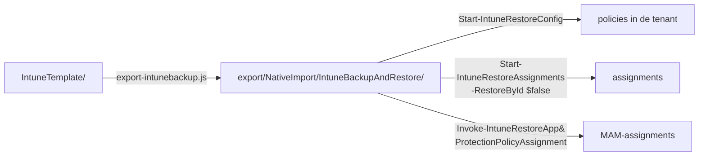

**Nederlands** · [English](README.en.md) · [Français](README.fr.md)

# export/

De baseline uit `IntuneTemplate/` in het formaat dat de PowerShell-module
[IntuneBackupAndRestore](https://github.com/jseerden/IntuneBackupAndRestore) verwacht.

**De inhoud van `NativeImport/` is gegenereerd — niet met de hand bijwerken.** Wijzig je daar
iets, dan is het bij de volgende `node scripts/export-intunebackup.js` weer weg. Alleen deze
README is handwerk.

| Bron | Export | Policies | Assignments |
|---|---|---:|---|
| `IntuneTemplate/` | `NativeImport/IntuneBackupAndRestore/` | 207 | 85, uit `_assignments.json` (fase 1, zonder de 21 met toewijzingsfilter) |

In totaal 293 JSON-bestanden: 207 policies, 85 assignment-bestanden en het meegereisde
macOS ADE-profiel. CIPP heeft deze map niet nodig; die leest `IntuneTemplate/` rechtstreeks.

## Waarom `NativeImport` in het pad staat

Omdat CIPP dat woord als enige uitsluiting kent. Een template-repository wordt gescand met
`git/trees?recursive=1`, en er wordt maar op twee dingen gefilterd: het bestand moet op
`.json` eindigen, en het pad mag `NativeImport` niet bevatten. Een instelling voor "kijk
alleen in deze submap" bestaat niet.

Zonder dat woord importeert CIPP deze 293 bestanden dus ook. Ze bevatten dezelfde 207 policies
(plus hun assignments en het ADE-profiel), maar in Graph-vorm zonder `RowKey` — en dan valt
CIPP terug op het raden van het policytype uit de inhoud en maakt er een **tweede** template
van, met dezelfde naam en een eigen GUID. Twee templates met dezelfde naam is precies het geval
waar CIPP zelf een foutmelding voor heeft ("a same-named duplicate row shadowed the one
selected").

De naam is dus een misnomer — dit is geen native import-formaat — maar het is de enige haak
die CIPP biedt. OpenIntuneBaseline gebruikt dezelfde map om dezelfde reden: ook daar staan
dezelfde policies in twee formaten in één repository.


```mermaid
flowchart LR
  T["IntuneTemplate/"] -->|export-intunebackup.js| E["export/NativeImport/IntuneBackupAndRestore/"]
  E -->|Start-IntuneRestoreConfig| P["policies in de tenant"]
  E -->|Start-IntuneRestoreAssignments<br/>-RestoreById $false| A["assignments"]
  E -->|Invoke-IntuneRestoreApp&#8203;ProtectionPolicyAssignment| M["MAM-assignments"]
```

## Terugzetten

```powershell
Start-IntuneRestoreConfig      -Path '<repo>\export\NativeImport\IntuneBackupAndRestore'
Start-IntuneRestoreAssignments -Path '<repo>\export\NativeImport\IntuneBackupAndRestore' -RestoreById $false
Invoke-IntuneRestoreAppProtectionPolicyAssignment -Path '<repo>\export\NativeImport\IntuneBackupAndRestore' -RestoreById $false
```

`-RestoreById $false` is **verplicht**: de export bevat bewust geen tenant-id's, dus de module
moet op policynaam matchen. Dat is ook de enige modus die cross-tenant klopt — een id uit
tenant A wijst in tenant B nergens naar.

De derde regel is geen vergetelheid. `Start-IntuneRestoreAssignments` roept in module 4.0.1
wél de assignments van Settings Catalog, ADMX, device configurations en compliance aan, maar
**niet** die van App Protection. Zonder die losse aanroep staan de twee MAM-policies er wel,
maar zonder toewijzing — en dan beschermen ze niets.

Het macOS ADE-enrollmentprofiel en de macOS-shellscripts gaan door geen van deze aanroepen: die
kent de module niet. Ze reizen mee als sidecar en gaan er met de hand of met een eigen script
in — zie hieronder.

## Mappen

| Map | Inhoud | Terugzetten |
|---|---:|---|
| `Settings Catalog/` | 165 policies | `Invoke-IntuneRestoreConfigurationPolicy` |
| `Device Compliance Policies/` | 26 policies | `Invoke-IntuneRestoreDeviceCompliancePolicy` |
| `Device Configurations/` | 13 policies | `Invoke-IntuneRestoreDeviceConfiguration` |
| `App Protection Policies/` | 2 policies | `Invoke-IntuneRestoreAppProtectionPolicy` |
| `Administrative Templates/` | 1 policy | `Invoke-IntuneRestoreGroupPolicyConfiguration` |
| `Apple ADE Enrollment Profiles/` | 1 profiel (sidecar, uit `extras/macos/enrollment/`) | `scripts/New-MacOSEnrollmentPolicy.ps1` — zie de README in die map |
| `macOS Shell Scripts/` | 4 scripts (sidecar, uit `extras/macos/shell-scripts/`) | met de hand in Intune — zie de README in die map |

Elke policymap heeft een `Assignments/`-submap voor de policies die er een hebben. Twee vormen,
allebei zoals de module ze zelf wegschrijft:

- **App Protection**: bestandsnaam `<guid> - <policynaam>.json`, en de lijst zit in een
  `value`-property. De module leest de policynaam als alles ná het eerste ` - `, en leest
  `$assignments.Value` — een kale array levert daar stilzwijgend nul assignments op.
- **De rest**: bestandsnaam is de policynaam, inhoud is een kale array.

## Policies zonder assignment

Alleen fase 1 heeft een assignment. De 101 policies in fase 2 tot en met 5 komen met opzet
ongetoewezen terug — zie `fase` in [`_manifest.json`](../IntuneTemplate/_manifest.json). Wijs
ze na de restore toe volgens hun fase: de pilot op `SEC-Baseline-Pilot`, fase 4 op de groep uit
`faseGroep`, fase 3 zodra de voorwaarde er is, fase 5 niet. `node scripts/export-intunebackup.js`
noemt bij elke run de volledige lijst.

## Policies met een toewijzingsfilter

De 21 Windows-policies in fase 1 met `doelgroep` `fysiek` of `avd` horen een include-filter te
krijgen (`WIN - Physical`, `WIN - AVD Multi-session`). `_assignments.json` noemt dat filter op naam,
want een filter-id bestaat maar in één tenant. De module kan daar niets mee: hij zet `target`
letterlijk terug (`@{ target = $assignment.target }`) en zoekt geen filter op. Een id uit een andere
tenant laat de `POST` falen; het filter weglaten zou de alleen-fysieke policies op de
AVD-sessiehosts zetten. Daarom staan ze **zonder assignment** in deze export. Na de restore:

```powershell
.\scripts\Set-BaselineAssignment.ps1 -AllDevices -Doelgroep fysiek,avd -CreateFilters -WhatIf
.\scripts\Set-BaselineAssignment.ps1 -AllUsers   -Doelgroep fysiek -WhatIf
```

Het script zoekt het filter op naam op en maakt het met `-CreateFilters` aan uit
`IntuneTemplate/WIN/AssignmentFilters/`. Wie voor één tenant een complete export wil:
`node scripts/export-intunebackup.js local/<tenant>/export --filter-ids local/<tenant>/filters.json`,
met `{ "WIN - Physical": "<id>", "WIN - AVD Multi-session": "<id>" }` — nooit in `export/`, want de
id's zijn van die tenant. Fase-2-policies met een klasse krijgen hun filter bij
`-GroupName 'SEC-Baseline-Pilot'` op dezelfde manier.

Zie de [hoofd-README](../README.md#terugzetten-in-een-tenant) voor de volledige context en
[OVERZICHT.md](../docs/OVERZICHT.md#eerst-in-een-pilot) voor de policies die eerst in een pilot
horen.
