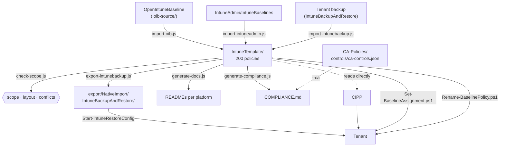

[Nederlands](README.md) · **English** · [Français](README.fr.md)

# scripts/

`IntuneTemplate/` is the only source. Everything here fills that folder, checks it, or
derives something from it — nothing writes directly into `export/` without
`IntuneTemplate/` already knowing about it.



## Node

| Script | Direction | What it does |
|---|---|---|
| [`import-intuneadmin.js`](import-intuneadmin.js) | **into** the source | Converts profiles from IntuneAdmin/IntuneBaselines into CIPP templates, driven by the `intuneadmin` block in `_manifest.json`. Reads UTF-16LE, strips template references from the source tenant, keeps GUIDs and our own settings. |
| [`import-oib.js`](import-oib.js) | **into** the source | Converts OpenIntuneBaseline policies into CIPP templates, driven by `_manifest.json`. Keeps GUIDs and our own settings that OIB does not have. Idempotent. |
| [`import-intunebackup.js`](import-intunebackup.js) | **into** the source | Converts a tenant backup back into templates. Only adds by default; `--overwrite` to replace. |
| [`set-packages.js`](set-packages.js) | **within** the source | Sets `Package` in every template — the CIPP package the policy is deployed in — derived from the phase in `_manifest.json` and the target in `_assignments.json` — and the English description shown next to the policy in the tenant (`doel` + assignment + source, translated via `_i18n/en.json`). Run after every change to those files. |
| [`check-scope.js`](check-scope.js) | check | Scope, naming convention, folder layout, conflicting settings, the CIPP package and the migration table. Blocking in CI. |
| [`check-osversion.js`](check-osversion.js) | check | Reports how far the OS minimums lag behind n-1 per platform, using endoflife.date as the source. **Exit code always 0** — an outdated minimum is a decision waiting to be made, not an error; if this made CI fail, someone would bump the number just to get the build green. |
| [`export-intunebackup.js`](export-intunebackup.js) | **out of** the source | Writes the folder structure IntuneBackupAndRestore expects — `IntuneTemplate/` with the phase 1 assignments — and copies the macOS ADE profiles and shell scripts from `IntuneTemplate/MAC/` along as a sidecar. |
| [`generate-baseline-template.js`](generate-baseline-template.js) | **out of** the source | Writes the CIPP baselines in `BaselineTemplate/`: `Baseline.json` with its stages and packages, and `Defender-Office365.json` from `lib/defender-office.js`. `--check` fails if it is out of date. |
| [`generate-app-templates.js`](generate-app-templates.js) | **out of** `IntuneTemplate/WIN/Apps/` | Writes `AppTemplate/*.json`: CIPP application templates (Win32 script apps) from the scripts in `IntuneTemplate/WIN/Apps/`. Refuses when the pinned version, hash or exclusion list differ from the manual package. `--check` fails if they are out of date. |
| [`generate-docs.js`](generate-docs.js) | **out of** the source | Generates `docs/OVERZICHT.md`, the READMEs in `IntuneTemplate/` and, per policy, a markdown file with every setting it applies, and the Conditional Access policies that rely on it (from `../CA-Policies/docs/policies.json`, or without that repo from the copy `IntuneTemplate/_ca.json`). `--check` fails if they are out of date. |
| [`generate-compliance.js`](generate-compliance.js) | **out of** the source | Writes `docs/COMPLIANCE.md`: for each ISO 27001, NIS2, CIS and NIST CSF item, which policies cover it, from `controls` in `_manifest.json` and the vocabulary in `_controls.json`. `--strict` fails on an unknown or deviating label, `--check` if the document is out of date. With `--ca` the Conditional Access side is counted too — see below. |

All ten scripts share [`lib/templates.js`](lib/templates.js): how the folder is laid out,
how to read it and where a new template belongs. Four scripts used to read that folder each in
their own way; with subfolders that assumption would have silently given the wrong answer in
four places.

### The CA side of COMPLIANCE.md

`generate-compliance.js` can include the Conditional Access policies from the CA-Policies repo
(cloned next to this one as `../CA-Policies`), which maintains `controls/ca-controls.json` for
this purpose in the same vocabulary:

```bash
node scripts/generate-compliance.js --strict --ca ../CA-Policies/controls/ca-controls.json
```

What is in git is deliberately the `--no-ca` version, because that is what the workflow regenerates — CI
cannot see that other repo. Having both in git would mean COMPLIANCE.md flips back and forth on every
PR. The difference is largest for NIS2 (j), multi-factor authentication: 3 policies without CA, 13 with.
How to get the CA side into CI after all is described in [ANALYSE.en.md](../docs/ANALYSE.en.md#open-items), open issue 3.

## PowerShell

All four require PowerShell 7 (`pwsh`) or Windows PowerShell 5.1, and
`Microsoft.Graph.Authentication`. Run them with `-WhatIf` first.

| Script | What it does |
|---|---|
| [`Set-BaselineAssignment.ps1`](Set-BaselineAssignment.ps1) | Assigns in one go the baseline policies that, according to their phase, belong to that target, across the five policy types: `-AllDevices`/`-AllUsers` phase 1, `-GroupName` the pilot or a `faseGroep`. `-Scope D\|U`, `-Platform WIN\|MAC\|IOS\|AND`, `-Replace`, `-FilterId`, `-IgnoreFase`. Adds by default, does not replace. |
| [`Rename-BaselinePolicy.ps1`](Rename-BaselinePolicy.ps1) | Brings the policy names in a tenant in line with the current convention, according to `_renames.json`. `PATCH`, so id and assignments are kept. Reports the cases that need manual work instead of forcing them. |
| [`New-MacOSEnrollmentPolicy.ps1`](New-MacOSEnrollmentPolicy.ps1) | Creates a macOS ADE enrollment profile under an ABM token from a JSON in [`IntuneTemplate/MAC/Enrollment/ade-profile/`](../IntuneTemplate/MAC/Enrollment/ade-profile/README.en.md), or exports the existing profiles to JSON (`-Export`). Deliberately does not assign. |
| [`New-WindowsAutopilotPolicy.ps1`](New-WindowsAutopilotPolicy.ps1) | Creates an Autopilot deployment profile, Enrollment Status Page or device preparation policy from a JSON in [`IntuneTemplate/WIN/Enrollment/`](../IntuneTemplate/WIN/Enrollment/README.en.md); for device preparation also the device group owned by the Intune Provisioning Client and the membership target. `-Export` fetches them as JSON. Deliberately does not assign. |

Still to build: `Get-BaselinePolicyState.ps1`, the tenant-side counterpart of
`check-scope.js` — see [PLAN.en.md](../docs/PLAN.en.md#still-to-build-scriptsget-baselinepolicystateps1).

## Order

```bash
node scripts/set-packages.js       # first: update the CIPP package per template
node scripts/check-scope.js        # then: fails on scope, folder, package or conflict problems
node scripts/export-intunebackup.js
node scripts/generate-baseline-template.js
node scripts/generate-app-templates.js
node scripts/generate-docs.js
node scripts/generate-compliance.js --strict --no-ca   # last
```

That order is also in [`.github/workflows/generate-baseline.yml`](../.github/workflows/generate-baseline.yml),
which opens a PR with the regenerated files after every change in `IntuneTemplate/`. That is
the only workflow: one source, one pipeline, one place where the order is defined.

## Three languages

Every document exists in Dutch (`X.md`), English (`X.en.md`) and French (`X.fr.md`), with a
language bar at the top. Dutch is the source; the other two follow.

The generated documents translate themselves: `generate-docs.js`, `generate-compliance.js` and
`export-intunebackup.js` write all three languages in one run, via
[`lib/i18n.js`](lib/i18n.js). Fixed text lives in the script as `{ nl, en, fr }`; text from the
data — `doel`, `note`, `faseWaarom` in the manifest, the explanations in `_controls.json` and
`_licenties.json` — stays Dutch in the data and is translated via
`IntuneTemplate/_i18n/en.json` and `fr.json`, keyed on the Dutch text.

When such a text changes, the old translation no longer matches: the sentence appears in Dutch in the
English and French documents and both scripts report how many texts are affected. To list what is missing:

```bash
node scripts/generate-docs.js --missend
node scripts/generate-compliance.js --no-ca --missend
```

That prints, per language, a JSON object with the Dutch texts as keys and an empty value.
Fill those in `_i18n/<lang>.json` and run the generators again. A text that no longer occurs
stays in that file until someone cleans it up; it does nothing.

The handwritten documents — the READMEs, `ANALYSE.md`, `PLAN.md`, `STRUCTUUR.md` — are translated
by hand: a change in `X.md` belongs in `X.en.md` and `X.fr.md` in the same commit.

## Mirroring to a second clone

`sync-mirror.js` is not part of the pipeline above: it does not read `IntuneTemplate/` and so does
not share `lib/templates.js` either. It makes the files in a second clone match what is in git
here and turns that into one ordinary commit there.

```bash
node scripts/sync-mirror.js <targetfolder> --dry-run   # first see what would change
node scripts/sync-mirror.js <targetfolder> --push
```

What goes along is `git ls-files`, not what is on disk — that keeps `local/` out of the
mirror, and that is exactly the reason not to do this with a copy command: a single deployment copy
with secrets that leaks to a second remote can never be removed from there. Deleted is
deleted, but only for files that are in git on the other side; anything created locally there
is left alone.

The target clone keeps its own history. No `push --force`, so the commits, workflow runs and
branches on that side stay — and that is also why it is a script and not a remote: a
second remote of this repo would overwrite that side on every push.

Run it after the order above, otherwise you mirror generated files that are still out of date.
