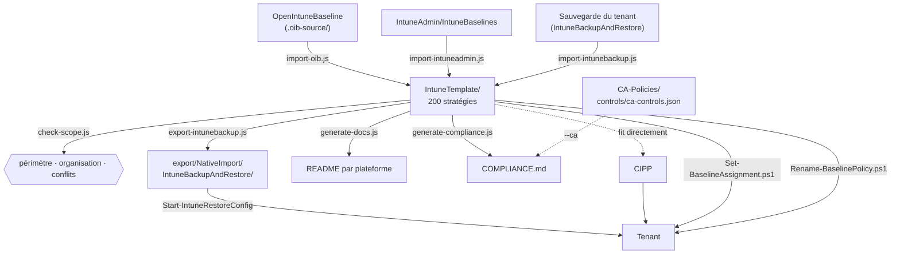

[Nederlands](README.md) · [English](README.en.md) · **Français**

# scripts/

`IntuneTemplate/` est la seule source. Tout ce qui se trouve ici alimente ce dossier, le contrôle,
ou en dérive quelque chose — rien n'écrit directement dans `export/` sans que
`IntuneTemplate/` le sache déjà.



## Node

| Script | Sens | Ce qu'il fait |
|---|---|---|
| [`import-intuneadmin.js`](import-intuneadmin.js) | **vers** la source | Convertit les profils d'IntuneAdmin/IntuneBaselines en templates CIPP, piloté par le bloc `intuneadmin` de `_manifest.json`. Lit l'UTF-16LE, supprime les références de templates du tenant source, conserve les GUID et nos propres paramètres. |
| [`import-oib.js`](import-oib.js) | **vers** la source | Convertit les stratégies OpenIntuneBaseline en templates CIPP, piloté par `_manifest.json`. Conserve les GUID et nos propres paramètres qu'OIB ne connaît pas. Idempotent. |
| [`import-intunebackup.js`](import-intunebackup.js) | **vers** la source | Reconvertit une sauvegarde de tenant en templates. Par défaut, ajoute uniquement ; `--overwrite` pour remplacer. |
| [`set-packages.js`](set-packages.js) | **dans** la source | Définit `Package` dans chaque template — le package CIPP dans lequel la stratégie est déployée — déduit de la phase dans `_manifest.json` et de la cible dans `_assignments.json` — ainsi que la description en anglais affichée à côté de la stratégie dans le tenant (`doel` + affectation + source, traduits via `_i18n/en.json`). À exécuter après chaque modification de ces fichiers. |
| [`check-scope.js`](check-scope.js) | contrôle | Périmètre, convention de nommage, organisation des dossiers, paramètres en conflit, le package CIPP et la table de migration. Bloquant en CI. |
| [`check-osversion.js`](check-osversion.js) | contrôle | Indique de combien les versions minimales d'OS sont en retard sur n-1 par plateforme, avec endoflife.date comme source. **Code de sortie toujours 0** — un minimum obsolète est une décision en attente, pas une erreur ; si cela faisait échouer la CI, quelqu'un augmenterait le chiffre juste pour rendre le build vert. |
| [`export-intunebackup.js`](export-intunebackup.js) | **depuis** la source | Écrit l'arborescence attendue par IntuneBackupAndRestore — `IntuneTemplate/` avec les affectations de la phase 1 — et y copie en sidecar les profils ADE macOS et les scripts shell de `IntuneTemplate/MAC/`. |
| [`generate-baseline-template.js`](generate-baseline-template.js) | **depuis** la source | Écrit les baselines CIPP dans `BaselineTemplate/` : `Baseline.json` avec ses stages et ses packages, `Defender-Office365.json` depuis `lib/defender-office.js` et `Windows-Updates.json` depuis `lib/windows-updates.js` (lancez d'abord `generate-app-templates.js` : le stage 2 renvoie à un template d'application). `--check` échoue s'il n'est pas à jour. |
| [`generate-app-templates.js`](generate-app-templates.js) | **depuis** `IntuneTemplate/WIN/Apps/` | Écrit `AppTemplate/*.json` : les templates d'application CIPP (apps Win32 par script) à partir des scripts de `IntuneTemplate/WIN/Apps/`. Refuse si la version épinglée, le hash ou la liste d'exclusion diffèrent du paquet manuel. `--check` échoue s'ils ne sont pas à jour. |
| [`generate-docs.js`](generate-docs.js) | **depuis** la source | Génère `docs/OVERZICHT.md`, les README dans `IntuneTemplate/` et, par stratégie, un markdown avec chaque paramètre qu'elle définit, et les stratégies Conditional Access qui s'appuient sur elle (depuis `../CA-Policies/docs/policies.json`, ou sans ce dépôt depuis la copie `IntuneTemplate/_ca.json`). `--check` échoue s'ils ne sont pas à jour. |
| [`generate-compliance.js`](generate-compliance.js) | **depuis** la source | Écrit `docs/COMPLIANCE.md` : pour chaque élément ISO 27001, NIS2, CIS et NIST CSF, quelles stratégies le couvrent, à partir de `controls` dans `_manifest.json` et du vocabulaire de `_controls.json`. `--strict` échoue sur un libellé inconnu ou divergent, `--check` si le document n'est pas à jour. Avec `--ca`, le volet Conditional Access est également pris en compte — voir ci-dessous. |

Les dix scripts partagent [`lib/templates.js`](lib/templates.js) : comment le dossier est organisé,
comment le lire et où un nouveau template doit aller. Auparavant, quatre scripts lisaient ce dossier
chacun à leur manière ; avec des sous-dossiers, cette hypothèse aurait silencieusement donné la
mauvaise réponse à quatre endroits.

### Le volet CA de COMPLIANCE.md

`generate-compliance.js` peut intégrer les stratégies Conditional Access du dépôt CA-Policies
(cloné à côté de celui-ci sous `../CA-Policies`), qui tient à cet effet `controls/ca-controls.json`
dans le même vocabulaire :

```bash
node scripts/generate-compliance.js --strict --ca ../CA-Policies/controls/ca-controls.json
```

Ce qui est dans git est volontairement la version `--no-ca`, car c'est ce que le workflow régénère — la
CI ne voit pas cet autre dépôt. Avoir les deux dans git signifierait que COMPLIANCE.md basculerait
d'une version à l'autre à chaque PR. L'écart est le plus grand pour NIS2 (j), authentification
multifacteur : 3 stratégies sans CA, 13 avec. Comment intégrer malgré tout le volet CA dans la CI est
décrit dans [ANALYSE.fr.md](../docs/ANALYSE.fr.md#points-ouverts), point ouvert 3.

## PowerShell

Les cinq nécessitent PowerShell 7 (`pwsh`) ou Windows PowerShell 5.1, ainsi que
`Microsoft.Graph.Authentication` ; `Set-DefenderOfficeTenant.ps1` aussi `ExchangeOnlineManagement`. Exécutez-les d'abord avec `-WhatIf`.

| Script | Ce qu'il fait |
|---|---|
| [`Set-BaselineAssignment.ps1`](Set-BaselineAssignment.ps1) | Affecte en une fois les stratégies de baseline qui, selon leur phase, relèvent de cette cible, sur l'ensemble des cinq types de stratégies : `-AllDevices`/`-AllUsers` la phase 1, `-GroupName` le pilote ou un `faseGroep`. `-Scope D\|U`, `-Platform WIN\|MAC\|IOS\|AND`, `-Replace`, `-FilterId`, `-IgnoreFase`. Par défaut, complète sans remplacer. |
| [`Rename-BaselinePolicy.ps1`](Rename-BaselinePolicy.ps1) | Aligne les noms des stratégies d'un tenant sur la convention actuelle, selon `_renames.json`. `PATCH`, donc l'id et les affectations sont conservés. Signale les cas qui demandent une intervention manuelle au lieu de les forcer. |
| [`New-MacOSEnrollmentPolicy.ps1`](New-MacOSEnrollmentPolicy.ps1) | Crée un profil d'inscription ADE macOS sous un jeton ABM à partir d'un JSON de [`IntuneTemplate/MAC/Enrollment/ade-profile/`](../IntuneTemplate/MAC/Enrollment/ade-profile/README.fr.md), ou exporte les profils existants en JSON (`-Export`). N'affecte délibérément rien. |
| [`New-WindowsAutopilotPolicy.ps1`](New-WindowsAutopilotPolicy.ps1) | Crée un profil de déploiement Autopilot, une Enrollment Status Page ou une stratégie device preparation à partir d'un JSON de [`IntuneTemplate/WIN/Enrollment/`](../IntuneTemplate/WIN/Enrollment/README.fr.md) ; pour device preparation, aussi le groupe d'appareils détenu par l'Intune Provisioning Client et la cible d'appartenance. `-Export` les récupère en JSON. N'affecte délibérément rien. |

| [`Set-DefenderOfficeTenant.ps1`](Set-DefenderOfficeTenant.ps1) | Les deux étapes tenant de [`Defender-Office365.json`](../BaselineTemplate/README.fr.md#defender-office365json--protection-de-la-messagerie) pour lesquelles CIPP n'a pas de standard : désactive les presets Standard/Strict et, seulement avec `-VipGroupName`, remplit la liste VIP de la policy anti-hameçonnage depuis ce groupe — pas de VIP par défaut. `-SkipPresets`. |
Reste à construire : `Get-BaselinePolicyState.ps1`, le pendant côté tenant de
`check-scope.js` — voir [PLAN.fr.md](../docs/PLAN.fr.md#reste-à-construire-scriptsget-baselinepolicystateps1).

## Ordre d'exécution

```bash
node scripts/set-packages.js       # d'abord : mettre à jour le package CIPP par template
node scripts/check-scope.js        # puis : échoue sur des problèmes de périmètre, de dossier, de package ou de conflit
node scripts/export-intunebackup.js
node scripts/generate-baseline-template.js
node scripts/generate-app-templates.js
node scripts/generate-docs.js
node scripts/generate-compliance.js --strict --no-ca   # en dernier
```

Cet ordre figure aussi dans [`.github/workflows/generate-baseline.yml`](../.github/workflows/generate-baseline.yml),
qui ouvre une PR avec les fichiers régénérés après chaque modification dans `IntuneTemplate/`. C'est
le seul workflow : une source, un pipeline, un seul endroit où l'ordre est défini.

## Trois langues

Chaque document existe en néerlandais (`X.md`), en anglais (`X.en.md`) et en français (`X.fr.md`),
avec une barre de langues en haut. Le néerlandais est la source ; les deux autres suivent.

Les documents générés se traduisent eux-mêmes : `generate-docs.js`, `generate-compliance.js` et
`export-intunebackup.js` écrivent les trois langues en une seule exécution, via
[`lib/i18n.js`](lib/i18n.js). Le texte fixe se trouve dans le script sous la forme `{ nl, en, fr }` ;
le texte issu des données — `doel`, `note`, `faseWaarom` dans le manifeste, les explications de
`_controls.json` et `_licenties.json` — reste en néerlandais dans les données et est traduit via
`IntuneTemplate/_i18n/en.json` et `fr.json`, avec le texte néerlandais comme clé.

Si un tel texte change, l'ancienne traduction ne correspond plus : la phrase apparaît en néerlandais
dans les documents anglais et français, et les deux scripts indiquent combien de textes sont concernés.
Pour lister ce qui manque :

```bash
node scripts/generate-docs.js --missend
node scripts/generate-compliance.js --no-ca --missend
```

Cela affiche, par langue, un objet JSON avec les textes néerlandais comme clés et une valeur vide.
Complétez-les dans `_i18n/<langue>.json` et relancez les générateurs. Un texte qui n'apparaît plus
reste dans ce fichier jusqu'à ce que quelqu'un le supprime ; il ne fait rien.

Les documents rédigés à la main — les README, `ANALYSE.md`, `PLAN.md`, `STRUCTUUR.md` — sont
traduits à la main : une modification de `X.md` doit figurer dans le même commit dans `X.en.md` et `X.fr.md`.

## Mise en miroir vers un second clone

`sync-mirror.js` ne fait pas partie du pipeline ci-dessus : il ne lit pas `IntuneTemplate/` et ne
partage donc pas non plus `lib/templates.js`. Il aligne les fichiers d'un second clone sur ce qui est
dans git ici et en fait un commit ordinaire là-bas.

```bash
node scripts/sync-mirror.js <dossiercible> --dry-run   # d'abord voir ce qui changerait
node scripts/sync-mirror.js <dossiercible> --push
```

Ce qui est repris, c'est `git ls-files`, pas ce qui se trouve sur le disque — ainsi `local/` reste
hors du miroir, et c'est précisément la raison de ne pas le faire avec une commande de copie : une
seule copie de déploiement contenant des secrets qui fuit vers un second remote ne peut plus jamais
en être retirée. Supprimé veut dire supprimé, mais uniquement pour les fichiers qui sont dans git de
l'autre côté ; ce qui y a été créé localement n'est pas touché.

Le clone cible conserve son propre historique. Pas de `push --force`, donc les commits, les exécutions
de workflow et les branches de ce côté restent en place — et c'est aussi pourquoi c'est un script et
non un remote : un second remote de ce dépôt écraserait ce côté à chaque push.

Exécutez-le après l'ordre ci-dessus, sinon vous mettez en miroir des fichiers générés qui ne sont pas
encore à jour.
