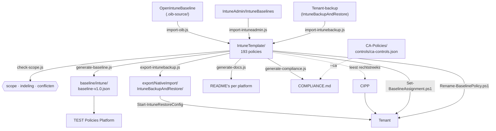

# scripts/

`IntuneTemplate/` is de enige bron. Alles wat hier staat vult die map, controleert 'm, of
leidt er iets uit af — niets schrijft rechtstreeks in `baseline/` of `export/` zonder dat
`IntuneTemplate/` het al weet.



## Node

| Script | Richting | Wat het doet |
|---|---|---|
| [`import-intuneadmin.js`](import-intuneadmin.js) | **naar** de bron | Zet profielen uit IntuneAdmin/IntuneBaselines om naar CIPP-templates, gestuurd door het `intuneadmin`-blok in `_manifest.json`. Leest UTF-16LE, strippt template-referenties uit de brontenant, behoudt GUID's en eigen instellingen. |
| [`import-oib.js`](import-oib.js) | **naar** de bron | Zet OpenIntuneBaseline-policies om naar CIPP-templates, gestuurd door `_manifest.json`. Behoudt GUID's en eigen instellingen die OIB niet kent. Idempotent. |
| [`import-intunebackup.js`](import-intunebackup.js) | **naar** de bron | Zet een tenant-backup terug om naar templates. Voegt standaard alleen toe; `--overwrite` om te vervangen. |
| [`set-packages.js`](set-packages.js) | **in** de bron | Zet `Package` in elk template — het CIPP-pakket waarin de policy uitrolt — afgeleid uit de fase in `_manifest.json` en het doel in `_assignments.json`. Draaien na elke wijziging in die twee. |
| [`check-scope.js`](check-scope.js) | controle | Scope, naamconventie, mapindeling, conflicterende instellingen, het CIPP-pakket en de migratietabel. Blokkerend in CI. |
| [`check-osversion.js`](check-osversion.js) | controle | Rapporteert hoe ver de OS-ondergrenzen achterlopen op n-1 per platform, met endoflife.date als bron. **Exitcode altijd 0** — een verouderde ondergrens is een besluit dat wacht, geen fout; zou dit CI laten falen, dan verhoogt iemand het getal om de build groen te krijgen. |
| [`generate-baseline.js`](generate-baseline.js) | **uit** de bron | Bouwt de baseline-regels voor het TEST Policies Platform. Beheert de checkId-nummering. |
| [`export-intunebackup.js`](export-intunebackup.js) | **uit** de bron | Schrijft de mapstructuur die IntuneBackupAndRestore verwacht — `IntuneTemplate/` mét assignments, elke set daarnaast in een eigen map zonder. |
| [`generate-baseline-template.js`](generate-baseline-template.js) | **uit** de bron | Schrijft `BaselineTemplate/Baseline.json`: de CIPP-baseline met zijn stages en pakketten. `--check` faalt als hij achterloopt. |
| [`generate-docs.js`](generate-docs.js) | **uit** de bron | Genereert `OVERZICHT.md`, de README's in `IntuneTemplate/` en per policy een markdown met élke instelling die hij zet. `--check` faalt als ze achterlopen. |
| [`generate-compliance.js`](generate-compliance.js) | **uit** de bron | Schrijft `COMPLIANCE.md`: per ISO 27001-, NIS2-, CIS- en NIST CSF-item welke policies hem invullen, uit `controls` in `_manifest.json` en de vocabulaire in `_controls.json`. `--strict` faalt op een onbekend of afwijkend label, `--check` als het document achterloopt. Met `--ca` telt ook de Conditional Access-kant mee — zie hieronder. |

Alle elf de scripts delen [`lib/templates.js`](lib/templates.js): hoe de map is ingedeeld,
hoe je 'm uitleest en waar een nieuw template hoort. Vier scripts lazen die map eerder elk op
hun eigen manier uit; met submappen zou die aanname op vier plekken stilzwijgend het verkeerde
antwoord geven.

### De CA-kant van COMPLIANCE.md

`generate-compliance.js` kan de Conditional Access-policies meenemen uit de zusterrepo
[CA-Policies](https://github.com/sjkanon/CA-Policies), die daarvoor `controls/ca-controls.json`
bijhoudt in dezelfde vocabulaire:

```bash
node scripts/generate-compliance.js --strict --ca ../CA-Policies/controls/ca-controls.json
```

Wat in git staat is bewust de `--no-ca`-versie, want dat is wat de workflow regenereert — CI ziet
die andere repo niet. Beide lijnen in git zou betekenen dat COMPLIANCE.md bij elke PR heen en weer
wisselt. Het scheelt het meest bij NIS2 (j), multifactorauthenticatie: 3 policies zonder CA, 13 met.
Hoe je de CA-kant wél in CI krijgt staat in [ANALYSE.md](../ANALYSE.md#open-punten), open punt 3.

## PowerShell

Beide vragen om PowerShell 7 (`pwsh`) of Windows PowerShell 5.1, en om
`Microsoft.Graph.Authentication`. Draai ze eerst met `-WhatIf`.

| Script | Wat het doet |
|---|---|
| [`Set-BaselineAssignment.ps1`](Set-BaselineAssignment.ps1) | Zet in één keer een assignment op de baseline-policies die volgens hun fase bij dat doel horen, over de vijf policytypes heen: `-AllDevices`/`-AllUsers` fase 1, `-GroupName` de pilot of een `faseGroep`. `-Scope D\|U`, `-Platform WIN\|MAC\|IOS\|AND`, `-Replace`, `-FilterId`, `-IgnoreFase`. Vult standaard aan, vervangt niet. |
| [`Rename-BaselinePolicy.ps1`](Rename-BaselinePolicy.ps1) | Brengt de policynamen in een tenant op de huidige conventie, volgens `_renames.json`. `PATCH`, dus id en assignments blijven. Meldt de gevallen die handwerk vragen in plaats van ze te forceren. |

Nog te bouwen: `Get-BaselinePolicyState.ps1`, de tenant-zijdige tegenhanger van
`check-scope.js` — zie [PLAN.md](../PLAN.md#nog-te-bouwen-scriptsget-baselinepolicystateps1).

## Volgorde

```bash
node scripts/set-packages.js       # eerst: het CIPP-pakket per template bijwerken
node scripts/check-scope.js        # dan: faalt bij scope-, map-, pakket- of conflictproblemen
node scripts/generate-baseline.js  # dan: checkId's toekennen en de baseline schrijven
node scripts/export-intunebackup.js
node scripts/generate-baseline-template.js
node scripts/generate-docs.js      # dan: leest de checkId's uit de baseline
node scripts/generate-compliance.js --strict --no-ca   # laatst: idem, plus de fases
```

Die volgorde staat ook in [`.github/workflows/generate-baseline.yml`](../.github/workflows/generate-baseline.yml),
die na elke wijziging in `IntuneTemplate/` een PR opent met de geregenereerde bestanden. Dat is
de enige workflow: één bron, één pijplijn, één plek waar de volgorde staat.
