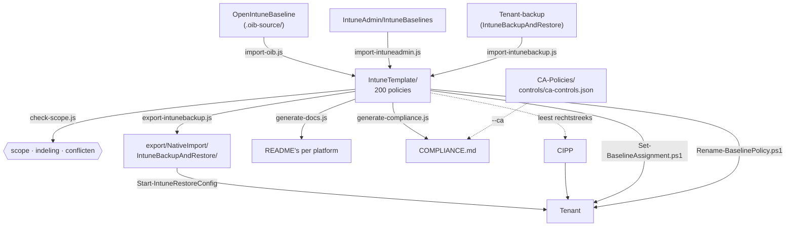

**Nederlands** · [English](README.en.md) · [Français](README.fr.md)

# scripts/

`IntuneTemplate/` is de enige bron. Alles wat hier staat vult die map, controleert 'm, of
leidt er iets uit af — niets schrijft rechtstreeks in `export/` zonder dat
`IntuneTemplate/` het al weet.


```mermaid
flowchart TD
  OIB["OpenIntuneBaseline<br/>(.oib-source/)"] -->|import-oib.js| T
  IA["IntuneAdmin/IntuneBaselines"] -->|import-intuneadmin.js| T
  TEN["Tenant-backup<br/>(IntuneBackupAndRestore)"] -->|import-intunebackup.js| T
  T["IntuneTemplate/<br/>200 policies"]
  T -->|check-scope.js| CHK{{"scope · indeling · conflicten"}}
  T -->|export-intunebackup.js| EX["export/NativeImport/<br/>IntuneBackupAndRestore/"]
  T -->|generate-docs.js| DOC["README's per platform"]
  T -->|generate-compliance.js| CMP["COMPLIANCE.md"]
  CA["CA-Policies/<br/>controls/ca-controls.json"] -.->|--ca| CMP
  T -.->|leest rechtstreeks| CIPP["CIPP"]
  EX -->|Start-IntuneRestoreConfig| TENANT["Tenant"]
  CIPP --> TENANT
  T -->|Set-BaselineAssignment.ps1| TENANT
  T -->|Rename-BaselinePolicy.ps1| TENANT
```

## Node

| Script | Richting | Wat het doet |
|---|---|---|
| [`import-intuneadmin.js`](import-intuneadmin.js) | **naar** de bron | Zet profielen uit IntuneAdmin/IntuneBaselines om naar CIPP-templates, gestuurd door het `intuneadmin`-blok in `_manifest.json`. Leest UTF-16LE, strippt template-referenties uit de brontenant, behoudt GUID's en eigen instellingen. |
| [`import-oib.js`](import-oib.js) | **naar** de bron | Zet OpenIntuneBaseline-policies om naar CIPP-templates, gestuurd door `_manifest.json`. Behoudt GUID's en eigen instellingen die OIB niet kent. Idempotent. |
| [`import-intunebackup.js`](import-intunebackup.js) | **naar** de bron | Zet een tenant-backup terug om naar templates. Voegt standaard alleen toe; `--overwrite` om te vervangen. |
| [`set-packages.js`](set-packages.js) | **in** de bron | Zet `Package` in elk template — het CIPP-pakket waarin de policy uitrolt — afgeleid uit de fase in `_manifest.json` en het doel in `_assignments.json` — en de Engelse omschrijving die in de tenant naast de policy staat (`doel` + toewijzing + bron, vertaald via `_i18n/en.json`). Draaien na elke wijziging in die bestanden. |
| [`set-organisation.js`](set-organisation.js) | **in** de bron | Zet het voorvoegsel en de CA-URL uit `_organisation.json` om in alle bestanden en bestandsnamen, en de oude namen in `_renames.json`. Zie [Een eigen voorvoegsel](#een-eigen-voorvoegsel). |
| [`check-scope.js`](check-scope.js) | controle | Scope, naamconventie, mapindeling, conflicterende instellingen, het CIPP-pakket en de migratietabel. Blokkerend in CI. |
| [`check-osversion.js`](check-osversion.js) | controle | Rapporteert hoe ver de OS-ondergrenzen achterlopen op n-1 per platform, met endoflife.date als bron. **Exitcode altijd 0** — een verouderde ondergrens is een besluit dat wacht, geen fout; zou dit CI laten falen, dan verhoogt iemand het getal om de build groen te krijgen. |
| [`export-intunebackup.js`](export-intunebackup.js) | **uit** de bron | Schrijft de mapstructuur die IntuneBackupAndRestore verwacht — `IntuneTemplate/` met de assignments van fase 1 — en kopieert de macOS ADE-profielen en shellscripts uit `IntuneTemplate/MAC/` als sidecar mee. |
| [`generate-baseline-template.js`](generate-baseline-template.js) | **uit** de bron | Schrijft de CIPP-baselines in `BaselineTemplate/`: `Baseline.json` met zijn stages en pakketten, `Defender-Office365.json` uit `lib/defender-office.js` en `Windows-Updates.json` uit `lib/windows-updates.js` en `Purview-DLP.json` en `Purview-DLP-Aviation.json` uit `lib/purview-dlp.js` (draai eerst `generate-app-templates.js` en `generate-dlp-templates.js`: die baselines verwijzen naar hun templates). `--check` faalt als hij achterloopt. |
| [`generate-dlp-templates.js`](generate-dlp-templates.js) | **uit** `lib/purview-dlp.js` | Schrijft `DlpCompliancePolicyTemplate/*.json`: CIPP-DLP-policytemplates voor Exchange, SharePoint en OneDrive. Weigert bij een regel- of policynaam boven 64 tekens, een dubbele regelnaam of een policytip boven 256 tekens. `--check` faalt als ze achterlopen. |
| [`generate-app-templates.js`](generate-app-templates.js) | **uit** `IntuneTemplate/WIN/Apps/` | Schrijft `AppTemplate/*.json`: CIPP-applicatietemplates (Win32-script-apps) uit de scripts in `IntuneTemplate/WIN/Apps/`. Weigert als vastgepinde versie, hash of uitsluitingslijst afwijken van het handmatige pakket. `--check` faalt als ze achterlopen. |
| [`generate-docs.js`](generate-docs.js) | **uit** de bron | Genereert `docs/OVERZICHT.md`, de README's in `IntuneTemplate/` en per policy een markdown met élke instelling die hij zet, en de Conditional Access-policies die erop leunen (uit `../CA-Policies/docs/policies.json`, of zonder die repo uit de kopie `IntuneTemplate/_ca.json`). `--check` faalt als ze achterlopen. |
| [`generate-compliance.js`](generate-compliance.js) | **uit** de bron | Schrijft `docs/COMPLIANCE.md`: per ISO 27001-, NIS2-, CIS- en NIST CSF-item welke policies hem invullen, uit `controls` in `_manifest.json` en de vocabulaire in `_controls.json`. `--strict` faalt op een onbekend of afwijkend label, `--check` als het document achterloopt. Met `--ca` telt ook de Conditional Access-kant mee — zie hieronder. |

Alle tien de scripts delen [`lib/templates.js`](lib/templates.js): hoe de map is ingedeeld,
hoe je 'm uitleest en waar een nieuw template hoort. Vier scripts lazen die map eerder elk op
hun eigen manier uit; met submappen zou die aanname op vier plekken stilzwijgend het verkeerde
antwoord geven.

### De CA-kant van COMPLIANCE.md

`generate-compliance.js` kan de Conditional Access-policies meenemen uit de CA-Policies-repo
(naast deze gekloond als `../CA-Policies`), die daarvoor `controls/ca-controls.json` bijhoudt in
dezelfde vocabulaire:

```bash
node scripts/generate-compliance.js --strict --ca ../CA-Policies/controls/ca-controls.json
```

Wat in git staat is bewust de `--no-ca`-versie, want dat is wat de workflow regenereert — CI ziet
die andere repo niet. Beide lijnen in git zou betekenen dat COMPLIANCE.md bij elke PR heen en weer
wisselt. Het scheelt het meest bij NIS2 (j), multifactorauthenticatie: 3 policies zonder CA, 13 met.
Hoe je de CA-kant wél in CI krijgt staat in [ANALYSE.md](../docs/ANALYSE.md#open-punten), open punt 3.

## PowerShell

Alle vijf vragen om PowerShell 7 (`pwsh`) of Windows PowerShell 5.1, en om
`Microsoft.Graph.Authentication`; `Set-DefenderOfficeTenant.ps1` ook om `ExchangeOnlineManagement`. Draai ze eerst met `-WhatIf`.

| Script | Wat het doet |
|---|---|
| [`Set-BaselineAssignment.ps1`](Set-BaselineAssignment.ps1) | Zet in één keer een assignment op de baseline-policies die volgens hun fase bij dat doel horen, over de vijf policytypes heen: `-AllDevices`/`-AllUsers` fase 1, `-GroupName` de pilot of een `faseGroep`. `-Scope D\|U`, `-Platform WIN\|MAC\|IOS\|AND`, `-Replace`, `-FilterId`, `-IgnoreFase`. Vult standaard aan, vervangt niet. |
| [`Rename-BaselinePolicy.ps1`](Rename-BaselinePolicy.ps1) | Brengt de policynamen in een tenant op de huidige conventie, volgens `_renames.json`. `PATCH`, dus id en assignments blijven. Meldt de gevallen die handwerk vragen in plaats van ze te forceren. |
| [`New-MacOSEnrollmentPolicy.ps1`](New-MacOSEnrollmentPolicy.ps1) | Maakt een macOS ADE-inschrijfprofiel aan onder een ABM-token uit een JSON in [`IntuneTemplate/MAC/Enrollment/ade-profile/`](../IntuneTemplate/MAC/Enrollment/ade-profile/README.md), of exporteert de bestaande profielen naar JSON (`-Export`). Wijst bewust niet toe. |
| [`New-WindowsAutopilotPolicy.ps1`](New-WindowsAutopilotPolicy.ps1) | Maakt een Autopilot deployment profile, Enrollment Status Page of device preparation-policy aan uit een JSON in [`IntuneTemplate/WIN/Enrollment/`](../IntuneTemplate/WIN/Enrollment/README.md); voor device preparation ook de apparaatgroep met de Intune Provisioning Client als eigenaar en het membership target. `-Export` haalt ze op als JSON. Wijst bewust niet toe. |

| [`Set-DefenderOfficeTenant.ps1`](Set-DefenderOfficeTenant.ps1) | De twee tenantstappen van [`Defender-Office365.json`](../BaselineTemplate/README.md#defender-office365json--e-mailbeveiliging) waar CIPP geen standard voor heeft: zet de Standard/Strict-presets uit en vult alleen met `-VipGroupName` de VIP-lijst van de anti-phishingpolicy uit die groep — standaard geen VIP's. `-SkipPresets`. |
Nog te bouwen: `Get-BaselinePolicyState.ps1`, de tenant-zijdige tegenhanger van
`check-scope.js` — zie [PLAN.md](../docs/PLAN.md#nog-te-bouwen-scriptsget-baselinepolicystateps1).

## Volgorde

```bash
node scripts/set-packages.js       # eerst: het CIPP-pakket per template bijwerken
node scripts/check-scope.js        # dan: faalt bij scope-, map-, pakket- of conflictproblemen
node scripts/export-intunebackup.js
node scripts/generate-app-templates.js
node scripts/generate-dlp-templates.js
node scripts/generate-baseline-template.js
node scripts/generate-docs.js
node scripts/generate-compliance.js --strict --no-ca   # laatst
```

Die volgorde staat ook in [`.github/workflows/generate-baseline.yml`](../.github/workflows/generate-baseline.yml),
die na elke wijziging in `IntuneTemplate/` een PR opent met de geregenereerde bestanden. Dat is
de enige workflow: één bron, één pijplijn, één plek waar de volgorde staat.

## Drie talen

Elk document staat er in het Nederlands (`X.md`), Engels (`X.en.md`) en Frans (`X.fr.md`), met
een taalbalk bovenaan. Nederlands is de bron; de andere twee volgen.

De gegenereerde documenten vertalen zichzelf: `generate-docs.js`, `generate-compliance.js` en
`export-intunebackup.js` schrijven alle drie de talen in één run, via
[`lib/i18n.js`](lib/i18n.js). Vaste tekst staat in het script als `{ nl, en, fr }`; tekst uit de
data — `doel`, `note`, `faseWaarom` in het manifest, de toelichtingen in `_controls.json` en
`_licenties.json` — blijft Nederlands in de data en wordt vertaald via
`IntuneTemplate/_i18n/en.json` en `fr.json`, met de Nederlandse tekst als sleutel.

Wijzigt er zo'n tekst, dan past de oude vertaling niet meer: de zin komt in het Nederlands in het
Engelse en Franse document en beide scripts melden hoeveel teksten er zo zijn. Wat er ontbreekt:

```bash
node scripts/generate-docs.js --missend
node scripts/generate-compliance.js --no-ca --missend
```

Dat geeft per taal een JSON-object met de Nederlandse teksten als sleutel en een lege waarde.
Vul die in `_i18n/<taal>.json` in en draai de generatoren opnieuw. Een tekst die niet meer
voorkomt blijft in dat bestand staan tot iemand hem opruimt; hij doet niets.

De handgeschreven documenten — de README's, `ANALYSE.md`, `PLAN.md`, `STRUCTUUR.md` — worden met
de hand vertaald: een wijziging in `X.md` hoort in dezelfde commit ook in `X.en.md` en `X.fr.md`.

## Een eigen voorvoegsel

Wat per organisatie verschilt staat in `IntuneTemplate/_organisation.json`: het voorvoegsel van elke
policy, elk CIPP-pakket en elke baseline (`prefix`), en waar de CA-Policies-repo te lezen is
(`caRepoUrl`; zonder URL staan bij de policies alleen de CA-namen, zonder link). Geen script noemt
het voorvoegsel letterlijk; ze lezen het via `lib/organisation.js`.

Het voorvoegsel zit ook in de data en de uitvoer — elke `displayName`, `_assignments.json`, de
exportbestandsnamen, de docs — dus wijzigen gaat met `set-organisation.js`, dat alles in één keer
omzet en daarna de pijplijn draait:

```bash
node scripts/set-organisation.js --prefix "Contoso - " --dry-run
node scripts/set-organisation.js --prefix "Contoso - " --ca-url https://github.com/<org>/<repo>/blob/main/
```

De oude namen komen in `previousNames` in `_renames.json`. Draai daarna per tenant
`Rename-BaselinePolicy.ps1`, anders zet CIPP de policies onder de nieuwe naam naast de oude. Dat
geldt niet voor wat geen Intune-policy is: de Defender-policies (Safe Links e.d.), het
Autopilot-profiel en de app-templates krijgen in de tenant een nieuw exemplaar; ruim het oude op.

## Spiegelen naar een tweede clone

`sync-mirror.js` hoort niet bij de pijplijn hierboven: hij leest `IntuneTemplate/` niet en deelt
`lib/templates.js` dus ook niet. Hij zet de bestanden in een tweede clone gelijk aan wat hier in
git staat en maakt daar één gewone commit van. Heeft die clone een eigen `_organisation.json`, dan
houdt hij die: na het kopiëren draait `set-organisation.js` daar, zodat de spiegel de inhoud van hier
krijgt met zijn eigen voorvoegsel en CA-URL. De eerste keer geef je die mee met `--prefix` en
`--ca-url`.

```bash
node scripts/sync-mirror.js <doelmap> --dry-run   # eerst kijken wat er zou verschuiven
node scripts/sync-mirror.js <doelmap> --push
```

Wat meegaat is `git ls-files`, niet wat er op de schijf ligt — daarmee blijft `local/` buiten de
spiegel, en dat is precies de reden om het niet met een kopieeropdracht te doen: één uitrolkopie
mét geheimen die naar een tweede remote lekt krijg je daar nooit meer uit. Verwijderd is
verwijderd, maar alleen voor bestanden die aan de andere kant in git staan; wat daar lokaal is
aangemaakt blijft met rust. Ook wat iemand daar zelf heeft gecommit (geen spiegelcommit) en hier
nooit in git stond — een CIPP-"Save" van een collega — blijft staan; de uitvoer toont dat met `=`.

De doelclone houdt zijn eigen geschiedenis. Geen `push --force`, dus de commits, workflowruns en
branches aan die kant blijven staan — en dat is ook waarom het een script is en geen remote: een
tweede remote van deze repo zou die kant bij elke push overschrijven.

Draai het ná de volgorde hierboven, anders spiegel je gegenereerde bestanden die nog achterlopen.
